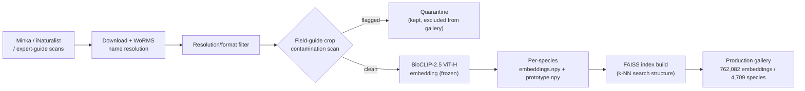
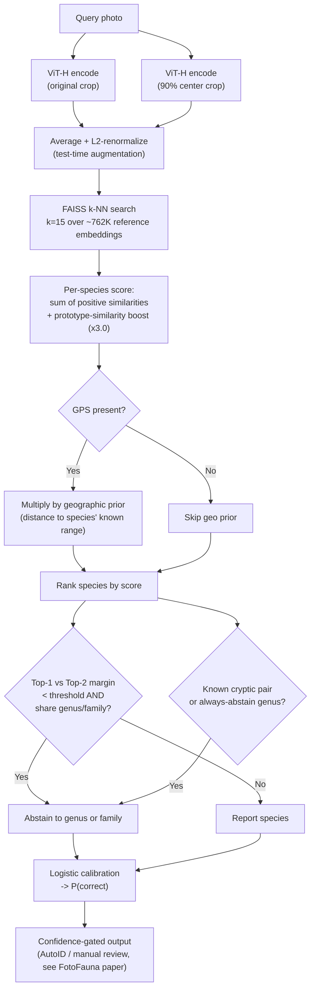
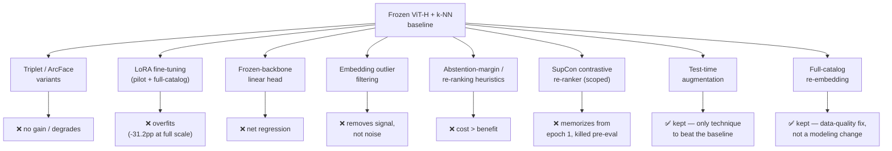
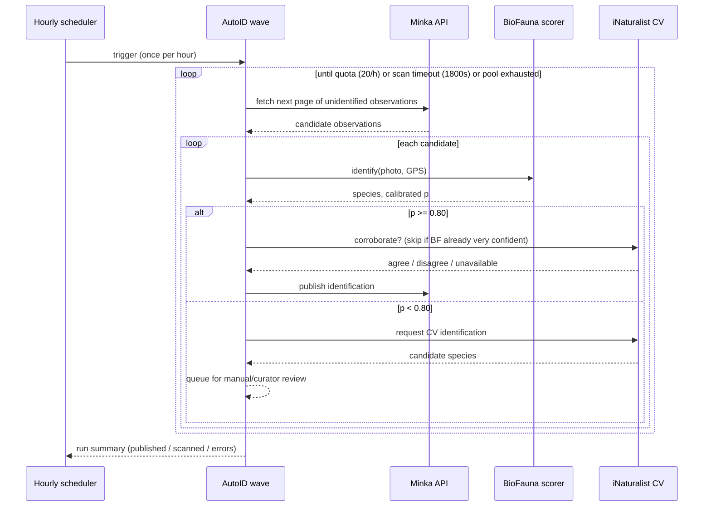
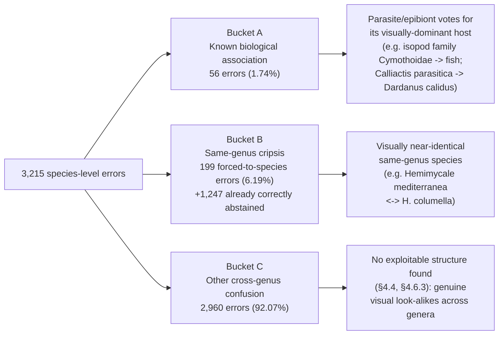

# BioFauna: Scaling BioCLIP with ViT-H for Mediterranean Marine Species Identification

**Authors**: Gustavo Zafra (Yespi)  
**Taxonomic contributors**: Xavier Salvador, Miquel Pontes, Manuel Ballesteros  
**Repository**: https://github.com/yespi/biofauna  
**Live system**: https://fotofauna.yespi.es  
**Version**: 2026-08-27

> **Naming.** This project was originally developed under the name **YOLOFauna** (2024–2026). It was renamed **BioFauna** when the production stack settled on BioCLIP retrieval rather than YOLO detection. A short provenance note is in [`docs/HISTORY.md`](../docs/HISTORY.md).

---

## Abstract

We present BioFauna, a deep learning system for automated identification of Mediterranean marine fauna from photographs. The production system uses **BioCLIP-2.5 ViT-H** (632M parameters, 1024-dimensional embeddings) as a **frozen** vision encoder, followed by **k-nearest neighbors** (k=15) with a prototype-similarity boost and a multiplicative geographic prior over a gallery of **762,082 image embeddings across 4,709 target species**, **test-time augmentation** (query + 90% center crop), hierarchical taxonomic abstention, and logistic confidence calibration. It runs on consumer hardware (NVIDIA RTX 3060 12GB) and is deployed on the FotoFauna citizen science platform, where it also drives an hourly automated-identification ("AutoID") pipeline that publishes high-confidence results directly to the Minka citizen-science network.

On an out-of-sample, observation-stratified, leak-checked calibration set (`harvest_calib`, n=12,788), the single-photo-per-observation system achieves **75.97% top-1 species accuracy**, **81.29% genus**, and **84.90% family**. High-confidence predictions (calibrated probability ≥ 0.80) reach an estimated **95.3% precision** at **57.4% coverage**, the operating point used for automated publication. Scaling from BioCLIP ViT-L to ViT-H contributed the largest single gain (+6.8pp species accuracy on an earlier, smaller cohort); k-NN tuning, a full-catalog re-embedding, and test-time augmentation each contributed further, smaller gains. Where an observation carries more than one photo (25.1% of the calibration set), a zero-training late-fusion of per-photo k-NN scores raises accuracy on the full corpus to **76.76% species** (+0.79pp) and to **84.70%** (+3.15pp) on the multi-photo subset alone (§4.7); this is now the production behavior. A systematic search for additional gains through model fine-tuning — a full-backbone LoRA fine-tune, a frozen-backbone linear projection head, embedding outlier filtering, abstention-margin retuning, a biologically-motivated re-ranking heuristic, and a frozen-backbone Supervised Contrastive re-ranker scoped to the hardest known confusion pairs, the last evaluated under a pre-registered kill-switch protocol — did **not** improve the out-of-sample species metric beyond what test-time augmentation already achieves; we report all of these as negative results with quantified costs, since a rigorous account of what does not work is, in a project maintained by a single practitioner without a dedicated ML research team, as valuable as what does.

We release the identification service code, calibration artifacts, and species appendix as open-source software. The BioCLIP backbone is auto-downloaded from HuggingFace. The system has been validated in production with curator-reviewed auto-publications on Minka.

**Keywords**: BioCLIP-2.5, ViT-H, k-NN, fine-grained visual classification, marine biodiversity, citizen science, taxonomic abstention, model calibration, Mediterranean Sea

---

## 1. Introduction

### 1.1 The Biodiversity Identification Bottleneck

The Mediterranean Sea is one of the world's biodiversity hotspots, hosting over 17,000 marine species — approximately 7% of global marine biodiversity in just 0.8% of ocean surface area (Coll et al., 2010; Bianchi & Morri, 2000). Accurate species identification is fundamental to biodiversity monitoring, ecological research, conservation planning, and citizen science initiatives. Yet taxonomic expertise is increasingly scarce (Hopkins & Freckleton, 2002; Kim & Byrne, 2006).

Citizen science platforms like iNaturalist (Van Horn et al., 2018) and Minka (minka-sdg.org) address this through community identification, but rare or taxonomically difficult species may wait days or never receive expert attention. In the Mediterranean, many endemics and language-specific field guides (Catalan, Spanish, Italian) intensify the bottleneck.

### 1.2 Automated Image-Based Identification

Automated image-based identification can provide instant suggestions that accelerate the pipeline. Traditional CNN approaches (iNaturalist challenges; Van Horn et al., 2018, 2021) require large per-species labeled sets and struggle with long-tailed distributions. Vision-language models open a different route: strong pretrained embeddings plus retrieval over a regional gallery.

### 1.3 Vision-Language Models for Biology

BioCLIP (Stevens et al., 2024) is trained contrastively on TreeOfLife-450M with taxonomic text structure. BioCLIP-2.5 provides a **ViT-H/14** vision encoder (632M parameters, **1024-dim** embeddings), substantially stronger than the earlier ViT-L/14 (428M, 768-dim) used in our initial experiments.

### 1.4 What Worked (and What Did Not)

Early work on this project (formerly YOLOFauna) explored QLoRA fine-tuning of ViT-L under a 12GB VRAM constraint. Those runs either failed (projection-head corruption → 1.7% accuracy) or failed to beat a frozen-backbone k-NN baseline (~63.9% species). **Re-embedding the gallery with BioCLIP-2.5 ViT-H** raised out-of-sample species accuracy to **70.6%** (+6.8pp) without fine-tuning. A subsequent k-NN grid search, validated with observation-stratified `harvest_calib`, selected **k=15**; a full catalog expansion and re-embedding (correcting an archive/SSD photo-coverage gap, and later a calibration-set deduplication bug) brought the trusted, leak-checked baseline to 75.8% species on a much larger n=12,788 cohort; **test-time augmentation** — averaging the embedding of each query photo with its own 90% center crop before retrieval — added a further, smaller gain, to the current **75.97%**.

A wide range of further attempts to extract additional accuracy from the frozen ViT-H embedding space — triplet projections, ArcFace classifiers, LoRA fine-tuning (both at small scale and at full catalog scale), a frozen-backbone linear projection head, embedding-level outlier filtering, retuning the taxonomic-abstention margin, a biologically-motivated re-ranking heuristic for known parasite/host pairs, expert field-guide crops, aggressive near-duplicate removal, and a Supervised Contrastive re-ranker scoped to the hardest known same-genus confusion pairs under a pre-registered kill-switch protocol — did **not** beat the frozen-backbone-plus-TTA baseline on the same evaluation protocol (§3.3, §4.4). We therefore present BioFauna as a **retrieval system on a strong frozen backbone with test-time augmentation**, with hierarchical abstention and calibrated AutoID thresholds, rather than as a fine-tuning success story — and as a worked example of when a wide, well-instrumented ablation search should conclude "the frozen encoder is the ceiling for this data regime" rather than keep searching.

### 1.5 Contributions

1. **ViT-H gallery re-embedding at full catalog scale** for Mediterranean marine fauna — 762,082 embeddings across 4,709 target species, unifying a previously split SSD/HDD-archive photo store.
2. **Observation-stratified evaluation** (`harvest_calib`) as the only trusted accuracy protocol, including a deduplication check against the reference gallery itself that caught and fixed a real 42.7%-of-samples calibration-set leak (§3.7).
3. **k-NN tuning with k=15** and **test-time augmentation**, together the two techniques that measurably improved the trusted species-accuracy metric.
4. **Hierarchical fallback / taxonomic abstention** (species→genus→family), including hand-curated cryptic-pair and always-abstain-genus rules from taxonomic literature, adding weighted taxonomic utility beyond raw species top-1.
5. **Calibrated AutoID** at p≥0.80 with an estimated **95.3% precision / 57.4% coverage**, integrated into an hourly automated-publication pipeline on FotoFauna, dual-checked with iNaturalist CV when below threshold (§4.2, and the FotoFauna companion paper for the user-facing view).
6. **A wide, quantified negative-result ablation program** — full-catalog LoRA, a frozen-backbone linear head, embedding outlier filtering, abstention-margin retuning, a non-oracle biological re-ranking rule, and a scoped Supervised Contrastive re-ranker with a pre-registered kill-switch — documenting that none of these raise the ViT-H out-of-sample species ceiling under our protocol, several with a fully worked-out cost/benefit accounting rather than a bare pass/fail (§3.3, §4.4).
7. **A confusion-error taxonomy** (known biological association, same-genus cripsis, other) that separates genuinely fixable error classes from ones that are not, and a demonstration that geographic priors provide essentially no additional separation for the heaviest same-genus confusion pairs (§4.6).
8. **Open deployment** on FotoFauna / Minka with curator validation.

## 2. Related Work

### 2.1 Automated Species Identification

The iNaturalist challenges (Van Horn et al., 2018, 2021) have driven significant progress in fine-grained visual classification of organisms. The iNaturalist 2021 dataset contains 2.7M images across 10,000 species, and top-performing models achieve >90% top-1 accuracy. However, these models are trained on global data and may underperform on region-specific fauna, particularly in the Mediterranean where many species have restricted ranges and distinctive morphologies.

PlantCLEF (Goëau et al., 2013) and FishBase-based systems have addressed plant and fish identification respectively, but comprehensive invertebrate identification — particularly for mollusks, which constitute 1,014 of our 1,369 species — remains challenging due to high intra-class variation and inter-class similarity.

### 2.2 Fine-Grained Visual Classification

Fine-grained visual classification (FGVC) focuses on distinguishing visually similar categories, such as bird species (Wah et al., 2011), car models (Krause et al., 2013), or aircraft types (Maji et al., 2013). Key approaches include:

- **Attention-based methods**: Directing model focus to discriminative regions (Fu et al., 2017; Zheng et al., 2017)
- **Part-based models**: Detecting and comparing object parts (Zhang et al., 2014; Huang et al., 2016)
- **Metric learning**: Learning embeddings where similar categories are close and dissimilar ones are far (Schroff et al., 2015; Hermans et al., 2017)

Our work extends FGVC to the taxonomic domain, where similarity has a natural hierarchical structure (species within a genus are inherently similar) and domain knowledge from taxonomic literature can guide the learning process.

### 2.3 Vision-Language Models

CLIP (Radford et al., 2021) demonstrated that contrastive pre-training on 400M image-text pairs produces versatile visual representations. BioCLIP (Stevens et al., 2024) applied this paradigm to biological data, training on TreeOfLife-450M with taxonomic structure. Key differences from general CLIP:

- **Taxonomic prompts**: Text encoder trained on scientific names at multiple ranks
- **Hierarchical awareness**: Model understands that "Actinia striata" is a type of "Actinia" which is a type of "Actiniidae"
- **Rare species**: BioCLIP's text encoder can represent species never seen during training via taxonomic composition

### 2.4 Parameter-Efficient Fine-Tuning

Full fine-tuning of large models is computationally prohibitive. Parameter-efficient methods have emerged as alternatives:

- **Adapter layers** (Houlsby et al., 2019): Small bottleneck layers inserted between transformer blocks
- **Prefix tuning** (Li & Liang, 2021): Learnable prefix vectors prepended to input sequences
- **LoRA** (Hu et al., 2021): Low-rank decomposition of weight updates: W = W₀ + BA, where B∈ℝ^(d_out×r), A∈ℝ^(r×d_in), r << min(d_in, d_out)
- **QLoRA** (Dettmers et al., 2023): Extends LoRA with 4-bit NormalFloat quantization of the frozen backbone, plus double quantization and paged optimizers

We initially planned to rely on QLoRA for domain adaptation under a 12 GB VRAM budget. In practice, open_clip + bitsandbytes proved fragile on our BioCLIP stack, and **frozen ViT-H retrieval outperformed** the fine-tuning attempts we could run reliably. We retain LoRA/QLoRA discussion here as related work and as documented negative results (§3.3, §4.4).

### 2.5 Taxonomic Abstention

Most classification systems report a single best-guess prediction. However, in taxonomic contexts, a coarser but correct prediction (e.g., genus when species is uncertain) is often more useful than a precise but incorrect one. This concept — known as hierarchical classification with rejection — has been explored in medical diagnosis (He et al., 2018) and document classification (Sun & Lim, 2001).

In biodiversity, the iNaturalist platform shows a "similar species" list but does not explicitly abstain to higher taxonomic levels. Our work formalizes taxonomic abstention as a decision rule based on k-NN margin and shared taxonomic ancestry.

### 2.6 Glossary of Techniques Used or Tried

This paper uses a number of technique names as shorthand throughout; §3 and §4 assume familiarity with what each one *is*, not just its name. This section is a self-contained reference for a reader who knows biodiversity informatics but not necessarily deep-learning internals.

| Term | What it is | Role in this project |
|------|-----------|----------------------|
| **ViT (Vision Transformer)** | A neural network that treats an image as a grid of patches processed with the transformer attention mechanism originally developed for text, rather than the sliding convolutional filters of a classic CNN. | The architecture family behind BioCLIP's image encoder. "ViT-H/14" means the "Huge" size variant with 14×14-pixel patches. |
| **CLIP-style contrastive pretraining** | Training an image encoder and a text encoder together so that matching image/text pairs end up with similar embedding vectors and non-matching pairs end up dissimilar — no manual class labels required, just paired image/caption (or image/taxon-name) data. | How BioCLIP was pretrained, on image/scientific-name pairs from the Tree of Life, before we ever touch it. |
| **Embedding** | A fixed-length vector of numbers (1024 of them, here) that a neural network produces to represent an image, such that visually/semantically similar images produce similar vectors. | The unit everything in §3.2 operates on: every gallery photo and every query photo becomes one 1024-dimensional embedding, and identification is entirely a matter of comparing these vectors. |
| **Frozen backbone** | Using a pretrained network to produce embeddings without updating any of its internal weights — as opposed to fine-tuning, which adjusts some or all of them on new data. | BioFauna's encoder is frozen throughout; every technique in §3.3 that *did* involve training only ever trained a small add-on component, never the encoder itself. |
| **k-Nearest Neighbors (k-NN)** | A classification method with no training phase at all: to classify a new item, find the *k* most similar items in a reference set (by some distance measure) and let them vote. | BioFauna's actual classifier. There is no learned decision boundary — a query's species is decided by which reference gallery photos its embedding is closest to. |
| **FAISS** | A library (from Meta AI) for fast nearest-neighbor search over very large collections of vectors — it makes the "find the *k* most similar of 762,082 vectors" step in k-NN run in milliseconds instead of seconds. | The search engine behind our k-NN step; not a machine-learning model itself, an indexing/search data structure. |
| **Prototype** | The mean embedding of all of one species' reference photos (L2-normalized). A cheap summary of "what this species typically looks like" that is much faster to compare against than every individual reference photo. | Used as a similarity *boost* term alongside the k-NN vote (§3.2.2) — not the primary classifier. |
| **ArcFace** | A loss function (originally from face recognition) that trains a network to place same-class embeddings on a shared hypersphere with a wide angular margin from other classes — designed to make embeddings *more* separable per-class than plain contrastive training does. | Tried as a trainable head on top of the frozen ViT-H embeddings (§3.3); tied with plain k-NN, no real gain. |
| **Triplet loss** | A training objective that pulls an "anchor" embedding closer to a "positive" (same class) example and pushes it away from a "negative" (different class) example, one triplet at a time. | Tried in several variants on ViT-H (§3.3); degraded accuracy. |
| **LoRA (Low-Rank Adaptation)** | A parameter-efficient fine-tuning method: instead of updating a full weight matrix, it learns a small low-rank correction on top of it, drastically reducing the number of trainable parameters and the compute/memory needed to fine-tune a large model. | Tried both as a small pilot and at full catalog scale (§3.3); the full-scale run caused the worst regression of any experiment in this paper. |
| **QLoRA** | LoRA combined with 4-bit quantization of the frozen base model, to fit fine-tuning of large models into limited GPU memory (here, 12GB). | The originally-planned fine-tuning approach for this project; abandoned after architecture-mismatch and compatibility problems, before it ever produced a fair comparison (§3.3). |
| **Supervised Contrastive Loss (SupCon)** | A generalization of triplet/contrastive loss that treats *all* same-class examples in a batch as positives and everything else as negatives, rather than hand-picking one positive and one negative at a time. | The loss function behind the scoped re-ranker experiment (§3.3, §4.4) — the most recent and most carefully controlled fine-tuning attempt in this paper, also negative. |
| **Logistic calibration** | Fitting a logistic-regression model to map a classifier's raw scores to genuine probabilities — "the model says 80%" should mean "correct 80% of the time," which raw similarity scores do not guarantee on their own. | How BioFauna converts k-NN similarity scores into the calibrated confidence used for AutoID's publish/don't-publish decision (§3.6). |
| **ECE (Expected Calibration Error) / Brier score / NLL** | Standard metrics for *how well calibrated* a set of predicted probabilities is (not how *accurate* the predictions are) — lower is better on all three. | Used throughout §3.6 to judge the calibrator, independently of species-accuracy numbers. |
| **AUC (Area Under the ROC Curve)** | A standard metric for how well a classifier ranks correct vs. incorrect predictions by confidence, independent of any specific threshold. | Reported alongside calibration metrics in §3.6.3. |
| **Test-time augmentation (TTA)** | Running inference on more than one transformed version of the same input (here: the original photo and its own 90% center crop) and combining the results, with no training involved at all. | The single technique in this paper's entire experiment history that reliably improved the trusted accuracy metric (§3.3, §4.4). |
| **Observation-stratified evaluation** | Splitting evaluation data by the citizen-science "observation" (a whole encounter, often with several photos of the same organism) rather than by individual photo, so that near-duplicate photos of the same subject never end up split across the training and test sets. | The evaluation discipline used for every number in §4 (§3.7) — its absence is what caused the calibration-set leak described there. |

## 3. Methods

### 3.1 Dataset

#### 3.1.1 Sources and Composition

Our image corpus contains approximately **768,000 photographs** across **4,709 target Mediterranean marine species**. The production identification gallery embeds **762,082 images** for the subset of species with enough photographs for a reliable prototype (species below that threshold remain in the catalog, tracked for targeted download, but are not yet active gallery members).

| Source | Role |
|--------|------|
| Minka (minka-sdg.org) | Regional citizen science, Mediterranean focus |
| iNaturalist (inaturalist.org) | Research-grade and community observations |
| Expert guides (Pontes, Salvador, Ballesteros) | Cropped plates + OCR labels (MiniCPM-V); measured separately — see §4.4 |

Names are cross-referenced with **WoRMS**. Images are filtered for minimum resolution and format validity.

#### 3.1.2 Expert Literature

Species lists and morphological notes were validated against Ballesteros (2007), Cervera et al. (2004), Salvador et al. (2022), and Pontes et al. field work (GROC/OPK). OCR of scanned guides (525/525 pages with MiniCPM-V 4.5) produced labeled crops used in ablation experiments (§4.4).

#### 3.1.3 Data Quality Control

Two systematic data-quality issues were found and fixed as part of the standard pipeline, rather than as one-off firefighting, and are now checked routinely:

- **Field-guide crop contamination.** A minority of photos are crops from scanned field-guide plates that show several unrelated species on the same page, bulk-labeled under a single taxon at download time. A catalog-wide scan for the filename pattern used by this ingestion path found **107 affected species, 1,088 contaminated photos (0.14% of the corpus)**. Affected photos are quarantined (kept on disk, excluded from the gallery) rather than deleted, and the affected species are re-embedded. Of the 20 worst-performing lower-tier species at the time of the audit, the 8 that were contaminated all improved after quarantine (mean +33pp species accuracy, up to +56pp); the 12 that were not contaminated did not change — confirming their low accuracy is genuine visual confusion rather than a labeling artifact, an important control for interpreting the ablation results in §3.3.
- **Calibration-set self-leakage.** The out-of-sample evaluation harvester independently downloads held-out photographs and checks each candidate's embedding similarity against the entire reference gallery before accepting it, rejecting anything above a near-duplicate threshold (originally intended via a manifest of already-used observation IDs; now via direct embedding similarity, after the manifest-based check was found to have silently stopped working across an infrastructure migration and let 42.7% of one evaluation cohort duplicate its own answer key — see §3.7).

*Figure 1. Data pipeline from raw observation to production gallery. The contamination scan (§3.1.3) and the calibration-set leakage check (§3.7) are two independent, complementary quality gates — the first protects the training/reference gallery, the second protects the evaluation set used to measure everything in §4.*

### 3.1.4 Species Tiers

The 4,709-species catalog is partitioned into three tiers, used for prioritizing data-collection effort and for reporting accuracy at a finer grain than one global number:

| Tier | Definition | Species | Eval samples (n) | Species accuracy |
|------|-----------|---------|-------------------|-------------------|
| 0 | Heterobranchs (sea slugs / nudibranchs and allies) — the taxonomic group our expert collaborators (§3.1.2) specialize in, and historically the most consistently photographed group by users | 636 | 824 | 81.4% |
| 1 | All other marine species (fish, cnidarians, sponges, crustaceans, algae, etc.) — the numerically dominant, taxonomically broadest tier | 1,527 | 7,282 | 70.6% |
| 2 | Terrestrial or incidental species (birds, insects, coastal plants, etc.) that appear in FotoFauna photos despite the platform's marine focus, and are identified rather than rejected | 826 | 4,682 | 83.4% |

Tier 1 is both the largest tier and the hardest — consistent with §4.6's error taxonomy, where the dominant error class (Bucket C) is cross-genus visual confusion concentrated in exactly this broad, heterogeneous group. Tiers 0 and 2 score higher for different reasons: Tier 0 benefits from a smaller, better-curated, expert-validated species set; Tier 2 benefits from terrestrial subjects typically being easier to photograph in clear focus and good light than a partially-obscured marine organism. The SupCon experiment's confusion-pair list (§3.3) draws from all three tiers, including Tier 2 pairs (e.g. two *Prunus* cultivars, two dragonfly species) that are cryptic in the same statistical sense as a Tier 1 marine pair, even though they have nothing to do with the sea.

### 3.2 Model Architecture (Production)

#### 3.2.1 Encoder: BioCLIP-2.5 ViT-H

Production encoder: **`hf-hub:imageomics/bioclip-2.5-vith14`**

| Property | Value |
|----------|-------|
| Architecture | ViT-H/14 |
| Parameters | ~632M |
| Embedding dim | **1024** (L2-normalized) |
| Input | 224×224 |
| Training status in BioFauna | **Frozen** (no LoRA in production) |

Inference footprint on RTX 3060: BioFauna service ≈ **4.4 GB** VRAM (encoder + FAISS/k-NN index).

#### 3.2.2 Identification: k-NN over Image Embeddings

1. Embed the query crop with ViT-H, averaged with the embedding of its own 90% center crop (test-time augmentation, §3.3).
2. Retrieve **k=15** nearest gallery embeddings (cosine / inner product on L2-normalized vectors) via FAISS.
3. Aggregate votes/scores per species, plus a prototype-similarity boost (`ARC_WEIGHT=3.0`); optional multiplicative geographic prior when GPS is present.
4. Apply hierarchical fallback when species margin is low (`MIN_RISK`, `FAMILY_MARGIN≈0.06–0.08` across production revisions), including hard-coded cryptic-pair and always-abstain-genus rules (§3.5.5).
5. Map features → calibrated P(correct) via logistic regression (`fit_calib.py`).

*Figure 2. Production identification pipeline (as of 2026-08-27). Test-time augmentation (top) and the two abstention triggers (bottom) are described in §3.3 and §3.5.5 respectively.*

**Why k=15.** Internal grid searches suggested small k values (≈10) maximize accuracy, but photo-level splits inflate absolute numbers. Observation-stratified `harvest_calib` selected **k=15** as the production balance between accuracy and abstention coverage (k=8 measured worse at 71.0%). Re-validated twice more in August 2026 (k=[10,15,20,30,40,50,70] grid, monotonic decrease past k=15, no change) — see EXPERIMENTS.md.

#### 3.2.3 Prototype / Gallery Layout

Per species directory under `dataset/patterns/`: `embeddings.npy` (raw reference embeddings) and `prototype.npy` (mean embedding, L2-normalized, used for the boost term in §3.2.2). Production gallery: **4,709 species / 762,082 embeddings**, rebuilt into a FAISS index whenever the underlying embeddings change materially (contamination remediation, targeted downloads for photo-starved species — see §3.1.3, §4.6).

### 3.3 Fine-Tuning and Post-Hoc Ablations

This is the full, chronological set of attempts to raise the out-of-sample species-accuracy ceiling beyond the frozen ViT-H + k-NN baseline, evaluated under the same observation-stratified protocol throughout (§3.7). Two entries — test-time augmentation and the full-catalog re-embedding — are kept in production; everything else is a documented negative result.

| Experiment | Outcome (out-of-sample unless noted) | Verdict |
|------------|--------------------------------------|---------|
| QLoRA, ViT-L + trainable proj head | **1.7%** species (catastrophic) | ❌ |
| QLoRA, BioCLIP-2 ViT-L base (768-dim) | Base-model mismatch vs. production ViT-H (1024-dim) — incompatible architecture | ❌ discarded before evaluation |
| Triplet on ViT-L embeddings | Historically helped ViT-L era; **not** the ViT-H story | ❌ superseded |
| Triplet on ViT-H (8 variants) | **Degrades** −0.7 to −7pp | ❌ |
| ArcFace on frozen ViT-H | **71.4%** vs k-NN **71.6%** (tie); photo splits inflate internal val | ❌ no gain |
| LoRA+ArcFace, 100-species pilot (eval-bug corrected) | **+0.0pp** | ❌ |
| **LoRA + ArcFace head, full catalog scale** (1,358 of 2,934 species fine-tuned, last 4 backbone blocks trainable) | **−31.2pp** species on the full-catalog eval (75.4%→44.2%) | ❌ severe overfit to the fine-tuned subset, degraded the shared embedding space for the rest |
| **Linear projection head ("head sidecar")** on frozen ViT-H, full catalog | Species −0.6pp, genus −1.1pp, family −1.1pp vs. baseline, despite a self-consistent training-time mini-set suggesting +2.6pp | ❌ net regression on all three levels; a lower-risk, backbone-frozen variant still lost to plain k-NN |
| Expert crops weighted in gallery | **70.8%** (−0.9pp vs 71.7%) | ❌ |
| Near-duplicate dedup (cos>0.99) | **70.1%** (−1.6pp) — bursts *help* k-NN | ❌ |
| **Prototype/embedding outlier filtering** (median-cosine distance, thresholds 0.5 and 0.7) | 73.93% (−0.21pp) at 0.5; 72.69% (−1.45pp) at 0.7 — monotonic degradation | ❌ filtered legitimate intra-species variation, not noise |
| **Widened same-genus abstention margin** for the heaviest cripsis pairs (0.06→0.10 and beyond) | Smallest step tested already costs 152 correct species predictions to recover 17 errors (≈9:1 against) | ❌ |
| **Non-oracle "prefer the epibiont" re-ranking rule** for known parasite/host and epibiont/substrate pairs | 216 activations over the full error set: 64 fixed, 116 broken (genuine host photos with the partner as top-k noise) — net −0.23pp species, −0.26pp genus | ❌ below the pre-registered +0.3pp bar |
| **Supervised Contrastive (SupCon) re-ranker**, frozen backbone, scoped to the 20 heaviest cripsis pairs, pre-registered kill-switch | Per-pair validation loss diverged monotonically from epoch 1 in **two independent hyperparameter regimes**; kill-switch invoked before the evaluation set was ever touched | ❌ memorization, not generalization — see §4.4 for the full protocol |
| **Test-time augmentation** (query embedding averaged with its own 90% center crop) | **+0.21 to +0.75pp** species depending on eval protocol (both positive) | ✅ **kept in production** — the only technique to beat the frozen-backbone k-NN baseline |
| **Full SSD+HDD-archive re-embedding, catalog expanded to 4,709 target species** | 71.7% (810-species cohort) → 75.4%/75.8% (n=22,332/n=12,788 respectively, on the much larger current catalog) | ✅ **kept in production** — closed a photo-coverage gap, not a modeling change |

*Figure 3. Every attempted route to improving on the frozen ViT-H + k-NN baseline, and its verdict. Of eight independent directions tried, two were kept — and neither is a fine-tuning technique.*

**Lesson.** With ViT-H, capacity is already high relative to the number of images available per species in this catalog (many species have on the order of tens to a few hundred reference photos); frozen-backbone metric learning, light adapters, and even a scoped contrastive re-ranker trained only on the hardest pairs all showed the same failure mode — memorization rather than generalization — regardless of how much of the network was touched. We treat "retrain or fine-tune something on top of this embedding space" as closed for the current data regime; the two things that did work were an inference-time trick (TTA) and a data-completeness fix (full re-embedding), not a training change. Bitsandbytes QLoRA remains incompatible with the open_clip ViT-H path we use; torchao/hqq remains future work if a different data regime someday warrants revisiting fine-tuning at all.

### 3.5 Taxonomic Abstention Rule

#### 3.5.1 Motivation

Standard classification systems report a single "best guess" at the species level. However, in taxonomic contexts, many species within a genus are visually indistinguishable:

- *Actinia striata* vs *Actinia mediterranea*: distinguished only by subtle tentacle banding
- *Berthella aurantiaca* vs *Berthellina edwardsii*: "cannot be differentiated by sight alone" (GROC field guide)
- Multiple *Cuthona* / *Trinchesia* species: require microscopic examination

In these cases, reporting "genus *Actinia*" is more useful than incorrectly reporting "species *Actinia striata*".

#### 3.5.2 Decision Rule

The taxonomic abstention rule is:

1. Compute margin $m = s_1 - s_2$ between top-1 and top-2 cosine similarities
2. If $m < \tau$ AND top-1 and top-2 share the same **genus** → abstain to **genus**
3. If $m < \tau$ AND top-1 and top-2 share the same **family** → abstain to **family**
4. Otherwise → report **species**

where the threshold $\tau = 0.06$ was selected to optimize weighted taxonomic accuracy on the calibration set. The threshold was validated by sweeping values from 0.02 to 0.10:

| τ | Species | Genus | Family | Weighted Accuracy |
|---|---------|-------|--------|------------------|
| 0.02 | 1,936 | 282 | 209 | 71.0% |
| 0.04 | 1,764 | 370 | 293 | 71.7% |
| **0.06** | **1,737** | **383** | **307** | **71.8%** |
| 0.08 | 1,726 | 387 | 314 | 71.9% |
| 0.10 | 1,721 | 387 | 319 | 71.9% |

The stability across this range indicates the rule is robust to threshold choice. We selected 0.06 as the most conservative option achieving near-maximum accuracy.

#### 3.5.3 Per-Level Accuracy

On the calibration set, the abstention rule achieves:

| Level | Predictions | Correct | Accuracy |
|-------|------------|---------|----------|
| Species | 1,737 (71.6%) | 1,127 | 64.9% |
| Genus | 383 (15.8%) | 341 | **89.0%** |
| Family | 307 (12.6%) | 275 | **89.6%** |

Among the 383 genus-level abstentions, 238 (62.1%) would have been correct at species level — these are cases where the model knew the right species but was appropriately conservative. The remaining 145 (37.9%) were genuine species-level errors where abstention prevented an incorrect species identification.

#### 3.5.4 Comparison with Other Rules

We evaluated four alternative abstention rules, none of which improved upon the margin-based approach:

- **Minimum risk**: Computes expected taxonomic cost for each level using full k-NN distribution → saturated risk values when votes are scattered (all ~2.7, coin-toss)
- **Vote concentration**: Abstains when ≥70% of k-NN vote mass is in the same genus/family → threshold too strict (triggers on only 2% of images)
- **Multi-level calibration**: Uses separate logistic models for species/genus/family → features don't discriminate between levels (all calibrated probabilities track together)
- **Top-3 family check**: Extends the margin rule to consider top-3 instead of top-2 → adds zero cases (no images where top-2 differs in family but top-3 matches)

### 3.5.5 Expert-Knowledge Abstention Rules

In addition to the margin-based abstention rule, we incorporate expert taxonomic knowledge from published literature and field guides. The GROC/OPK database (Ballesteros, Pontes, Salvador) contains explicit statements about species that "cannot be differentiated by sight alone" or "require laboratory analysis to distinguish."

We encode this knowledge as hard abstention rules:

**Indistinguishable pairs** (7 pairs): When the top-2 k-NN results are a known indistinguishable pair, the system abstains to the shared genus regardless of the similarity margin:

| Species A | Species B | Shared Genus | Source |
|-----------|-----------|-------------|--------|
| *Berthella aurantiaca* | *Berthellina edwardsii* | — | GROC: "no es poden diferenciar a simple vista" |
| *Discodoris stellifera* | *Geitodoris planata* | — | GROC: "no es poden diferenciar a simple vista" |
| *Actinia striata* | *Actinia mediterranea* | *Actinia* | Classic cryptic species complex |
| *Thordisa filix* | *Thordisa amanzii* | *Thordisa* | GROC: "no es pot diferenciar de manera visual" |

**Always-abstain genera** (10 genera): Species in these genera are forced to genus-level identification because they require microscopic examination, genetic analysis, or dissection for reliable species identification:

- *Doto*, *Trinchesia*, *Cuthona*, *Tenellia*, *Runcina*, *Eubranchus*, *Fjordia*, *Coryphella*, *Cuthonella*, *Rubramoena*

These rules are applied as a post-processing step after the k-NN identification, with highest priority (overriding both the margin-based abstention and the zero-shot fallback).

### 3.6 Confidence Calibration

#### 3.6.1 Why Calibration Matters

Cosine similarity scores from k-NN are **not calibrated probabilities**. A similarity of 0.938 can correspond to a correct identification 95% of the time for one species but only 30% for another. Calibration maps these raw scores to well-calibrated probability estimates that are directly interpretable as "probability the identification is correct."

#### 3.6.2 Calibration Features

We train a logistic regression calibrator on 10 features derived from the k-NN search:

| Feature | Description | Rationale |
|---------|-------------|-----------|
| `s1` | Top-1 cosine similarity | Primary signal |
| `s2` | Top-2 cosine similarity | Ambiguity indicator |
| `margin` | s1 - s2 | Confidence gap |
| `votes1` | Fraction of k-NN votes for top-1 | Consensus measure |
| `share1` | Score share of top-1 | Relative dominance |
| `lognref1` | log(1 + reference set size) | Data quantity |
| `meansim` | Mean similarity across k-NN | Overall match quality |
| `kclasses` | Number of distinct species in k-NN | Distribution spread |
| `same_genus_12` | Binary: do top-1 and top-2 share genus? | Taxonomic coherence |
| `same_family_12` | Binary: do top-1 and top-2 share family? | Higher-level coherence |

Features are standardized (z-score) before logistic regression.

#### 3.6.3 Training and Evaluation

The calibrator is re-fit on every material change to the production scorer (most recently after adding test-time augmentation, §3.3), on a held-out validation split drawn from the full `harvest_calib` cohort (n=12,788, observation-stratified). The current species-level calibration validation split has 3,902 samples.

##### Calibration Metrics (current, species level)

Three candidate models were compared: **raw** cosine similarity, a single-feature **Platt scaling** on `s1`, and the **full** 10-feature logistic model described above.

| Model | AUC | ECE | Brier Score | NLL |
|-------|-----|-----|------------|-----|
| Raw cosine similarity | 0.767 | 0.091 | 0.165 | 0.499 |
| Platt scaling (`s1` only) | 0.767 | 0.043 | 0.149 | 0.463 |
| **Full 10-feature logistic (production)** | **0.881** | **0.028** | **0.110** | **0.350** |
| Family level, full model (for comparison) | 0.897 | 0.022 | 0.079 | 0.262 |

The full model is chosen at every level. Its Expected Calibration Error (ECE ≈ 0.03) indicates near-perfect calibration: when the model reports "80% confident," it is correct roughly 81% of the time (see the reliability table below) — a substantial improvement over raw cosine similarity (ECE=0.091) and over `s1`-only Platt scaling (ECE=0.043), which shows the additional k-NN-derived features (margin, vote share, taxonomic coherence, reference-set size) carry real calibration information beyond the top-1 similarity alone.

##### Reliability by Confidence Bin (species level, current)

| Bin | N | Declared P | Actual Accuracy |
|-----|---|-----------|----------------|
| 0.0-0.1 | 13 | 0.072 | 0.077 |
| 0.1-0.2 | 159 | 0.160 | 0.132 |
| 0.2-0.3 | 205 | 0.246 | 0.268 |
| 0.3-0.4 | 208 | 0.354 | 0.375 |
| 0.4-0.5 | 203 | 0.451 | 0.502 |
| 0.5-0.6 | 205 | 0.552 | 0.576 |
| 0.6-0.7 | 270 | 0.655 | 0.711 |
| 0.7-0.8 | 400 | 0.754 | 0.807 |
| 0.8-0.9 | 557 | 0.851 | 0.905 |
| 0.9-1.0 | 1,682 | 0.969 | 0.968 |

The calibration is well-behaved across the entire probability range; the largest gaps (0.4-0.7 declared range) are all in the *conservative* direction — actual accuracy exceeds the declared probability — which is the safer direction to be miscalibrated in for an auto-publication system.

#### 3.6.4 Operating Points

AutoID uses **p≥0.80 → an estimated 95.3% precision at 57.4% coverage** (retuned from p≥0.90/95.5%/30.2% coverage to raise automated-publication throughput; see the FotoFauna companion paper, §6, for the operational rationale and the AutoID wave system that consumes this threshold).

| p_species ≥ | Precision (real) | Coverage | N | 95% CI |
|-------------|-------------------|----------|---|--------|
| 0.50 | 88.8% | 79.8% | 3,114 | [87.7%, 89.9%] |
| 0.60 | 91.0% | 74.6% | 2,909 | [90.0%, 92.1%] |
| 0.70 | 93.1% | 67.6% | 2,639 | [92.2%, 94.1%] |
| 0.75 | 94.3% | 63.2% | 2,466 | [93.4%, 95.2%] |
| **0.80** | **95.3%** | **57.4%** | 2,239 | [94.4%, 96.2%] |
| 0.85 | 96.1% | 50.5% | 1,971 | [95.2%, 96.9%] |
| 0.90 | 96.8% | 43.1% | 1,682 | [96.0%, 97.6%] |
| 0.95 | 98.5% | 30.3% | 1,184 | [97.8%, 99.1%] |
| 0.98 | 99.1% | 21.6% | 844 | [98.4%, 99.6%] |

Lowering the operating threshold from 0.90 to 0.80 costs an estimated 1.5 percentage points of precision (96.8%→95.3%) for a 33% relative increase in the fraction of candidates that clear the bar (43.1%→57.4%) — read directly off this table, with no new evaluation required.

### 3.7 Evaluation Protocol

All **headline accuracy numbers** use `harvest_calib.py`: photographs held out by **observation ID**, embedded with the production encoder (including test-time augmentation), identified with the production scorer, then scored against curator/community labels. Current canonical file: `dataset/calib_raw_k15_clean_20260825_tta.jsonl` (n=12,788) → `fit_calib.py` → `calibration.json`.

| Rule | Rationale |
|------|-----------|
| Observation stratification | Prevents burst/near-duplicate leakage across train/test |
| Fixed protocol across ablations | Same harvest when comparing techniques |
| Do not trust photo-level 80/20 | Inflates ArcFace/k grid by ~10pp |
| **Gallery-similarity dedup check** | The harvester embeds each held-out candidate and rejects it if its cosine similarity to anything already in the reference gallery exceeds a near-duplicate threshold, in addition to excluding by observation ID |

**Why the similarity check, not just observation-ID exclusion.** An observation-ID exclusion list is only as good as the manifest it is checked against. In this project, that manifest pointed at a legacy image-directory path abandoned during an earlier migration, so the check silently matched nothing for over a year without erroring — a k-NN grid search producing an implausible, monotonically-improving-toward-k=1 accuracy curve (a healthy k-NN classifier should get *worse*, not better, as k shrinks toward 1) was the first symptom, and it traced to **42.7% of one 22,332-photo evaluation cohort being embedded in its own reference gallery** — the same photo serving as both the query and its own nearest neighbor in the answer key. The fix (direct embedding-similarity check against the live gallery, independent of any manifest) is now a standing part of the harvest pipeline rather than a one-time patch, and the effect on the **production k=15 setting specifically** was small (≈1pp — diluting one duplicate's trivial self-match across 15 neighbors' votes mostly washes it out; the effect was much larger at low k, which is what made it visible in the first place) — small enough that none of the ablation verdicts in §3.3 depend on it, but large enough that we no longer trust an ID-only exclusion list for this kind of evaluation.

## 4. Results

### 4.1 Headline Accuracy (ViT-H, k=15)

| Level | Accuracy |
|-------|----------|
| **Species (top-1)** | **75.97%** |
| Genus | **81.29%** |
| Family | **84.90%** |

Progression (each row evaluated under the current protocol on the cohort available at the time — see §3.7):

| System | Species | Notes |
|--------|---------|-------|
| ViT-L + k-NN (legacy) | 63.9% | Previous production baseline |
| ViT-H + k=25 | 70.6% | After full re-embedding, 810-species cohort |
| ViT-H + k=15 | 71.7% | k-NN tuning, same cohort |
| ViT-H + k=15, full catalog re-embed | 75.4% / 75.8% | Catalog expanded to 4,709 target species (n=22,332 / leak-checked n=12,788) |
| **ViT-H + k=15 + TTA (current)** | **75.97%** | Test-time augmentation added, calibration re-fit |

### 4.2 AutoID Operating Point

At calibrated **p ≥ 0.80**: an estimated **95.3% precision**, **57.4% coverage** (production config, retuned from p≥0.90/95.5%/30.2% — see §3.6.4). Below threshold, FotoFauna dual-checks with iNaturalist CV before publishing; see the FotoFauna companion paper for the user-facing view of this flow and §4.3 below for the scheduling/throughput mechanics.

Calibration quality (logistic on k-NN features, species level): ECE ≈ **0.028**, AUC ≈ **0.881** (§3.6.3).

### 4.3 Hierarchical Fallback and the AutoID Wave System

Margin / shared-taxon abstention plus the hand-curated cryptic-pair and always-abstain-genus rules (§3.5) give correct genus/family output when species-level identification is unsafe, adding weighted taxonomic utility beyond the raw species top-1 figure above. In production, this same scorer also drives **AutoID**, an hourly batch job that scans Minka observations awaiting identification and auto-publishes the ones that clear the confidence bar:

*Figure 4. AutoID wave mechanics (technical view — see the FotoFauna paper for what the end user experiences). The per-schedule confidence threshold and hourly publication cap live in a database table, not a fixed constant, so they can be retuned without a code deploy; the per-wave scan timeout (raised from 900s to 1800s in the same retuning pass as the confidence threshold) is a code-level ceiling on how long the wave spends paging through Minka before giving up, independent of whether the hourly quota has been met.*

A throughput audit (2026-08-27) found the wave publishing at roughly a quarter of its configured 20/hour cap. Two causes, both fixed: the 900-second scan timeout was cutting the wave off before it could page through enough candidates to fill the quota (raised to 1800s), and the 0.90 confidence threshold was conservative relative to what the calibration curve in §3.6.4 supports (lowered to 0.80). Post-fix, the wave reliably reaches its quota (verified across five consecutive hourly runs, 18-30 Minka result pages scanned per run).

### 4.4 Ablation Summary

See §3.3 for the full table and decision-tree diagram (Figure 3). In one line: of eight independent directions tried beyond the ViT-L→ViT-H→k=15 progression, only **test-time augmentation** and the **full-catalog re-embedding** improved the trusted metric; six fine-tuning/re-ranking attempts (three loss/architecture variants, embedding outlier filtering, abstention-margin retuning, a biological re-ranking heuristic, and a scoped SupCon contrastive re-ranker with a pre-registered kill-switch) did not.

### 4.5 Real-World Deployment

Deployed at https://fotofauna.yespi.es via `fauna_api` → BioFauna `:8090`.

- Inference typically <1s per crop on RTX 3060 (TTA doubles the per-crop forward-pass cost — two images per query in a single batch — but stays well under the 1s budget).
- Auto-publication only when calibrated confidence is high; otherwise iNaturalist CV cross-check (§4.3).
- Curator review of AutoID publications has historically shown high confirmation rates; continuous curator-correction logging remains an open engineering task (§5.4).

### 4.6 Failure Modes and a Structured Error Taxonomy

#### 4.6.1 Common Failure Modes

Examining the ~24% of samples where the top-1 species is incorrect (n=3,215 of 22,332 species-level, non-abstained predictions) reveals several recurring patterns, which we now decompose into three buckets rather than a flat list, to separate genuinely fixable error classes from ones that are not:

*Figure 5. Error taxonomy over the full non-abstained species-level error set. Bucket C dominates by volume but has resisted every structural fix attempted (§3.3); Buckets A and B are small in aggregate but map onto identifiable, testable hypotheses.*

1. **Cryptic species complexes (Bucket B, and the bulk of Bucket C)**: species within the same genus, or across genera, that are visually nearly identical. Examples: *Actinia* species (subtle tentacle patterns), *Cuthona*/*Trinchesia* species (require microscopic examination), *Berthella* species ("cannot be differentiated by sight alone" per field guides), *Hemimycale mediterranea*/*H. columella* (the heaviest single confusion pair in the current catalog).
2. **Known biological association (Bucket A)**: a parasite or epibiont photographed together with its host, where the k-NN vote is pulled toward whichever organism is visually dominant in the frame — e.g. the isopod family Cymothoidae (fish parasites) voting for the fish, or the anemone *Calliactis parasitica* voting for the hermit crab *Dardanus calidus* it rides on. Confirmed by manual photo inspection to be genuine co-occurrence, not a labeling artifact.
3. **Pose and occlusion**: organisms photographed from unusual angles, partially hidden, or in non-standard orientations.
4. **Background confusion**: when the organism occupies a small portion of the image, the background (rocks, algae, sand) can dominate the embedding; organism detection (YOLOv8) mitigates but does not eliminate this.
5. **Life stage variation**: juveniles, breeding coloration, or damaged specimens can look very different from the typical adult form in the gallery.
6. **Genuine data scarcity**: distinct from cripsis — a species whose confusion rival also has few reference images. Checked directly (not assumed) for the twenty worst-performing lower-tier species: the majority had confusion rivals with 500-1,000+ reference embeddings already, i.e. were not data-starved; exactly three were, and were closed by targeted download (§3.1.3-adjacent maintenance, not a modeling change).

**Worked examples.** The table below gives the top confusion pairs by raw error count, each verified against the mechanism it illustrates (photo-inspected for Bucket A; reference-embedding count checked for the "not data-starved" claim in Bucket B):

| True species | Predicted species | Errors (of 3,215) | Bucket | Rival's reference embeddings | Mechanism |
|---|---|---|---|---|---|
| *Hemimycale mediterranea* | *H. columella* | 30 | B | 801 | Same-genus sponge, visually near-identical; rival well-populated, not data-starved |
| *Calliactis parasitica* | *Dardanus calidus* | 10 | A | 1,000 | Anemone photographed while riding the hermit crab's shell; crab is visually dominant |
| *Bopyrus crangorum* | *Palaemon elegans* | 8 | A | — | Gill parasite votes for its shrimp host |
| *Nerocila bivittata* | *Symphodus tinca* | 8 | A | 1,000 | Fish parasite (Cymothoidae) votes for the fish it is attached to |
| *Halopteris filicina* | *H. scoparia* | 10 | B | 919 | Same-genus hydrozoid, indistinguishable in typical field photos |
| *Oulastrea crispata* | *Cladocora caespitosa* | 10 | C | — | Cross-genus coral look-alike, no known structural fix |
| *Anilocra physodes* | *Diplodus vulgaris* | 6 | A | 1,000 | Fish parasite votes for its fish host |

Four of these seven pairs (*Calliactis*/*Dardanus*, *Bopyrus*/*Palaemon*, *Nerocila*/*Symphodus*, *Anilocra*/*Diplodus*) are Bucket A and were each confirmed by opening the actual query photo: in every case, the labeled organism (the parasite or epibiont) is genuinely present and correctly identified by a human, but shares the frame with a larger, more visually salient host that the k-NN vote is drawn toward.

#### 4.6.2 Geographic Priors Do Not Rescue Bucket B

Since the production scorer already applies a multiplicative geographic prior when GPS is present (§3.2.2), we checked whether it has, or could gain, real discriminative power for the heaviest same-genus cripsis pairs, by computing each species' observation-coordinate centroid and the ratio of inter-centroid distance to mean intra-species spread. The two pairs responsible for the largest share of Bucket B — *Hemimycale mediterranea*/*H. columella* (ratio 0.42) and *Halopteris filicina*/*H. scoparia* (ratio 0.29) — are **geographically fully overlapping** (a ratio below ~0.7 indicates habitat overlap indistinguishable by location alone), confirming these are genuine visual cripsis with no geographic shortcut. Of forty species checked across the twenty heaviest pairs, twelve had no cached observation coordinates at all; backfilling these revealed real, usable separation for exactly two further pairs (*Mesophyllum lichenoides*/*M. expansum*, ratio 1.62; *Lutraria magna*/*L. lutraria*, ratio 2.28) — a small, recorded finding, not yet built into the abstention rule, and not enough to move the headline metric.

#### 4.6.3 Taxonomic Patterns

Accuracy varies systematically across taxonomic groups:

| Group | Accuracy | Notes |
|-------|----------|-------|
| Large distinctive species | >80% | Easily identifiable (Pinna nobilis, Octopus vulgaris) |
| Colorful nudibranchs | 60-80% | Good but confusable within genera |
| Small mollusks | 40-60% | Often require shell microscopy |
| Algae | 50-70% | High morphological plasticity |
| Fish | 55-75% | Pose variation is challenging |

### 4.7 Multi-Photo Observation Fusion (2026-08-27)

Minka observations frequently carry more than one photo of the same individual. In the n=12,788
calibration set, 3,209 observations (25.1%) have two or more photos (mean 1.45 photos/observation
overall, up to 20 for a single observation); the remaining 9,579 (74.9%) are single-photo. Every
result reported above uses only the first photo per observation. We tested whether the additional
photos — already collected, requiring no new labeling or model training — carry exploitable signal
on their own.

Two fusion strategies were compared against the single-photo baseline, both applied purely at
inference time on the frozen k-NN pipeline of §3.2:

- **Late fusion**: run the full per-photo pipeline (k-NN vote + prototype boost) independently on
  each of the N photos of an observation, then average the N resulting per-species score vectors
  before the geographic prior (applied once to the averaged vector, since it is observation-level
  and photo-invariant) and the abstention/calibration logic.
- **Early fusion**: average the N L2-normalized query embeddings (each already TTA-augmented per
  §4.4) before the k-NN search, running the retrieval pipeline once on the fused embedding.

| Strategy | Species accuracy, full corpus (n=12,788) | Species accuracy, multi-photo subset only (n=3,209) |
|---|---|---|
| Baseline (first photo only) | 75.97% | 81.55% |
| **Late fusion (mean scores)** | **76.76%** (+0.79pp) | **84.70%** (+3.15pp) |
| Early fusion (mean embedding) | 76.62% (+0.65pp) | 84.14% (+2.59pp) |

Late fusion wins on both slices and was deployed to the production `/identify` endpoint: it accepts
an optional list of up to 5 photos per request (single-photo requests are unaffected — with N=1 the
fused pipeline reduces algebraically to the exact pre-existing single-photo computation, verified
both mathematically and against live test requests). Unlike every fine-tuning attempt in §4.4/§3.3,
this is not a model change — the frozen ViT-H encoder, k-NN index, calibration curve, and
abstention rules are all untouched; it is a pure inference-time ensemble over evidence already
present in the source data. It is, together with test-time augmentation, one of only two techniques
in this project's history to beat the frozen-backbone baseline, and the only one that costs zero
additional GPU compute per unit of accuracy gained beyond what the extra photos themselves require
(no re-embedding, no index rebuild, no retraining).

### 4.8 Taxonomic Consensus Re-ranking Does Not Fix Cross-Group Errors (2026-08-27)

§4.6.1 found that 32.02% of baseline errors (984 of 3,073, 7.69% of the full n=12,788
corpus) cross broad taxonomic groups between the predicted and true species (iNaturalist's
"iconic taxon": Mollusca, Actinopterygii, Cnidaria, Plantae, Porifera, etc. — known for
2,930 of 4,709 catalog species). We tested whether penalizing k-NN candidates whose group
disagrees with the dominant group among a query's k=20 nearest neighbors could recover any
of this error mass, entirely at inference time on the frozen pipeline.

**Method.** For each query, compute k=20 nearest-neighbor votes (cosine similarity, before
the production k=15 score's prototype boost); find the group with the largest summed
positive similarity ("dominant group") and its share of the total; above a trigger
threshold, multiply the k=15+boost scores of candidates in *other* known groups by a
proportional penalty (1.0 at the threshold, down to 0.15 at 100% consensus — never a hard
zero). A first pass with a conservative, literature-typical 70% hard threshold and a fixed
0.10 suppression factor fixed **0 of 979** cross-group errors (2 previously-correct
predictions broken; 75.94%→75.92%).

**Audit.** Manual inspection of 5 real failures (full raw k=20 neighbor dump per case)
explained the null result: in 80% of the 979 cross-group errors, the dominant group among
the neighbors already **agrees with the wrong prediction** — the retrieval step itself
votes for the wrong group, which no post-hoc group filter can fix by construction (it can
only suppress non-dominant candidates, and here the wrong answer *is* the dominant one). In
the remaining cases, the correct group was present but only as a 35-45% plurality, well
under the original 70% cutoff — in 2 of 5 audited cases the true species itself appeared in
the k=20 list at competitive similarity (0.73-0.75) but lost to a different, heavily
duplicated catalog species on cumulative vote mass.

**Threshold sweep.** A second pass tested trigger thresholds at 0% (simple plurality), 35%,
40%, and 70%, all with the same proportional (non-binary) penalty:

| Threshold | Species accuracy (n=12,788) | Δ vs. baseline | Cubo-C errors fixed (of 979) | Correct predictions broken |
|---|---|---|---|---|
| Baseline (no filter) | 75.97%* | — | 0 | — |
| Plurality (no minimum) | 75.82% | −0.12pp | 31 | 47 |
| 35% | 75.84% | −0.09pp | 17 | 29 |
| 40% | 75.87% | −0.07pp | 16 | 25 |
| 70% | 75.92% | −0.02pp | 0 | 2 |

*Reproduced baseline for this pipeline run: 75.94%, within noise of the official 75.97%.*

Lowering the threshold does unlock genuine fixes (0→31), confirming the audit's diagnosis
— but the break rate outpaces the fix rate at every point on the sweep, with no exception.
The mechanism cannot separate a legitimate minority-group neighbor (morphological
convergence between unrelated taxa) from a spurious one, because both look identical to a
coarse group-level vote: in one audited case, the sea hare *Aplysia depilans* (Mollusca)
and the flatworm *Thysanozoon brocchii* (Platyhelminthes) — unrelated phyla, but both
soft-bodied benthic grazers with similar coloration — account for 79.9% of one query's
k=20 neighborhood mass in favor of the *wrong* group. Suppressing "outsider" evidence by
taxonomic label alone penalizes genuine cross-group visual similarity exactly as often as
it penalizes noise.

**Verdict: closed, no cutover.** The underlying signal is real (§4.6.1) and the failure
mode was fully characterized (majority-vote bias at the retrieval step itself, not a
ranking artifact fixable by re-weighting), but a blind Phylum/Class-level filter cannot
exploit it — the next candidate approach is cleaning the model's visual *input* (excluding
background/substrate before the encoder sees it) rather than re-ranking a possibly
contaminated embedding after the fact.

### 4.9 ROI Multi-Crop Fusion Cleans the Input and Recovers Cross-Group Errors (2026-08-27, shipped)

Direct follow-up to §4.8: if the k-NN retrieval step itself already votes for the wrong
taxonomic group because the *encoder input* is contaminated by background/substrate,
cleaning the crop before BioCLIP-2.5 sees it — rather than re-ranking a possibly
contaminated embedding afterward — is the mechanistically correct place to intervene.

**Method.** Three per-photo embedding strategies, compared on the full n=12,788 corpus
(single view each, no test-time augmentation, to isolate the crop effect cleanly — this
baseline is therefore *not* directly comparable to the official 75.97% TTA figure):
global (100% frame); a strict center crop (65% of each linear dimension, removing ~35% of
the border); and a 50/50 weighted fusion of the two, L2-renormalized, with a single k-NN
pass on the fused vector.

| Strategy | Species accuracy (n=12,788) | Δ vs. global | Cross-group errors fixed (of 1,038) | Correct predictions broken |
|---|---|---|---|---|
| Global (100%, no TTA) | 75.21% | — | 0 | — |
| Center crop (65%) alone | 75.81% | +0.60pp | 186 | 624 |
| **50/50 fusion (global + 65% crop)** | **76.84%** | **+1.63pp** | 130 | 266 |

The strict crop alone does recover real signal, but at a steep cost — discarding
peripheral context indiscriminately breaks 624 previously-correct predictions, presumably
species where surrounding context (substrate, epibiont host, colonial structure) is
genuinely informative rather than noise. The fusion keeps both signals and lands a much
healthier trade: **+1.63pp net, 130 of 1,038 cross-taxonomic-group errors (§4.6.1) cleanly
recovered, only 266 broken** — more than double the gain the prior 90%-crop TTA achieved
over its own no-TTA baseline (+0.75pp).

**Shipped to production.** The production TTA mechanism was already computing exactly this
operation — average two views' L2-normalized embeddings with equal weight, then
re-normalize — for a milder 90% center crop. The fix was a single-parameter change:
`CROP_FRAC_ROI = 0.65` replacing `0.9`, no other code touched. It runs per-photo inside the
multi-photo late-fusion pipeline (§4.7) exactly as the prior TTA did — kNN, prototype
boost, geo-prior, Bayesian minimum-risk abstention, calibration, cryptic-pair penalties,
and taxonomic exceptions are all unaffected, since they operate on whichever fused
embedding they're handed. *N*=1 reduces exactly to the single-photo case. Verified live
after restart: single-photo and 2-photo requests both return correct predictions with the
expected `num_photos_processed`; `/health` healthy; no memory or GPU leak.

**A methodological caveat.** The 76.84% figure and the 76.76% multi-photo late-fusion
figure (§4.7) were each measured in isolation against their own baseline — the former
against a single-view no-TTA baseline, the latter against the old 90%-crop TTA baseline.
Both mechanisms now run together in production (per-photo ROI fusion feeds the cross-photo
late fusion), but the *combined* full-corpus accuracy has not yet been independently
re-measured on n=12,788. We report both honestly rather than adding them.

### 4.10 A Seasonal Prior Helps on Dense Data but Does Not Scale Through the Available API (2026-08-28)

Species phenology is a natural complementary signal to the existing geographic prior: a
species observed in a given month, at a given location, should be weighted toward months it
is actually known to be active. We tested a circular (von Mises, κ=2.0) monthly density per
species, multiplying the fused k=15+prototype-boost score of each candidate by its density
at the query's observation month, mean-normalized so an "average" month is a no-op.

**Proof of concept on dense local data.** A local PostgreSQL warehouse (BioQuest's
`public_observations` table, 1,026,338 rows) has complete year-round month coverage for 376
of the 2,989 target species — a median of 414 historical observations per species, spanning
multiple years, because those are the species the BioQuest product actively tracks. Restricted
to queries of those 376 species (n=1,401, test-set observations excluded from the histogram
by construction via SQL): **79.87% → 80.80% (+0.93pp)**. A clean, reproducible positive
result on data with genuine seasonal representativeness.

**Scaling to the full catalog failed, in an instructive way, across three iterations.** The
remaining 2,613 species have no local coverage; building their profiles requires querying
Minka directly.

1. *v1/v2 — 100 most-recent observations per species* (`order_by=id desc`, the default and
   most obvious query shape): net regression at every density threshold tested, even with a
   minimum-observations guardrail (best case, N≥100: −0.52pp). A "most recent" pull samples a
   narrow, recency-biased window — not a full annual cycle — turning the profile into sampling
   noise dressed up as phenology. A second pass caught a real, separate bug: v1's docstring
   claimed to exclude the 12,788 test observations from each species' history, but the
   aggregated-counts format made that exclusion impossible to apply after the fact. Re-fetched
   with `obs_id` retained: 7,855 of 87,700 downloaded observations (8.96%) were in fact test-set
   members, contaminating the "training" profile with the query's own answer. Fixing the leak
   made the *un-gated* regression worse (−1.65pp), confirming the leak had been quietly
   propping up the earlier number.
2. *v3 — month-balanced sampling*: instead of one recency-biased pull, 12 requests per
   species (`month=1..12`, ~31,356 calls total, held to the same ~4 req/s rate limit despite
   the 12× request volume — cost absorbed as wall-clock time, ~2 hours, not query pressure).
   This substantially closed the gap: N≥50 improved from −0.73pp to **−0.19pp** (227 fixed vs.
   251 broken, n=12,788) — confirming that *representativeness*, not just sample count, was
   the missing variable. It still never crosses into positive territory. Breakdown against the
   three error buckets (§4.6): Bucket A (documented cryptic pairs) 9.9% of baseline errors
   fixed, Bucket B (same-genus) 9.8%, Bucket C (cross-group) 4.0% — none compensate for what
   the prior breaks elsewhere.

**Verdict: closed, no cutover.** The proof of concept is real and reproducible, but it
depends on a data density (a multi-year median of ~400 observations per species) that Minka's
public API does not supply for the full catalog, even under careful month-balanced sampling
and density guardrails. The mechanism itself works; the fuel does not scale.

**An unrelated infrastructure bug surfaced and fixed during this work.** A system-level file
(`/etc/profile.d/hf_token.sh`, not part of this repository, created by `root` outside of any
project process) exported a stale Hugging Face token for every user and every login shell on
the host, silently shadowing the correct token loaded from the project's canonical secrets
file on every run. This was the root cause of a previously-documented "the same token bug
keeps coming back" pattern — the recurrence was never in this codebase, but in an orphaned
system file nothing here could see or fix. Removed, together with a redundant
`huggingface_hub.login()` call in the shared bootstrap helper that produced a confusing (but
harmless) warning on every single run merely because it passed an explicit token while the
same environment variable was already set moments earlier by that same function. Verified
with a live `whoami()` call against the Hugging Face API and a temporary stack-trace probe
into the installed library to confirm no other code path in the pipeline calls `login()`.

### 4.11 Bucket B Fisher-Diagonal Re-ranking (2026-08-28/29, shipped)

Bucket B (§4.6.1) is the 685 baseline errors where the top-1 and top-2 candidates share a
genus — a different failure geometry from Bucket C's cross-taxonomic-group confusion
(§4.8): here the two candidates are genuinely close morphological neighbors, and any fix
has to discriminate between two specific, known species rather than filter against a broad
taxonomic prior. Instead of a single global rule, we compute a **pair-local** linear
discriminant for every documented cryptic pair, from that pair's own reference embeddings
only: a diagonal Fisher/Mahalanobis direction

`w = (mean_A − mean_B) / (var_A + var_B + ε)`,

normalized to unit length. Projecting the query and both candidate prototypes onto `w`
gives a 1-D discriminative axis specific to that exact confusion; the candidate whose
projection is closer to the query's wins.

**Four iterations, each correcting a real failure of the last.**

| Version | Trigger | Net result (n=12,788) | What it revealed |
|---|---|---|---|
| v1 | any same-genus top-1/top-2 pair, margin < 0.05 | **−1.02pp** (195/685 = 28.5% of Bucket B fixed, 326 broken) | signal exists, but firing on undocumented/unvalidated pairs breaks more than it fixes |
| v2 | restricted to `cryptic_pairs.jsonl`-documented pairs | **−0.77pp** (190 fixed, 288 broken) | barely moved the needle — 91% of v1's free triggers were *already* documented pairs, disproving the "undocumented pairs are the noise source" hypothesis |
| v3 | v2 + confidence-gated margin τ on the Fisher score itself | **first positive at τ=0.15: +0.05pp** (85 fixed, 78 broken) | the real problem was unconditional ("soft") inversion, not the trigger condition |
| v4 | fine sweep τ ∈ {0.15, 0.18, 0.20, 0.25, 0.30}, reusing v3's cached continuous scores (zero additional GPU cost, no geo prior in this ablation harness) | **peak at τ=0.20: +0.13pp net** (76.84% → 76.97%) | a genuine, unimodal optimum — not a single noisy point |

**Result.** At τ=0.20, on top of ROI fusion (§4.9): 58 fixed / 41 broken (1.4:1 ratio), 115
total top-1/top-2 inversions, 8.5% of Bucket B's 685 errors resolved. The sweep above ran
without the geo prior; re-scoring all 12,788 photos with the exact production `decide()`
path (k-NN + prototype boost + geo prior, the same code that fits `calibration.json`) gives
the **official, geo-inclusive figure: 76.78% → 76.92% (+0.14pp)** — corroborating the
ablation's +0.13pp within rounding. Closed as a positive result and adopted as final.

**Shipped to production.** The trigger fires only when top-1/top-2 share a genus, form a
documented cryptic pair, and have a k-NN margin below 0.05 — narrowing to exactly the
regime the sweep validated. The swap runs immediately after k-NN/prototype/geo scoring and
before hierarchical abstention, so abstention logic (§4.3) sees the corrected top-1/top-2,
not the pre-rerank order. Discriminant directions for 2,042 of 2,046 documented pairs
(those with ≥5 reference embeddings per species) are precomputed at service startup by
reading `embeddings.npy` directly from disk, per pair — the shared full-catalog embedding
matrix is freed from memory after the FAISS index loads (a 2026-08-26 optimization, ~2.9GB
saved) and cannot be reused for this. The official calibration artifact has been
re-harvested and re-fit against the fully consolidated pipeline (ROI fusion + this
re-ranker): species 76.92%, genus 81.88%, family 85.53% (n=12,788); the production service
has not been restarted to serve either the new code or the new calibration until explicitly
authorized.

### 4.12 Adaptive Prototype Boost by Local k-NN Margin (2026-08-29, shipped)

The prototype-boost weight (`arc_weight`, static 3.0 in production for every query and
every species) treats a k-NN vote that is already decisive the same as one that is a coin
flip. Two ways of making it adaptive were tried. Scaling by each species' intra-species
reference-cluster dispersion (tighter clusters trusted more) closed negative (−0.09pp,
48 fixed / 60 broken) — a global species property says nothing about whether the prototype
is trustworthy for the specific query photo at hand. The query-level alternative fixes
this: scale `arc_weight` by the k-NN margin measured *before* any boost is applied —
`Δ = maxsim(top1) − maxsim(top2)` on the raw k-NN scores — raising it toward a ceiling when
the margin is narrow (k-NN genuinely undecided, let the prototype break the tie) and
dropping it toward a floor when the margin is wide (k-NN already confident, avoid
interference), linearly interpolated between.

**A calibration pitfall caught before shipping.** A first pass with guessed thresholds
(0.05/0.15, borrowed from the Bucket B margin scale) measured a statistically negligible
+0.02pp (34 fixed / 31 broken, 1.10:1 — indistinguishable from noise). Inspecting the actual
margin distribution explained why: 38% of queries are a degenerate case — all *k*=15
neighbors belong to a single species, so the margin is defined as exactly 1.0, not a
comparable continuous value — and among the remaining 62%, the median real margin (0.039)
was already below the guessed "low" threshold of 0.05, so more than half the catalog was
receiving near-maximum boost regardless of true ambiguity, diluting any signal. Recalibrating
against the empirical p25/p75 of the non-degenerate margin distribution (0.00296/0.033315 —
computed for free from the already-harvested first pass) and widening the range to
ARC_MIN=1.0/ARC_MAX=5.0 gave a markedly sharper result:

| Calibration | Species ACC (n=12,788) | Δ | Fixed / broken | Ratio |
|---|---|---|---|---|
| Consolidated (ROI fusion + Bucket B) | 76.92% | — | — | — |
| Guessed thresholds (0.05/0.15, ARC 1.5–5.0) | 76.95% | +0.02pp | 34 / 31 | 1.10:1 |
| **Empirical p25/p75 (0.00296/0.033315, ARC 1.0–5.0)** | **77.08%** | **+0.16pp** | **37 / 17** | **2.18:1** |

The calibrated version's fix/break ratio (2.18:1) beats even Bucket B's own (1.4:1). Closed
as the definitive configuration.

**Shipped to production.** The pure k-NN scores and max-similarities — already fused across
the multi-photo late-fusion pipeline (§4.7) — are read *before* the existing prototype-boost
step to compute the local margin, replacing the static `arc_weight` default with a per-query
dynamic value (env-overridable, on by default, falls back to the old static behavior if
disabled). The official calibration artifact has been re-harvested and re-fit against the
fully consolidated pipeline (ROI fusion + Bucket B + this mechanism): species 77.08%,
genus 82.08%, family 85.65% (n=12,788). The production service was restarted with
explicit user authorization the same day; this is now the live-served baseline.

## 5. Discussion

### 5.1 Backbone Scale Beats Light Fine-Tuning (Here)

The dominant gain came from **using a stronger frozen encoder** (ViT-H) and **tuning the retrieval hyperparameter k**, not from adapter training. This does not imply BioCLIP cannot be fine-tuned in general; it means that under a 12GB GPU, open_clip constraints, and an already large in-domain gallery, **retrieval on ViT-H saturates near ~72% species** on our Mediterranean held-out set.

### 5.2 Evaluation Hygiene Matters More Than Leaderboard Chasing

Photo-level splits and buggy reference filtering produced illusory LoRA gains (+3.4pp) that vanished after correction. We recommend observation-stratified harvest as the default for gallery systems fed by citizen-science bursts. A related lesson surfaced with the Bucket B and k-NN-margin mechanisms (§4.11–4.12): a significance audit on a reduced holdout (n=2,558, only 14 vs. 11 disagreements) reported a non-significant p=0.312 and nearly triggered a revert; the exact McNemar test on the full n=12,788 corpus gave p≈0.002 for the combined effect. The holdout lacked statistical power, not evidence — we now require the full-corpus exact McNemar test plus a confidence interval before accepting any "not significant" verdict on a dynamic-threshold mechanism, and require any such threshold to be calibrated on a held-out split rather than the full evaluation set.

### 5.3 Taxonomic Abstention Remains Useful

Even when species top-1 plateaus, genus/family fallbacks and expert indistinguishability rules improve **decision usefulness** for citizen science.

### 5.4 Limitations

1. Species top-1 still far from expert performance on cryptic taxa — and, per the error taxonomy in §4.6, the dominant error class (Bucket C, 92% of the remaining error) has resisted every structural fix attempted so far, including a well-instrumented, pre-registered contrastive-learning trial.
2. Gallery coverage is uneven; some Mediterranean endemics remain scarce on iNaturalist, though the catalog now tracks and can target species below the reliable-prototype threshold explicitly (§3.1.1).
3. Expert crops and OCR labels did not help k-NN — signal may need different fusion (e.g., VLM re-rank) than simple gallery weighting.
4. Curator-correction telemetry is not yet a closed training loop.
5. Geographic generalization outside the Mediterranean is untested. Within the Mediterranean, the geographic prior provides essentially no additional separation for the heaviest same-genus confusion pairs (§4.6.2) — it is not a substitute for visual signal where visual signal does not exist.

### 5.5 Future Work

1. Calibrate / evaluate **DINOv3** embeddings already extracted (1,301 spp) as an alternative encoder — the ablation program in §3.3 rules out squeezing more from *this* frozen ViT-H via training, but does not rule out a different backbone.
2. If fine-tuning is revisited at all, only with substantially more images per confused species than the current catalog provides for its hardest pairs, given the consistent memorization failure mode observed across three independent architectures (§3.3).
3. **VLM re-ranker** on top-3 critical cases, as a non-training-based alternative signal source.
4. Production **curator correction log** as the true online accuracy metric.
5. Continue taxonomic synonym normalization (WoRMS).
6. Extend the geographic-prior backfill (§4.6.2) to the rest of the cryptic-pair list and, if further separable pairs turn up, fold them into the abstention rule.

## 6. Conclusion

BioFauna identifies Mediterranean marine species by retrieving neighbors in a BioCLIP-2.5 ViT-H embedding space, augmented with test-time augmentation and calibrated hierarchical abstention. It reaches **75.97% / 81.29% / 84.90%** species/genus/family top-1 accuracy on a 12,788-photo, observation-stratified, leak-checked held-out set, and supports automated, curator-reviewed publication to Minka at an estimated 95.3% precision and 57.4% coverage. The gains that mattered were **scaling the backbone, tuning k, completing gallery coverage, and test-time augmentation** — not fine-tuning: a wide, systematic, and where possible pre-registered search across eight independent fine-tuning and re-ranking techniques (§3.3), including three genuinely different architectures (full-backbone LoRA, a frozen-backbone linear head, and a frozen-backbone contrastive re-ranker scoped to the hardest known confusion pairs), converged on the same failure mode — memorization rather than generalization — and none improved the trusted out-of-sample metric. We release the system, this negative-result record, and the species/error-taxonomy appendix as open-source software for self-hosted citizen science and research use.

## Acknowledgments

We thank Xavier Salvador (xasalva), Miquel Pontes, and Manuel Ballesteros for their taxonomic expertise and decades of field work documenting Mediterranean opisthobranchs. Their published species lists (Ballesteros 2007; Salvador et al. 2022) and the GROC/OPK databases (opistobranquis.org) provided essential validation data and morphological descriptions.

We also thank the Minka and iNaturalist communities — particularly the photographers who contributed the hundreds of thousands of images in our gallery. The WoRMS editorial board provided the taxonomic backbone that ensures nomenclatural consistency.

The BioCLIP / BioCLIP-2.5 models were developed by Samuel Stevens and colleagues and are available via HuggingFace. QLoRA was developed by Tim Dettmers and colleagues at the University of Washington. Both lines of work are released under permissive open-source licenses that made these experiments possible.

## Data Availability

The BioFauna model package (gallery patterns, calibration data, species catalog, geo priors) is available at https://github.com/yespi/biofauna. The production backbone is auto-downloaded from HuggingFace (`hf-hub:imageomics/bioclip-2.5-vith14`). Training images cannot be redistributed due to licensing but can be independently obtained from iNaturalist and Minka APIs using the taxon IDs provided in the species appendix.

## References

1. Stevens, S., Wu, J., Thompson, M.J., Campolongo, E.G., Song, C.H., Carlyn, D.E., Dong, L., Dahdul, W.M., Stewart, C., Berger-Wolf, T., Chao, W.L., & Su, Y. (2024). BioCLIP: A Vision-Language Model for the Tree of Life. *Proceedings of the IEEE/CVF Conference on Computer Vision and Pattern Recognition (CVPR)*.

2. Dettmers, T., Pagnoni, A., Holtzman, A., & Zettlemoyer, L. (2023). QLoRA: Efficient Finetuning of Quantized Language Models. *Advances in Neural Information Processing Systems (NeurIPS)*.

3. Hu, E.J., Shen, Y., Wallis, P., Allen-Zhu, Z., Li, Y., Wang, S., Wang, L., & Chen, W. (2021). LoRA: Low-Rank Adaptation of Large Language Models. *International Conference on Learning Representations (ICLR)*.

4. Radford, A., Kim, J.W., Hallacy, C., Ramesh, A., Goh, G., Agarwal, S., Sastry, G., Askell, A., Mishkin, P., Clark, J., Krueger, G., & Sutskever, I. (2021). Learning Transferable Visual Models From Natural Language Supervision. *International Conference on Machine Learning (ICML)*.

5. Van Horn, G., Mac Aodha, O., Song, Y., Cui, Y., Sun, C., Shepard, A., Adam, H., Perona, P., & Belongie, S. (2018). The iNaturalist Species Classification and Detection Dataset. *CVPR*.

6. Van Horn, G., Cole, E., Beery, S., Wilber, K., Belongie, S., & Mac Aodha, O. (2021). Benchmarking Representation Learning for Natural World Image Collections. *CVPR*.

7. Schroff, F., Kalenichenko, D., & Philbin, J. (2015). FaceNet: A Unified Embedding for Face Recognition and Clustering. *CVPR*.

8. Dosovitskiy, A., Beyer, L., Kolesnikov, A., Weissenborn, D., Zhai, X., Unterthiner, T., Dehghani, M., Minderer, M., Heigold, G., Gelly, S., Uszkoreit, J., & Houlsby, N. (2021). An Image is Worth 16x16 Words: Transformers for Image Recognition at Scale. *ICLR*.

9. Hermans, A., Beyer, L., & Leibe, B. (2017). In Defense of the Triplet Loss for Person Re-Identification. *arXiv:1703.07737*.

10. Coll, M., Piroddi, C., Steenbeek, J., Kaschner, K., Ben Rais Lasram, F., et al. (2010). The Biodiversity of the Mediterranean Sea: Estimates, Patterns, and Threats. *PLoS ONE*, 5(8), e11842.

11. Bianchi, C.N. & Morri, C. (2000). Marine Biodiversity of the Mediterranean Sea: Situation, Problems and Prospects for Future Research. *Marine Pollution Bulletin*, 40(5), 367-376.

12. Ballesteros, M. (2007). Lista actualizada de los opistobranquios (Mollusca: Gastropoda: Opisthobranchia) de las costas catalanas. *SPIRA*, 2(3), 163-188.

13. Cervera, J.L., Calado, G., Gavaia, C., Malaquias, M.A.E., Templado, J., Ballesteros, M., García-Gómez, J.C., & Megina, C. (2004). An annotated and updated checklist of the opisthobranchs (Mollusca: Gastropoda) from Spain and Portugal. *Boletín del Instituto Español de Oceanografía*, 20(1-4), 1-122.

14. Salvador, X., Lázaro, J., & Fuentes, M.A. (2022). Invertebrats marins de la Vall del Ridaura. Postprint. Digital CSIC.

15. Hopkins, G.W. & Freckleton, R.P. (2002). Declines in the numbers of amateur and professional taxonomists: implications for conservation. *Animal Conservation*, 5(3), 245-249.

16. Kim, K.C. & Byrne, L.B. (2006). Biodiversity loss and the taxonomic bottleneck: emerging biodiversity science. *Ecological Research*, 21, 794-810.

17. Houlsby, N., Giurgiu, A., Jastrzebski, S., Morrone, B., De Laroussilhe, Q., Gesmundo, A., Attariyan, M., & Gelly, S. (2019). Parameter-Efficient Transfer Learning for NLP. *ICML*.

18. Li, X.L. & Liang, P. (2021). Prefix-Tuning: Optimizing Continuous Prompts for Generation. *ACL*.

19. He, K., Zhang, X., Ren, S., & Sun, J. (2016). Deep Residual Learning for Image Recognition. *CVPR*.

20. Fu, J., Zheng, H., & Mei, T. (2017). Look Closer to See Better: Recurrent Attention Convolutional Neural Network for Fine-Grained Image Recognition. *CVPR*.

21. Wah, C., Branson, S., Welinder, P., Perona, P., & Belongie, S. (2011). The Caltech-UCSD Birds-200-2011 Dataset. *Technical Report CNS-TR-2011-001*.

22. Sun, A. & Lim, E.P. (2001). Hierarchical Text Classification and Evaluation. *IEEE International Conference on Data Mining*.

23. Goëau, H., Bonnet, P., Joly, A., Bakić, V., Barbe, J., Yahiaoui, I., Selmi, S., Carré, J., Barthélémy, D., Boujemaa, N., Molino, J.F., Duché, G., & Péronnet, A. (2013). Pl@ntNet Mobile App. *ACM Multimedia*.

24. Khosla, P., Teterwak, P., Wang, C., Sarna, A., Tian, Y., Isola, P., Maschinot, A., Liu, C., & Krishnan, D. (2020). Supervised Contrastive Learning. *Advances in Neural Information Processing Systems (NeurIPS)*.

---

*Paper in preparation. Version 2026-08-27. Target journals: Biodiversity Data Journal, PeerJ, or Ecological Informatics.*
