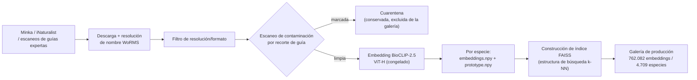
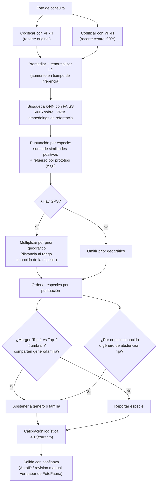
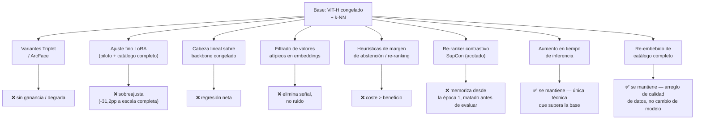
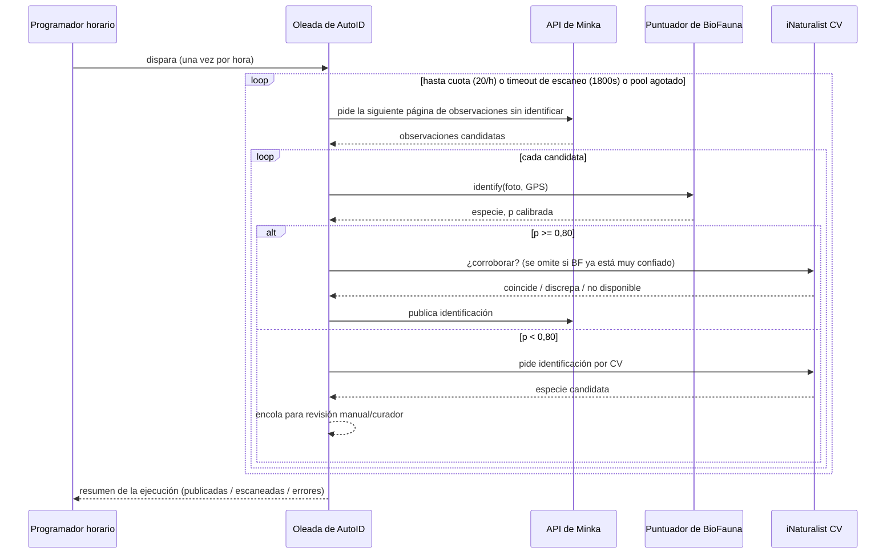
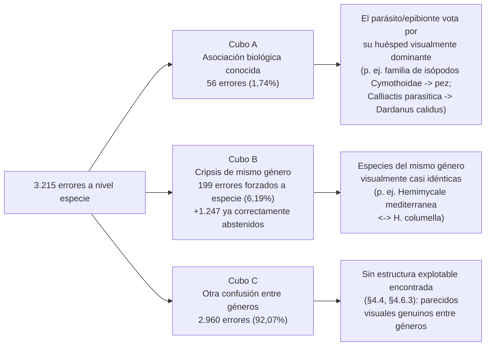

# BioFauna: escalando BioCLIP con ViT-H para la identificación de especies marinas mediterráneas

**Autores**: Gustavo Zafra (Yespi)
**Colaboradores taxonómicos**: Xavier Salvador, Miquel Pontes, Manuel Ballesteros
**Repositorio**: https://github.com/yespi/biofauna
**Sistema en producción**: https://fotofauna.yespi.es
**Versión**: 2026-08-27

> **Nomenclatura.** Este proyecto se desarrolló originalmente bajo el nombre **YOLOFauna** (2024–2026). Se renombró a **BioFauna** cuando la pila de producción se asentó en la recuperación (retrieval) por BioCLIP en vez de la detección por YOLO. Una nota breve de procedencia está en [`docs/HISTORY.md`](../docs/HISTORY.md).

---

## Resumen

Presentamos BioFauna, un sistema de aprendizaje profundo para la identificación automática de fauna marina mediterránea a partir de fotografías. El sistema en producción usa **BioCLIP-2.5 ViT-H** (632M de parámetros, embeddings de 1024 dimensiones) como codificador visual **congelado**, seguido de **k vecinos más cercanos** (k=15) con un refuerzo por similitud a prototipo y un prior geográfico multiplicativo sobre una galería de **762.082 embeddings de imagen en 4.709 especies objetivo**, **aumento en tiempo de inferencia** (query + recorte central al 90%), abstención taxonómica jerárquica, y calibración logística de confianza. Funciona en hardware de consumo (NVIDIA RTX 3060 12GB) y está desplegado en la plataforma de ciencia ciudadana FotoFauna, donde además impulsa una tubería horaria de identificación automática ("AutoID") que publica resultados de alta confianza directamente en la red de ciencia ciudadana Minka.

Sobre un conjunto de calibración fuera de muestra, estratificado por observación y verificado contra fugas (`harvest_calib`, n=12.788), el sistema con una foto por observación alcanza **75,97% de acierto top-1 a nivel especie**, **81,29% género**, y **84,90% familia**. Las predicciones de alta confianza (probabilidad calibrada ≥ 0,80) alcanzan una precisión estimada del **95,3%** con una **cobertura del 57,4%**, el punto de operación usado para la publicación automática. Escalar de BioCLIP ViT-L a ViT-H aportó la mayor ganancia individual (+6,8pp de acierto a nivel especie sobre una cohorte anterior más pequeña); el ajuste de k-NN, un re-embebido a escala de catálogo completo, y el aumento en tiempo de inferencia aportaron cada uno ganancias adicionales, más pequeñas. Cuando una observación tiene más de una foto (25,1% del conjunto de calibración), una fusión tardía sin entrenamiento de los scores kNN por foto eleva el acierto sobre el corpus completo a **76,76% de especie** (+0,79pp) y a **84,70%** (+3,15pp) solo en el subconjunto multi-foto (§4.7); este es ahora el comportamiento en producción. Una búsqueda sistemática de ganancias adicionales mediante ajuste fino del modelo — un ajuste fino LoRA de todo el backbone, una cabeza de proyección lineal sobre el backbone congelado, filtrado de valores atípicos en los embeddings, reajuste del margen de abstención, una heurística de re-ranking motivada biológicamente, y un re-ranker contrastivo Supervised Contrastive acotado a los pares de confusión más difíciles conocidos, este último evaluado bajo un protocolo de kill-switch preregistrado — **no** mejoró la métrica de especie fuera de muestra más allá de lo que ya logra el aumento en tiempo de inferencia; reportamos todos estos como resultados negativos con costes cuantificados, ya que un registro riguroso de lo que no funciona es, en un proyecto mantenido por un único practicante sin equipo dedicado de investigación en ML, tan valioso como lo que sí funciona.

Publicamos el código del servicio de identificación, los artefactos de calibración, y el apéndice de especies como software de código abierto. El backbone de BioCLIP se descarga automáticamente desde HuggingFace. El sistema ha sido validado en producción con publicaciones automáticas revisadas por curadores en Minka.

**Palabras clave**: BioCLIP-2.5, ViT-H, k-NN, clasificación visual de grano fino, biodiversidad marina, ciencia ciudadana, abstención taxonómica, calibración de modelos, mar Mediterráneo

---

## 1. Introducción

### 1.1 El cuello de botella de la identificación de biodiversidad

El mar Mediterráneo es uno de los puntos calientes de biodiversidad del mundo, con más de 17.000 especies marinas — aproximadamente el 7% de la biodiversidad marina global en solo el 0,8% de la superficie oceánica (Coll et al., 2010; Bianchi & Morri, 2000). La identificación precisa de especies es fundamental para el monitoreo de biodiversidad, la investigación ecológica, la planificación de conservación, y las iniciativas de ciencia ciudadana. Sin embargo, la experiencia taxonómica es cada vez más escasa (Hopkins & Freckleton, 2002; Kim & Byrne, 2006).

Las plataformas de ciencia ciudadana como iNaturalist (Van Horn et al., 2018) y Minka (minka-sdg.org) abordan esto mediante la identificación comunitaria, pero las especies raras o taxonómicamente difíciles pueden esperar días o nunca recibir atención experta. En el Mediterráneo, muchos endemismos y guías de campo en idiomas específicos (catalán, español, italiano) intensifican el cuello de botella.

### 1.2 Identificación automática basada en imagen

La identificación automática basada en imagen puede ofrecer sugerencias instantáneas que aceleran la tubería. Los enfoques CNN tradicionales (retos de iNaturalist; Van Horn et al., 2018, 2021) requieren grandes conjuntos etiquetados por especie y luchan con distribuciones de cola larga. Los modelos de visión-lenguaje abren una vía distinta: embeddings preentrenados robustos más recuperación (retrieval) sobre una galería regional.

### 1.3 Modelos de visión-lenguaje para biología

BioCLIP (Stevens et al., 2024) se entrena de forma contrastiva sobre TreeOfLife-450M con estructura textual taxonómica. BioCLIP-2.5 aporta un codificador visual **ViT-H/14** (632M de parámetros, embeddings de **1024 dim**), sustancialmente más fuerte que el ViT-L/14 anterior (428M, 768 dim) usado en nuestros experimentos iniciales.

### 1.4 Qué funcionó (y qué no)

El trabajo temprano de este proyecto (entonces YOLOFauna) exploró el ajuste fino QLoRA de ViT-L bajo una restricción de 12GB de VRAM. Esas ejecuciones o bien fallaron (corrupción de la cabeza de proyección → 1,7% de acierto) o no lograron superar una base k-NN con backbone congelado (~63,9% especie). **Re-embeber la galería con BioCLIP-2.5 ViT-H** elevó el acierto de especie fuera de muestra al **70,6%** (+6,8pp) sin ajuste fino. Una búsqueda posterior en rejilla de k-NN, validada con `harvest_calib` estratificado por observación, seleccionó **k=15**; una expansión y re-embebido a escala de catálogo completo (corrigiendo una brecha de cobertura fotográfica entre archivo/SSD, y más tarde un bug de deduplicación en el conjunto de calibración) llevó la base fiable y verificada contra fugas al 75,8% de especie sobre una cohorte n=12.788 mucho mayor; el **aumento en tiempo de inferencia** — promediar el embedding de cada foto de consulta con el de su propio recorte central al 90% — añadió una ganancia adicional, más pequeña, hasta el **75,97%** actual.

Un amplio abanico de intentos posteriores para extraer más acierto del espacio de embeddings de ViT-H congelado — proyecciones triplet, clasificadores ArcFace, ajuste fino LoRA (tanto a pequeña escala como a escala de catálogo completo), una cabeza de proyección lineal sobre backbone congelado, filtrado de valores atípicos a nivel de embedding, reajuste del margen de abstención taxonómica, una heurística de re-ranking biológicamente motivada para pares parásito/huésped conocidos, recortes de guías de campo expertas, eliminación agresiva de casi-duplicados, y un re-ranker Supervised Contrastive acotado a los pares de confusión de mismo género más difíciles conocidos bajo un protocolo de kill-switch preregistrado — **no** superaron la base de backbone-congelado-más-TTA bajo el mismo protocolo de evaluación (§3.3, §4.4). Por ello presentamos BioFauna como un **sistema de recuperación sobre un backbone congelado robusto con aumento en tiempo de inferencia**, con abstención jerárquica y umbrales de AutoID calibrados, en vez de como una historia de éxito de ajuste fino — y como un ejemplo trabajado de cuándo una búsqueda de ablación amplia y bien instrumentada debe concluir "el codificador congelado es el techo para este régimen de datos" en vez de seguir buscando.

### 1.5 Contribuciones

1. **Re-embebido de la galería con ViT-H a escala de catálogo completo** para fauna marina mediterránea — 762.082 embeddings en 4.709 especies objetivo, unificando un almacén de fotos que antes estaba dividido entre SSD y archivo HDD.
2. **Evaluación estratificada por observación** (`harvest_calib`) como único protocolo de acierto fiable, incluyendo una comprobación de deduplicación contra la propia galería de referencia que detectó y corrigió una fuga real del 42,7% de las muestras en el conjunto de calibración (§3.7).
3. **Ajuste de k-NN con k=15** y **aumento en tiempo de inferencia**, juntas las dos técnicas que mejoraron de forma medible la métrica de acierto de especie fiable.
4. **Retroceso jerárquico / abstención taxonómica** (especie→género→familia), incluyendo reglas de pares crípticos y de géneros que siempre abstienen curadas a mano a partir de literatura taxonómica, añadiendo utilidad taxonómica ponderada más allá del top-1 de especie en bruto.
5. **AutoID calibrado** en p≥0,80 con una precisión estimada de **95,3% / cobertura 57,4%**, integrado en una tubería de publicación automática horaria en FotoFauna, verificado de forma cruzada con iNaturalist CV cuando está por debajo del umbral (§4.2, y el paper compañero de FotoFauna para la vista de cara al usuario).
6. **Un amplio programa cuantificado de ablaciones de resultado negativo** — LoRA a escala de catálogo completo, una cabeza lineal sobre backbone congelado, filtrado de valores atípicos en embeddings, reajuste del margen de abstención, una regla de re-ranking biológica sin oráculo, y un re-ranker Supervised Contrastive acotado con kill-switch preregistrado — documentando que ninguno de ellos eleva el techo de especie fuera de muestra de ViT-H bajo nuestro protocolo, varios con una contabilidad de coste/beneficio completamente desarrollada en vez de un simple pasa/no-pasa (§3.3, §4.4).
7. **Una taxonomía de errores de confusión** (asociación biológica conocida, cripsis de mismo género, otros) que separa las clases de error genuinamente solucionables de las que no lo son, y una demostración de que los priors geográficos no aportan separación adicional relevante para los pares de confusión de mismo género más pesados (§4.6).
8. **Despliegue abierto** en FotoFauna / Minka con validación por curadores.

## 2. Trabajo relacionado

### 2.1 Identificación automática de especies

Los retos de iNaturalist (Van Horn et al., 2018, 2021) han impulsado avances significativos en la clasificación visual de grano fino de organismos. El conjunto de datos iNaturalist 2021 contiene 2,7M de imágenes en 10.000 especies, y los mejores modelos alcanzan >90% de acierto top-1. Sin embargo, estos modelos se entrenan con datos globales y pueden rendir peor en fauna regional específica, particularmente en el Mediterráneo donde muchas especies tienen rangos restringidos y morfologías distintivas.

PlantCLEF (Goëau et al., 2013) y sistemas basados en FishBase han abordado la identificación de plantas y peces respectivamente, pero la identificación exhaustiva de invertebrados — particularmente moluscos, que constituyen 1.014 de nuestras 1.369 especies — sigue siendo un reto por la alta variación intra-clase y similitud inter-clase.

### 2.2 Clasificación visual de grano fino

La clasificación visual de grano fino (FGVC) se centra en distinguir categorías visualmente similares, como especies de aves (Wah et al., 2011), modelos de coche (Krause et al., 2013), o tipos de avión (Maji et al., 2013). Los enfoques clave incluyen:

- **Métodos basados en atención**: dirigir el foco del modelo a regiones discriminativas (Fu et al., 2017; Zheng et al., 2017)
- **Modelos basados en partes**: detectar y comparar partes del objeto (Zhang et al., 2014; Huang et al., 2016)
- **Aprendizaje métrico**: aprender embeddings donde las categorías similares quedan cerca y las distintas lejos (Schroff et al., 2015; Hermans et al., 2017)

Nuestro trabajo extiende FGVC al dominio taxonómico, donde la similitud tiene una estructura jerárquica natural (las especies dentro de un género son inherentemente similares) y el conocimiento de dominio de la literatura taxonómica puede guiar el proceso de aprendizaje.

### 2.3 Modelos de visión-lenguaje

CLIP (Radford et al., 2021) demostró que el preentrenamiento contrastivo sobre 400M de pares imagen-texto produce representaciones visuales versátiles. BioCLIP (Stevens et al., 2024) aplicó este paradigma a datos biológicos, entrenando sobre TreeOfLife-450M con estructura taxonómica. Diferencias clave respecto al CLIP general:

- **Prompts taxonómicos**: codificador de texto entrenado sobre nombres científicos en múltiples rangos
- **Conciencia jerárquica**: el modelo entiende que "Actinia striata" es un tipo de "Actinia" que es un tipo de "Actiniidae"
- **Especies raras**: el codificador de texto de BioCLIP puede representar especies nunca vistas en entrenamiento mediante composición taxonómica

### 2.4 Ajuste fino eficiente en parámetros

El ajuste fino completo de modelos grandes es computacionalmente prohibitivo. Han surgido métodos eficientes en parámetros como alternativas:

- **Capas adaptadoras** (Houlsby et al., 2019): pequeñas capas de cuello de botella insertadas entre bloques transformer
- **Prefix tuning** (Li & Liang, 2021): vectores de prefijo aprendibles antepuestos a las secuencias de entrada
- **LoRA** (Hu et al., 2021): descomposición de bajo rango de las actualizaciones de pesos: W = W₀ + BA, donde B∈ℝ^(d_out×r), A∈ℝ^(r×d_in), r << min(d_in, d_out)
- **QLoRA** (Dettmers et al., 2023): extiende LoRA con cuantización 4-bit NormalFloat del backbone congelado, más doble cuantización y optimizadores paginados

Inicialmente planeamos apoyarnos en QLoRA para la adaptación de dominio bajo un presupuesto de 12GB de VRAM. En la práctica, open_clip + bitsandbytes resultó frágil sobre nuestra pila de BioCLIP, y la **recuperación con ViT-H congelado superó** a los intentos de ajuste fino que pudimos ejecutar de forma fiable. Mantenemos la discusión de LoRA/QLoRA aquí como trabajo relacionado y como resultados negativos documentados (§3.3, §4.4).

### 2.5 Abstención taxonómica

La mayoría de los sistemas de clasificación reportan una única predicción de mejor conjetura. Sin embargo, en contextos taxonómicos, una predicción más gruesa pero correcta (p. ej., género cuando la especie es incierta) suele ser más útil que una precisa pero incorrecta. Este concepto — conocido como clasificación jerárquica con rechazo — se ha explorado en diagnóstico médico (He et al., 2018) y clasificación de documentos (Sun & Lim, 2001).

En biodiversidad, la plataforma iNaturalist muestra una lista de "especies similares" pero no abstiene explícitamente a niveles taxonómicos superiores. Nuestro trabajo formaliza la abstención taxonómica como una regla de decisión basada en el margen de k-NN y la ascendencia taxonómica compartida.

### 2.6 Glosario de técnicas usadas o probadas

Este paper usa varios nombres de técnicas como abreviatura a lo largo del texto; §3 y §4 asumen familiaridad con qué *es* cada una, no solo su nombre. Esta sección es una referencia autocontenida para un lector que conoce la informática de la biodiversidad pero no necesariamente los internos del aprendizaje profundo.

| Término | Qué es | Papel en este proyecto |
|------|-----------|----------------------|
| **ViT (Vision Transformer)** | Una red neuronal que trata una imagen como una rejilla de parches procesados con el mecanismo de atención transformer originalmente desarrollado para texto, en vez de los filtros convolucionales deslizantes de una CNN clásica. | La familia de arquitectura detrás del codificador de imagen de BioCLIP. "ViT-H/14" significa la variante de tamaño "Huge" con parches de 14×14 píxeles. |
| **Preentrenamiento contrastivo estilo CLIP** | Entrenar un codificador de imagen y uno de texto juntos para que los pares imagen/texto que coinciden acaben con vectores de embedding similares y los que no coinciden acaben disímiles — sin necesidad de etiquetas de clase manuales, solo datos emparejados de imagen/leyenda (o imagen/nombre de taxón). | Cómo se preentrenó BioCLIP, sobre pares imagen/nombre científico del Árbol de la Vida, antes de que lo toquemos nosotros. |
| **Embedding** | Un vector de longitud fija de números (1024 de ellos, aquí) que una red neuronal produce para representar una imagen, de forma que imágenes visual/semánticamente similares producen vectores similares. | La unidad sobre la que opera todo en §3.2: cada foto de la galería y cada foto de consulta se convierte en un embedding de 1024 dimensiones, y la identificación es enteramente cuestión de comparar estos vectores. |
| **Backbone congelado** | Usar una red preentrenada para producir embeddings sin actualizar ninguno de sus pesos internos — a diferencia del ajuste fino, que ajusta algunos o todos sobre datos nuevos. | El codificador de BioFauna está congelado en todo momento; toda técnica de §3.3 que sí implicó entrenamiento solo entrenó un pequeño componente añadido, nunca el codificador en sí. |
| **k vecinos más cercanos (k-NN)** | Un método de clasificación sin fase de entrenamiento alguna: para clasificar un elemento nuevo, se buscan los *k* elementos más similares en un conjunto de referencia (por alguna medida de distancia) y se les deja votar. | El clasificador real de BioFauna. No hay una frontera de decisión aprendida — la especie de una consulta se decide por a qué fotos de la galería de referencia está más cerca su embedding. |
| **FAISS** | Una biblioteca (de Meta AI) para búsqueda rápida de vecinos más cercanos sobre colecciones muy grandes de vectores — hace que el paso "encontrar los *k* más similares de 762.082 vectores" del k-NN se ejecute en milisegundos en vez de segundos. | El motor de búsqueda detrás de nuestro paso de k-NN; no es un modelo de aprendizaje automático en sí, es una estructura de datos de indexación/búsqueda. |
| **Prototipo** | El embedding medio de todas las fotos de referencia de una especie (normalizado L2). Un resumen barato de "cómo suele verse esta especie" mucho más rápido de comparar que cada foto de referencia individual. | Se usa como término de refuerzo de similitud junto al voto de k-NN (§3.2.2) — no es el clasificador principal. |
| **ArcFace** | Una función de pérdida (originalmente de reconocimiento facial) que entrena una red para colocar los embeddings de la misma clase sobre una hiperesfera compartida con un amplio margen angular respecto a otras clases — diseñada para hacer los embeddings *más* separables por clase que el entrenamiento contrastivo simple. | Probada como cabeza entrenable sobre los embeddings congelados de ViT-H (§3.3); empatada con k-NN simple, sin ganancia real. |
| **Triplet loss** | Un objetivo de entrenamiento que acerca un embedding "ancla" a un ejemplo "positivo" (misma clase) y lo aleja de un ejemplo "negativo" (clase distinta), un triplete cada vez. | Probada en varias variantes sobre ViT-H (§3.3); degradó el acierto. |
| **LoRA (Low-Rank Adaptation)** | Un método de ajuste fino eficiente en parámetros: en vez de actualizar una matriz de pesos completa, aprende una pequeña corrección de bajo rango sobre ella, reduciendo drásticamente el número de parámetros entrenables y el cómputo/memoria necesarios para ajustar un modelo grande. | Probada tanto como piloto pequeño como a escala de catálogo completo (§3.3); la ejecución a escala completa causó la peor regresión de cualquier experimento de este paper. |
| **QLoRA** | LoRA combinado con cuantización de 4 bits del modelo base congelado, para que el ajuste fino de modelos grandes quepa en memoria de GPU limitada (aquí, 12GB). | El enfoque de ajuste fino planeado originalmente para este proyecto; abandonado tras problemas de incompatibilidad y desajuste de arquitectura, antes de que produjera nunca una comparación justa (§3.3). |
| **Supervised Contrastive Loss (SupCon)** | Una generalización de la pérdida triplet/contrastiva que trata *todos* los ejemplos de la misma clase en un lote como positivos y todo lo demás como negativos, en vez de elegir a mano un positivo y un negativo cada vez. | La función de pérdida detrás del experimento de re-ranker acotado (§3.3, §4.4) — el intento de ajuste fino más reciente y más cuidadosamente controlado de este paper, también negativo. |
| **Calibración logística** | Ajustar un modelo de regresión logística para mapear las puntuaciones en bruto de un clasificador a probabilidades genuinas — "el modelo dice 80%" debería significar "correcto el 80% de las veces", algo que las puntuaciones de similitud en bruto no garantizan por sí solas. | Cómo BioFauna convierte las puntuaciones de similitud de k-NN en la confianza calibrada usada para la decisión de publicar/no publicar de AutoID (§3.6). |
| **ECE (Expected Calibration Error) / Brier score / NLL** | Métricas estándar de *qué tan bien calibrado* está un conjunto de probabilidades predichas (no de qué tan *acertadas* son las predicciones) — cuanto más bajas, mejor en las tres. | Usadas en §3.6 para juzgar el calibrador, independientemente de las cifras de acierto de especie. |
| **AUC (Area Under the ROC Curve)** | Una métrica estándar de qué tan bien ordena un clasificador las predicciones correctas frente a las incorrectas por confianza, independiente de cualquier umbral específico. | Reportada junto a las métricas de calibración en §3.6.3. |
| **Aumento en tiempo de inferencia (TTA)** | Ejecutar la inferencia sobre más de una versión transformada de la misma entrada (aquí: la foto original y su propio recorte central al 90%) y combinar los resultados, sin ningún entrenamiento de por medio. | La única técnica en todo el historial de experimentos de este paper que mejoró de forma fiable la métrica de acierto de confianza. |
| **Evaluación estratificada por observación** | Dividir los datos de evaluación por la "observación" de ciencia ciudadana (un encuentro completo, a menudo con varias fotos del mismo organismo) en vez de por foto individual, de forma que fotos casi-duplicadas del mismo sujeto nunca acaben repartidas entre los conjuntos de entrenamiento y de prueba. | La disciplina de evaluación usada para cada cifra de §4 (§3.7) — su ausencia es lo que causó la fuga del conjunto de calibración descrita allí. |

## 3. Métodos

### 3.1 Conjunto de datos

#### 3.1.1 Fuentes y composición

Nuestro corpus de imágenes contiene aproximadamente **768.000 fotografías** en **4.709 especies objetivo mediterráneas**. La galería de identificación en producción embebe **762.082 imágenes** para el subconjunto de especies con fotos suficientes para un prototipo fiable (las especies por debajo de ese umbral permanecen en el catálogo, marcadas para descarga dirigida, pero aún no son miembros activos de la galería).

| Fuente | Papel |
|--------|------|
| Minka (minka-sdg.org) | Ciencia ciudadana regional, foco mediterráneo |
| iNaturalist (inaturalist.org) | Observaciones de grado investigación y comunitarias |
| Guías expertas (Pontes, Salvador, Ballesteros) | Láminas recortadas + etiquetas OCR (MiniCPM-V); medido por separado — ver §4.4 |

Los nombres se cruzan con **WoRMS**. Las imágenes se filtran por resolución mínima y validez de formato.

#### 3.1.2 Literatura experta

Las listas de especies y notas morfológicas se validaron contra Ballesteros (2007), Cervera et al. (2004), Salvador et al. (2022), y el trabajo de campo de Pontes et al. (GROC/OPK). El OCR de guías escaneadas (525/525 páginas con MiniCPM-V 4.5) produjo recortes etiquetados usados en experimentos de ablación (§4.4).

#### 3.1.3 Control de calidad de datos

Se encontraron y corrigieron dos problemas sistemáticos de calidad de datos como parte de la tubería estándar, no como apagafuegos puntual, y ahora se comprueban de forma rutinaria:

- **Contaminación por recortes de guía de campo.** Una minoría de fotos son recortes de láminas de guías de campo escaneadas que muestran varias especies no relacionadas en la misma página, etiquetadas en bloque bajo un único taxón al descargarlas. Un escaneo de todo el catálogo en busca del patrón de nombre de archivo usado por esta vía de ingesta encontró **107 especies afectadas, 1.088 fotos contaminadas (0,14% del corpus)**. Las fotos afectadas se ponen en cuarentena (se conservan en disco, se excluyen de la galería) en vez de borrarse, y las especies afectadas se re-embeben. De las 20 especies con peor rendimiento en tiers inferiores en el momento de la auditoría, las 8 que estaban contaminadas mejoraron todas tras la cuarentena (media +33pp de acierto de especie, hasta +56pp); las 12 no contaminadas no cambiaron — confirmando que su bajo acierto es confusión visual genuina y no un artefacto de etiquetado, un control importante para interpretar los resultados de ablación en §3.3.
- **Autofuga del conjunto de calibración.** El recolector de evaluación fuera de muestra descarga de forma independiente fotografías reservadas y comprueba la similitud de embedding de cada candidata contra toda la galería de referencia antes de aceptarla, rechazando cualquiera por encima de un umbral de casi-duplicado (originalmente pensado mediante un manifiesto de IDs de observación ya usados; ahora mediante similitud directa de embedding, tras descubrir que la comprobación basada en manifiesto había dejado de funcionar silenciosamente tras una migración de infraestructura y dejó que el 42,7% de una cohorte de evaluación duplicara su propia clave de respuestas — ver §3.7).

*Figura 1. Tubería de datos desde la observación en bruto hasta la galería de producción. El escaneo de contaminación (§3.1.3) y la comprobación de fuga del conjunto de calibración (§3.7) son dos controles de calidad independientes y complementarios — el primero protege la galería de referencia/entrenamiento, el segundo protege el conjunto de evaluación usado para medir todo en §4.*

### 3.1.4 Tiers de especies

El catálogo de 4.709 especies se reparte en tres tiers, usados para priorizar el esfuerzo de recolección de datos y para reportar el acierto con un grano más fino que una única cifra global:

| Tier | Definición | Especies | Muestras de evaluación (n) | Acierto de especie |
|------|-----------|---------|-------------------|-------------------|
| 0 | Heterobranquios (babosas de mar/nudibranquios y afines) — el grupo taxonómico en el que se especializan nuestros colaboradores expertos (§3.1.2), e históricamente el grupo fotografiado de forma más consistente por los usuarios | 636 | 824 | 81,4% |
| 1 | Todas las demás especies marinas (peces, cnidarios, esponjas, crustáceos, algas, etc.) — el tier numéricamente dominante y taxonómicamente más amplio | 1.527 | 7.282 | 70,6% |
| 2 | Especies terrestres o incidentales (aves, insectos, plantas costeras, etc.) que aparecen en fotos de FotoFauna pese al enfoque marino de la plataforma, y se identifican en vez de rechazarse | 826 | 4.682 | 83,4% |

El Tier 1 es a la vez el tier más grande y el más difícil — coherente con la taxonomía de errores de §4.6, donde la clase de error dominante (Cubo C) es confusión visual entre géneros concentrada exactamente en este grupo amplio y heterogéneo. Los Tiers 0 y 2 puntúan más alto por razones distintas: el Tier 0 se beneficia de un conjunto de especies más pequeño, mejor curado y validado por expertos; el Tier 2 se beneficia de que los sujetos terrestres suelen ser más fáciles de fotografiar con buen enfoque y luz que un organismo marino parcialmente oculto. La lista de pares de confusión del experimento SupCon (§3.3) recoge especies de los tres tiers, incluyendo pares de Tier 2 (p. ej. dos cultivares de *Prunus*, dos especies de libélula) que son crípticos en el mismo sentido estadístico que un par marino de Tier 1, aunque no tengan nada que ver con el mar.

### 3.2 Arquitectura del modelo (producción)

#### 3.2.1 Codificador: BioCLIP-2.5 ViT-H

Codificador de producción: **`hf-hub:imageomics/bioclip-2.5-vith14`**

| Propiedad | Valor |
|----------|-------|
| Arquitectura | ViT-H/14 |
| Parámetros | ~632M |
| Dim. del embedding | **1024** (normalizado L2) |
| Entrada | 224×224 |
| Estado de entrenamiento en BioFauna | **Congelado** (sin LoRA en producción) |

Huella de inferencia en RTX 3060: el servicio de BioFauna usa ≈ **4,4 GB** de VRAM (codificador + índice FAISS/k-NN).

#### 3.2.2 Identificación: k-NN sobre embeddings de imagen

1. Embeber el recorte de consulta con ViT-H, promediado con el embedding de su propio recorte central al 90% (aumento en tiempo de inferencia, §3.3).
2. Recuperar los **k=15** embeddings de galería más cercanos (coseno / producto interno sobre vectores normalizados L2) vía FAISS.
3. Agregar votos/puntuaciones por especie, más un refuerzo por similitud a prototipo (`ARC_WEIGHT=3.0`); prior geográfico multiplicativo opcional cuando hay GPS.
4. Aplicar retroceso jerárquico cuando el margen de especie es bajo (`MIN_RISK`, `FAMILY_MARGIN≈0,06–0,08` según revisiones de producción), incluyendo reglas fijas de pares crípticos y de géneros que siempre abstienen (§3.5.5).
5. Mapear características → P(correcto) calibrada mediante regresión logística (`fit_calib.py`).

*Figura 2. Tubería de identificación en producción (a fecha de 2026-08-27). El aumento en tiempo de inferencia (arriba) y los dos disparadores de abstención (abajo) se describen en §3.3 y §3.5.5 respectivamente.*

**Por qué k=15.** Búsquedas internas en rejilla sugerían que valores pequeños de k (≈10) maximizan el acierto, pero las particiones a nivel de foto inflan las cifras absolutas. `harvest_calib` estratificado por observación seleccionó **k=15** como el equilibrio de producción entre acierto y cobertura de abstención (k=8 midió peor, 71,0%). Revalidado dos veces más en agosto de 2026 (rejilla k=[10,15,20,30,40,50,70], descenso monótono pasado k=15, sin cambios) — ver EXPERIMENTS.md.

#### 3.2.3 Disposición de prototipos / galería

Por directorio de especie bajo `dataset/patterns/`: `embeddings.npy` (embeddings de referencia en bruto) y `prototype.npy` (embedding medio, normalizado L2, usado para el término de refuerzo en §3.2.2). Galería de producción: **4.709 especies / 762.082 embeddings**, reconstruida en un índice FAISS cada vez que los embeddings subyacentes cambian de forma material (remediación de contaminación, descargas dirigidas para especies con déficit de fotos — ver §3.1.3, §4.6).

### 3.3 Ajuste fino y ablaciones posteriores

Este es el conjunto completo y cronológico de intentos de elevar el techo de acierto de especie fuera de muestra más allá de la base de ViT-H congelado + k-NN, evaluados bajo el mismo protocolo estratificado por observación en todo momento (§3.7). Dos entradas — el aumento en tiempo de inferencia y el re-embebido a escala de catálogo completo — se mantienen en producción; todo lo demás es un resultado negativo documentado.

| Experimento | Resultado (fuera de muestra salvo que se indique) | Veredicto |
|------------|--------------------------------------|---------|
| QLoRA, ViT-L + cabeza de proyección entrenable | **1,7%** especie (catastrófico) | ❌ |
| QLoRA, base BioCLIP-2 ViT-L (768-dim) | Desajuste de modelo base vs. ViT-H de producción (1024-dim) — arquitectura incompatible | ❌ descartado antes de evaluar |
| Triplet sobre embeddings de ViT-L | Ayudó históricamente en la era ViT-L; **no** es la historia de ViT-H | ❌ superado |
| Triplet sobre ViT-H (8 variantes) | **Degrada** −0,7 a −7pp | ❌ |
| ArcFace sobre ViT-H congelado | **71,4%** vs k-NN **71,6%** (empate); las particiones por foto inflan la validación interna | ❌ sin ganancia |
| LoRA+ArcFace, piloto de 100 especies (bug de evaluación corregido) | **+0,0pp** | ❌ |
| **LoRA + cabeza ArcFace, escala de catálogo completo** (1.358 de 2.934 especies ajustadas, últimos 4 bloques del backbone entrenables) | **−31,2pp** de especie sobre la evaluación de catálogo completo (75,4%→44,2%) | ❌ sobreajuste severo al subconjunto ajustado, degradó el espacio de embeddings compartido para el resto |
| **Cabeza de proyección lineal ("sidecar")** sobre ViT-H congelado, catálogo completo | Especie −0,6pp, género −1,1pp, familia −1,1pp vs. base, pese a que un mini-conjunto autoconsistente en tiempo de entrenamiento sugería +2,6pp | ❌ regresión neta en los tres niveles; incluso una variante de menor riesgo con backbone congelado perdió frente al k-NN simple |
| Recortes expertos ponderados en la galería | **70,8%** (−0,9pp vs 71,7%) | ❌ |
| Deduplicación de casi-duplicados (cos>0,99) | **70,1%** (−1,6pp) — las ráfagas *ayudan* al k-NN | ❌ |
| **Filtrado de valores atípicos en prototipo/embedding** (distancia mediana-coseno, umbrales 0,5 y 0,7) | 73,93% (−0,21pp) a 0,5; 72,69% (−1,45pp) a 0,7 — degradación monótona | ❌ filtraba variación intra-especie legítima, no ruido |
| **Margen de abstención de mismo género ampliado** para los pares crípticos más pesados (0,06→0,10 y más) | El paso más pequeño probado ya cuesta 152 predicciones de especie correctas para recuperar 17 errores (≈9:1 en contra) | ❌ |
| **Regla de re-ranking "preferir el epibionte" sin oráculo** para pares parásito/huésped y epibionte/sustrato conocidos | 216 activaciones sobre el conjunto de error completo: 64 corregidas, 116 rotas (fotos genuinas del huésped con el compañero como ruido en el top-k) — neto −0,23pp especie, −0,26pp género | ❌ por debajo del umbral preregistrado de +0,3pp |
| **Re-ranker Supervised Contrastive (SupCon)**, backbone congelado, acotado a los 20 pares crípticos más pesados, kill-switch preregistrado | La pérdida de validación por pareja divergió de forma monótona desde la época 1 en **dos regímenes de hiperparámetros independientes**; el kill-switch se invocó antes de tocar siquiera el conjunto de evaluación | ❌ memorización, no generalización — ver §4.4 para el protocolo completo |
| **Aumento en tiempo de inferencia** (embedding de consulta promediado con su propio recorte central al 90%) | **+0,21 a +0,75pp** de especie según el protocolo de evaluación (ambos positivos) | ✅ **se mantiene en producción** — la única técnica que supera la base de k-NN con backbone congelado |
| **Re-embebido completo SSD+archivo HDD, catálogo ampliado a 4.709 especies objetivo** | 71,7% (cohorte de 810 especies) → 75,4%/75,8% (n=22.332/n=12.788 respectivamente, sobre el catálogo actual mucho mayor) | ✅ **se mantiene en producción** — cerró una brecha de cobertura fotográfica, no es un cambio de modelo |

*Figura 3. Cada vía intentada para mejorar la base de ViT-H congelado + k-NN, y su veredicto. De ocho direcciones independientes probadas, dos se mantuvieron — y ninguna es una técnica de ajuste fino.*

**Lección.** Con ViT-H, la capacidad ya es alta en relación con el número de imágenes disponibles por especie en este catálogo (muchas especies tienen del orden de decenas a unos pocos cientos de fotos de referencia); el aprendizaje métrico con backbone congelado, los adaptadores ligeros, e incluso un re-ranker contrastivo acotado entrenado solo sobre los pares más difíciles mostraron todos el mismo modo de fallo — memorización en vez de generalización — sin importar cuánta parte de la red se tocara. Consideramos cerrada la vía de "reentrenar o ajustar algo sobre este espacio de embeddings" para el régimen de datos actual; las dos cosas que sí funcionaron fueron un truco en tiempo de inferencia (TTA) y un arreglo de completitud de datos (re-embebido completo), no un cambio de entrenamiento. QLoRA con bitsandbytes sigue siendo incompatible con la vía de open_clip ViT-H que usamos; torchao/hqq queda como trabajo futuro si algún día un régimen de datos distinto justifica revisitar el ajuste fino.

### 3.5 Regla de abstención taxonómica

#### 3.5.1 Motivación

Los sistemas de clasificación estándar reportan una única "mejor conjetura" a nivel de especie. Sin embargo, en contextos taxonómicos, muchas especies dentro de un género son visualmente indistinguibles:

- *Actinia striata* vs *Actinia mediterranea*: se distinguen solo por sutiles bandas en los tentáculos
- *Berthella aurantiaca* vs *Berthellina edwardsii*: "no se pueden diferenciar a simple vista" (guía de campo GROC)
- Varias especies de *Cuthona* / *Trinchesia*: requieren examen microscópico

En estos casos, reportar "género *Actinia*" es más útil que reportar incorrectamente "especie *Actinia striata*".

#### 3.5.2 Regla de decisión

La regla de abstención taxonómica es:

1. Calcular el margen $m = s_1 - s_2$ entre las similitudes coseno de top-1 y top-2
2. Si $m < \tau$ Y top-1 y top-2 comparten el mismo **género** → abstener a **género**
3. Si $m < \tau$ Y top-1 y top-2 comparten la misma **familia** → abstener a **familia**
4. En otro caso → reportar **especie**

donde el umbral $\tau = 0,06$ se seleccionó para optimizar el acierto taxonómico ponderado sobre el conjunto de calibración. El umbral se validó barriendo valores de 0,02 a 0,10:

| τ | Especie | Género | Familia | Acierto ponderado |
|---|---------|-------|--------|------------------|
| 0,02 | 1.936 | 282 | 209 | 71,0% |
| 0,04 | 1.764 | 370 | 293 | 71,7% |
| **0,06** | **1.737** | **383** | **307** | **71,8%** |
| 0,08 | 1.726 | 387 | 314 | 71,9% |
| 0,10 | 1.721 | 387 | 319 | 71,9% |

La estabilidad en este rango indica que la regla es robusta a la elección del umbral. Elegimos 0,06 como la opción más conservadora que alcanza un acierto casi máximo.

#### 3.5.3 Acierto por nivel

Sobre el conjunto de calibración, la regla de abstención logra:

| Nivel | Predicciones | Correctas | Acierto |
|-------|------------|---------|----------|
| Especie | 1.737 (71,6%) | 1.127 | 64,9% |
| Género | 383 (15,8%) | 341 | **89,0%** |
| Familia | 307 (12,6%) | 275 | **89,6%** |

De las 383 abstenciones a nivel género, 238 (62,1%) habrían sido correctas a nivel especie — son casos donde el modelo sabía la especie correcta pero fue apropiadamente conservador. Las 145 restantes (37,9%) fueron errores genuinos a nivel especie donde la abstención evitó una identificación de especie incorrecta.

#### 3.5.4 Comparación con otras reglas

Evaluamos cuatro reglas de abstención alternativas, ninguna de las cuales mejoró el enfoque basado en margen:

- **Riesgo mínimo**: calcula el coste taxonómico esperado para cada nivel usando la distribución completa de k-NN → valores de riesgo saturados cuando los votos están dispersos (todos ~2,7, cara o cruz)
- **Concentración de votos**: abstiene cuando ≥70% de la masa de voto de k-NN está en el mismo género/familia → umbral demasiado estricto (dispara solo en el 2% de las imágenes)
- **Calibración multinivel**: usa modelos logísticos separados para especie/género/familia → las características no discriminan entre niveles (todas las probabilidades calibradas se mueven juntas)
- **Comprobación de familia en top-3**: extiende la regla de margen para considerar el top-3 en vez del top-2 → añade cero casos (ninguna imagen donde el top-2 difiere en familia pero el top-3 coincide)

### 3.5.5 Reglas de abstención por conocimiento experto

Además de la regla de abstención basada en margen, incorporamos conocimiento taxonómico experto de literatura publicada y guías de campo. La base de datos GROC/OPK (Ballesteros, Pontes, Salvador) contiene afirmaciones explícitas sobre especies que "no se pueden diferenciar a simple vista" o "requieren análisis de laboratorio para distinguir".

Codificamos este conocimiento como reglas de abstención duras:

**Pares indistinguibles** (7 pares): cuando los dos primeros resultados de k-NN son un par conocido como indistinguible, el sistema abstiene al género compartido independientemente del margen de similitud:

| Especie A | Especie B | Género compartido | Fuente |
|-----------|-----------|-------------|--------|
| *Berthella aurantiaca* | *Berthellina edwardsii* | — | GROC: "no es poden diferenciar a simple vista" |
| *Discodoris stellifera* | *Geitodoris planata* | — | GROC: "no es poden diferenciar a simple vista" |
| *Actinia striata* | *Actinia mediterranea* | *Actinia* | Complejo de especies crípticas clásico |
| *Thordisa filix* | *Thordisa amanzii* | *Thordisa* | GROC: "no es pot diferenciar de manera visual" |

**Géneros de abstención fija** (10 géneros): las especies de estos géneros se fuerzan a identificación a nivel género porque requieren examen microscópico, análisis genético, o disección para una identificación de especie fiable:

- *Doto*, *Trinchesia*, *Cuthona*, *Tenellia*, *Runcina*, *Eubranchus*, *Fjordia*, *Coryphella*, *Cuthonella*, *Rubramoena*

Estas reglas se aplican como paso de postprocesado tras la identificación por k-NN, con máxima prioridad (sobrescriben tanto la abstención basada en margen como el retroceso zero-shot).

### 3.6 Calibración de confianza

#### 3.6.1 Por qué importa la calibración

Las puntuaciones de similitud coseno del k-NN **no son probabilidades calibradas**. Una similitud de 0,938 puede corresponder a una identificación correcta el 95% de las veces para una especie pero solo el 30% para otra. La calibración mapea estas puntuaciones en bruto a estimaciones de probabilidad bien calibradas, interpretables directamente como "probabilidad de que la identificación sea correcta".

#### 3.6.2 Características de calibración

Entrenamos un calibrador de regresión logística sobre 10 características derivadas de la búsqueda k-NN:

| Característica | Descripción | Justificación |
|---------|-------------|-----------|
| `s1` | Similitud coseno del top-1 | Señal principal |
| `s2` | Similitud coseno del top-2 | Indicador de ambigüedad |
| `margin` | s1 - s2 | Brecha de confianza |
| `votes1` | Fracción de votos de k-NN para el top-1 | Medida de consenso |
| `share1` | Cuota de puntuación del top-1 | Dominancia relativa |
| `lognref1` | log(1 + tamaño del conjunto de referencia) | Cantidad de datos |
| `meansim` | Similitud media entre los k-NN | Calidad global del match |
| `kclasses` | Número de especies distintas entre los k-NN | Dispersión de la distribución |
| `same_genus_12` | Binario: ¿comparten género el top-1 y el top-2? | Coherencia taxonómica |
| `same_family_12` | Binario: ¿comparten familia el top-1 y el top-2? | Coherencia de nivel superior |

Las características se estandarizan (z-score) antes de la regresión logística.

#### 3.6.3 Entrenamiento y evaluación

El calibrador se reajusta en cada cambio material del puntuador de producción (el más reciente, tras añadir el aumento en tiempo de inferencia, §3.3), sobre una partición de validación reservada extraída de la cohorte completa de `harvest_calib` (n=12.788, estratificada por observación). La partición de validación de calibración a nivel especie actual tiene 3.902 muestras.

##### Métricas de calibración (actuales, nivel especie)

Se compararon tres modelos candidatos: similitud coseno **en bruto**, un escalado **Platt** de una sola característica sobre `s1`, y el modelo logístico **completo** de 10 características descrito arriba.

| Modelo | AUC | ECE | Brier Score | NLL |
|-------|-----|-----|------------|-----|
| Similitud coseno en bruto | 0,767 | 0,091 | 0,165 | 0,499 |
| Escalado Platt (solo `s1`) | 0,767 | 0,043 | 0,149 | 0,463 |
| **Logístico completo de 10 características (producción)** | **0,881** | **0,028** | **0,110** | **0,350** |
| Nivel familia, modelo completo (para comparar) | 0,897 | 0,022 | 0,079 | 0,262 |

El modelo completo se elige en todos los niveles. Su Error de Calibración Esperado (ECE ≈ 0,03) indica una calibración casi perfecta: cuando el modelo dice "80% de confianza", acierta aproximadamente el 81% de las veces (ver tabla de fiabilidad abajo) — una mejora sustancial sobre la similitud coseno en bruto (ECE=0,091) y sobre el escalado Platt de solo `s1` (ECE=0,043), lo que muestra que las características adicionales derivadas de k-NN (margen, cuota de voto, coherencia taxonómica, tamaño del conjunto de referencia) aportan información de calibración real más allá de la similitud del top-1 por sí sola.

##### Fiabilidad por rango de confianza (nivel especie, actual)

| Rango | N | P declarada | Acierto real |
|-----|---|-----------|----------------|
| 0,0-0,1 | 13 | 0,072 | 0,077 |
| 0,1-0,2 | 159 | 0,160 | 0,132 |
| 0,2-0,3 | 205 | 0,246 | 0,268 |
| 0,3-0,4 | 208 | 0,354 | 0,375 |
| 0,4-0,5 | 203 | 0,451 | 0,502 |
| 0,5-0,6 | 205 | 0,552 | 0,576 |
| 0,6-0,7 | 270 | 0,655 | 0,711 |
| 0,7-0,8 | 400 | 0,754 | 0,807 |
| 0,8-0,9 | 557 | 0,851 | 0,905 |
| 0,9-1,0 | 1.682 | 0,969 | 0,968 |

La calibración se comporta bien en todo el rango de probabilidad; las mayores brechas (rango declarado 0,4-0,7) van todas en la dirección *conservadora* — el acierto real supera a la probabilidad declarada — que es la dirección más segura en la que estar mal calibrado para un sistema de auto-publicación.

#### 3.6.4 Puntos de operación

AutoID usa **p≥0,80 → una precisión estimada del 95,3% con una cobertura del 57,4%** (reajustado desde p≥0,90/95,5%/30,2% de cobertura para elevar el volumen de publicación automática; ver el paper compañero de FotoFauna, §6, para la justificación operativa y el sistema de oleadas de AutoID que consume este umbral).

| p_species ≥ | Precisión (real) | Cobertura | N | IC 95% |
|-------------|-------------------|----------|---|--------|
| 0,50 | 88,8% | 79,8% | 3.114 | [87,7%, 89,9%] |
| 0,60 | 91,0% | 74,6% | 2.909 | [90,0%, 92,1%] |
| 0,70 | 93,1% | 67,6% | 2.639 | [92,2%, 94,1%] |
| 0,75 | 94,3% | 63,2% | 2.466 | [93,4%, 95,2%] |
| **0,80** | **95,3%** | **57,4%** | 2.239 | [94,4%, 96,2%] |
| 0,85 | 96,1% | 50,5% | 1.971 | [95,2%, 96,9%] |
| 0,90 | 96,8% | 43,1% | 1.682 | [96,0%, 97,6%] |
| 0,95 | 98,5% | 30,3% | 1.184 | [97,8%, 99,1%] |
| 0,98 | 99,1% | 21,6% | 844 | [98,4%, 99,6%] |

Bajar el umbral de operación de 0,90 a 0,80 cuesta una precisión estimada de 1,5 puntos porcentuales (96,8%→95,3%) a cambio de un aumento relativo del 33% en la fracción de candidatos que superan el umbral (43,1%→57,4%) — leído directamente de esta tabla, sin necesidad de una nueva evaluación.

### 3.7 Protocolo de evaluación

Todas las **cifras de acierto principales** usan `harvest_calib.py`: fotografías reservadas por **ID de observación**, embebidas con el codificador de producción (incluyendo el aumento en tiempo de inferencia), identificadas con el puntuador de producción, y luego puntuadas contra etiquetas de curadores/comunidad. Fichero canónico actual: `dataset/calib_raw_k15_clean_20260825_tta.jsonl` (n=12.788) → `fit_calib.py` → `calibration.json`.

| Regla | Justificación |
|------|-----------|
| Estratificación por observación | Evita fugas de ráfagas/casi-duplicados entre entrenamiento/prueba |
| Protocolo fijo entre ablaciones | Misma cosecha al comparar técnicas |
| No fiarse de particiones 80/20 por foto | Infla la rejilla de ArcFace/k en ~10pp |
| **Comprobación de deduplicación por similitud de galería** | El recolector embebe cada candidata reservada y la rechaza si su similitud coseno con algo ya presente en la galería de referencia supera un umbral de casi-duplicado, además de excluir por ID de observación |

**Por qué la comprobación de similitud, no solo la exclusión por ID de observación.** Una lista de exclusión por ID de observación es tan buena como el manifiesto contra el que se comprueba. En este proyecto, ese manifiesto apuntaba a una ruta de directorio de imágenes heredada, abandonada durante una migración anterior, así que la comprobación no coincidía silenciosamente con nada durante más de un año sin dar error — una búsqueda en rejilla de k-NN que producía una curva de acierto implausible, mejorando de forma monótona hacia k=1 (un clasificador k-NN sano debería empeorar, no mejorar, cuando k se reduce hacia 1) fue el primer síntoma, y se rastreó hasta que **el 42,7% de una cohorte de evaluación de 22.332 fotos estaba embebida en su propia galería de referencia** — la misma foto sirviendo como consulta y como su propio vecino más cercano en la clave de respuestas. La corrección (comprobación directa de similitud de embedding contra la galería en vivo, independiente de cualquier manifiesto) es ahora una parte permanente de la tubería de cosecha en vez de un parche puntual, y el efecto sobre **el ajuste de producción k=15 específicamente** fue pequeño (≈1pp — diluir el autoemparejamiento trivial de un duplicado entre los votos de 15 vecinos lo diluye casi por completo; el efecto era mucho mayor a k bajo, que es lo que lo hizo visible en primer lugar) — lo bastante pequeño como para que ninguno de los veredictos de ablación de §3.3 dependa de ello, pero lo bastante grande como para que ya no confiemos en una exclusión solo por ID para este tipo de evaluación.

## 4. Resultados

### 4.1 Acierto principal (ViT-H, k=15)

| Nivel | Acierto |
|-------|----------|
| **Especie (top-1)** | **75,97%** |
| Género | **81,29%** |
| Familia | **84,90%** |

Progresión (cada fila evaluada bajo el protocolo actual sobre la cohorte disponible en cada momento — ver §3.7):

| Sistema | Especie | Notas |
|--------|---------|-------|
| ViT-L + k-NN (heredado) | 63,9% | Base de producción anterior |
| ViT-H + k=25 | 70,6% | Tras el re-embebido completo, cohorte de 810 especies |
| ViT-H + k=15 | 71,7% | Ajuste de k-NN, misma cohorte |
| ViT-H + k=15, re-embebido de catálogo completo | 75,4% / 75,8% | Catálogo ampliado a 4.709 especies objetivo (n=22.332 / n=12.788 verificado contra fugas) |
| **ViT-H + k=15 + TTA (actual)** | **75,97%** | Añadido el aumento en tiempo de inferencia, calibración reajustada |

### 4.2 Punto de operación de AutoID

Con **p ≥ 0,80** calibrado: una precisión estimada del **95,3%**, con una **cobertura del 57,4%** (configuración de producción, reajustado desde p≥0,90/95,5%/30,2% — ver §3.6.4). Por debajo del umbral, FotoFauna verifica de forma cruzada con iNaturalist CV antes de publicar; ver el paper compañero de FotoFauna para la vista de cara al usuario de este flujo y el §4.3 siguiente para la mecánica de programación/rendimiento.

Calidad de calibración (logística sobre características de k-NN, nivel especie): ECE ≈ **0,028**, AUC ≈ **0,881** (§3.6.3).

### 4.3 Retroceso jerárquico y el sistema de oleadas de AutoID

El margen / abstención por taxón compartido más las reglas curadas a mano de pares crípticos y géneros de abstención fija (§3.5) dan una salida de género/familia correcta cuando la identificación a nivel especie no es segura, añadiendo utilidad taxonómica ponderada más allá de la cifra de top-1 de especie de arriba. En producción, este mismo puntuador también impulsa **AutoID**, un trabajo por lotes horario que escanea observaciones de Minka a la espera de identificación y auto-publica las que superan el umbral de confianza:

*Figura 4. Mecánica de la oleada de AutoID (vista técnica — ver el paper de FotoFauna para lo que experimenta el usuario final). El umbral de confianza por planificación y el tope de publicación por hora viven en una tabla de base de datos, no en una constante fija, así que se pueden reajustar sin desplegar código; el timeout de escaneo por oleada (subido de 900s a 1800s en el mismo reajuste que el umbral de confianza) es un límite a nivel de código de cuánto tiempo pasa la oleada paginando por Minka antes de rendirse, independiente de si se ha alcanzado la cuota horaria.*

Una auditoría de rendimiento (2026-08-27) encontró la oleada publicando a aproximadamente una cuarta parte de su tope configurado de 20/hora. Dos causas, ambas corregidas: el timeout de escaneo de 900 segundos cortaba la oleada antes de que pudiera paginar suficientes candidatas para llenar la cuota (subido a 1800s), y el umbral de confianza de 0,90 era conservador respecto a lo que la curva de calibración de §3.6.4 realmente soporta (bajado a 0,80). Tras el arreglo, la oleada alcanza su cuota de forma fiable (verificado en cinco ejecuciones horarias consecutivas, 18-30 páginas de resultados de Minka escaneadas por ejecución).

### 4.4 Resumen de ablaciones

Ver §3.3 para la tabla completa y el diagrama de árbol de decisión (Figura 3). En una frase: de ocho direcciones independientes probadas más allá de la progresión ViT-L→ViT-H→k=15, solo el **aumento en tiempo de inferencia** y el **re-embebido de catálogo completo** mejoraron la métrica fiable; seis intentos de ajuste fino/re-ranking (tres variantes de pérdida/arquitectura, filtrado de valores atípicos en embeddings, reajuste del margen de abstención, una heurística de re-ranking biológica, y un re-ranker contrastivo SupCon acotado con kill-switch preregistrado) no lo hicieron.

### 4.5 Despliegue en el mundo real

Desplegado en https://fotofauna.yespi.es vía `fauna_api` → BioFauna `:8090`.

- La inferencia toma típicamente <1s por recorte en una RTX 3060 (el TTA duplica el coste de cada pasada hacia delante — dos imágenes por consulta en un único lote — pero se mantiene muy por debajo del presupuesto de 1s).
- Publicación automática solo cuando la confianza calibrada es alta; en otro caso, verificación cruzada con iNaturalist CV (§4.3).
- La revisión por curadores de las publicaciones de AutoID ha mostrado históricamente altas tasas de confirmación; el registro continuo de correcciones de curadores sigue siendo una tarea de ingeniería abierta (§5.4).

### 4.6 Modos de fallo y una taxonomía de errores estructurada

#### 4.6.1 Modos de fallo comunes

Examinar el ~24% de las muestras donde el top-1 de especie es incorrecto (n=3.215 de 22.332 predicciones a nivel especie, no abstenidas) revela varios patrones recurrentes, que ahora descomponemos en tres cubos en vez de una lista plana, para separar las clases de error genuinamente solucionables de las que no lo son:

*Figura 5. Taxonomía de errores sobre el conjunto completo de errores a nivel especie no abstenidos. El Cubo C domina en volumen pero ha resistido cada arreglo estructural intentado (§3.3); los Cubos A y B son pequeños en conjunto pero se corresponden con hipótesis identificables y comprobables.*

1. **Complejos de especies crípticas (Cubo B, y el grueso del Cubo C)**: especies del mismo género, o entre géneros, visualmente casi idénticas. Ejemplos: especies de *Actinia* (patrones sutiles en tentáculos), especies de *Cuthona*/*Trinchesia* (requieren examen microscópico), especies de *Berthella* ("no se pueden diferenciar a simple vista" según las guías de campo), *Hemimycale mediterranea*/*H. columella* (el par de confusión más pesado del catálogo actual).
2. **Asociación biológica conocida (Cubo A)**: un parásito o epibionte fotografiado junto a su huésped, donde el voto de k-NN se ve arrastrado hacia el organismo visualmente dominante en el encuadre — p. ej. la familia de isópodos Cymothoidae (parásitos de peces) votando por el pez, o la anémona *Calliactis parasitica* votando por el cangrejo ermitaño *Dardanus calidus* al que va subida. Confirmado mediante inspección manual de fotos como coocurrencia genuina, no un artefacto de etiquetado.
3. **Pose y oclusión**: organismos fotografiados desde ángulos inusuales, parcialmente ocultos, o en orientaciones no estándar.
4. **Confusión de fondo**: cuando el organismo ocupa una porción pequeña de la imagen, el fondo (rocas, algas, arena) puede dominar el embedding; la detección de organismo (YOLOv8) mitiga pero no elimina esto.
5. **Variación por estadio vital**: juveniles, coloración reproductiva, o especímenes dañados pueden verse muy distintos de la forma adulta típica en la galería.
6. **Escasez genuina de datos**: distinta de la cripsis — una especie cuyo rival de confusión también tiene pocas imágenes de referencia. Comprobado directamente (no asumido) para las veinte especies con peor rendimiento en tiers inferiores: la mayoría tenía rivales de confusión con 500-1.000+ embeddings de referencia ya, es decir, no tenían déficit de datos; exactamente tres sí lo tenían, y se cerraron mediante descarga dirigida (mantenimiento adyacente a §3.1.3, no un cambio de modelo).

**Ejemplos trabajados.** La tabla siguiente da los pares de confusión principales por recuento de errores en bruto, cada uno verificado contra el mecanismo que ilustra (inspeccionado foto a foto para el Cubo A; recuento de embeddings de referencia comprobado para la afirmación de "sin déficit de datos" en el Cubo B):

| Especie real | Especie predicha | Errores (de 3.215) | Cubo | Embeddings de referencia del rival | Mecanismo |
|---|---|---|---|---|---|
| *Hemimycale mediterranea* | *H. columella* | 30 | B | 801 | Esponja del mismo género, visualmente casi idéntica; rival bien poblado, sin déficit de datos |
| *Calliactis parasitica* | *Dardanus calidus* | 10 | A | 1.000 | Anémona fotografiada subida a la concha del cangrejo ermitaño; el cangrejo es visualmente dominante |
| *Bopyrus crangorum* | *Palaemon elegans* | 8 | A | — | El parásito de branquia vota por su camarón huésped |
| *Nerocila bivittata* | *Symphodus tinca* | 8 | A | 1.000 | El parásito de pez (Cymothoidae) vota por el pez al que está adherido |
| *Halopteris filicina* | *H. scoparia* | 10 | B | 919 | Hidrozoo del mismo género, indistinguible en fotos de campo típicas |
| *Oulastrea crispata* | *Cladocora caespitosa* | 10 | C | — | Parecido de coral entre géneros, sin arreglo estructural conocido |
| *Anilocra physodes* | *Diplodus vulgaris* | 6 | A | 1.000 | El parásito de pez vota por su pez huésped |

Cuatro de estos siete pares (*Calliactis*/*Dardanus*, *Bopyrus*/*Palaemon*, *Nerocila*/*Symphodus*, *Anilocra*/*Diplodus*) son Cubo A y se confirmaron cada uno abriendo la foto de consulta real: en todos los casos, el organismo etiquetado (el parásito o epibionte) está genuinamente presente y correctamente identificado por un humano, pero comparte el encuadre con un huésped más grande y visualmente más destacado hacia el que se ve arrastrado el voto de k-NN.

#### 4.6.2 Los priors geográficos no rescatan el Cubo B

Dado que el puntuador de producción ya aplica un prior geográfico multiplicativo cuando hay GPS (§3.2.2), comprobamos si tiene, o podría ganar, poder discriminativo real para los pares de cripsis de mismo género más pesados, calculando el centroide de coordenadas de observación de cada especie y la razón entre la distancia entre centroides y la dispersión media intra-especie. Los dos pares responsables de la mayor parte del Cubo B — *Hemimycale mediterranea*/*H. columella* (razón 0,42) y *Halopteris filicina*/*H. scoparia* (razón 0,29) — están **completamente solapados geográficamente** (una razón por debajo de ~0,7 indica solapamiento de hábitat indistinguible solo por localización), confirmando que son cripsis visual genuina sin atajo geográfico. De las cuarenta especies comprobadas en los veinte pares más pesados, doce no tenían ninguna coordenada de observación en caché; rellenarlas reveló separación real y utilizable para exactamente dos pares más (*Mesophyllum lichenoides*/*M. expansum*, razón 1,62; *Lutraria magna*/*L. lutraria*, razón 2,28) — un hallazgo pequeño y registrado, aún no incorporado a la regla de abstención, e insuficiente para mover la métrica principal.

#### 4.6.3 Patrones taxonómicos

El acierto varía sistemáticamente entre grupos taxonómicos:

| Grupo | Acierto | Notas |
|-------|----------|-------|
| Especies grandes y distintivas | >80% | Fácilmente identificables (Pinna nobilis, Octopus vulgaris) |
| Nudibranquios coloridos | 60-80% | Bueno pero confundible dentro del género |
| Moluscos pequeños | 40-60% | A menudo requieren microscopía de concha |
| Algas | 50-70% | Alta plasticidad morfológica |
| Peces | 55-75% | La variación de pose es un reto |

### 4.7 Fusión multi-foto por observación (2026-08-27)

Las observaciones de Minka a menudo llevan más de una foto del mismo individuo. En el conjunto de calibración n=12.788, 3.209 observaciones (25,1%) tienen dos o más fotos (media 1,45 fotos/observación en total, hasta 20 en una sola observación); las 9.579 restantes (74,9%) son de una sola foto. Todos los resultados reportados arriba usan solo la primera foto de cada observación. Comprobamos si las fotos adicionales — ya recolectadas, sin necesitar nuevo etiquetado ni reentrenamiento — aportan señal explotable por sí solas.

Se compararon dos estrategias de fusión contra el baseline monofoto, ambas aplicadas puramente en tiempo de inferencia sobre la tubería kNN congelada de §3.2:

- **Fusión tardía (late fusion)**: ejecutar la tubería completa por foto (voto kNN + refuerzo de prototipo) de forma independiente sobre cada una de las N fotos de una observación, y promediar los N vectores de score por especie resultantes antes del prior geográfico (aplicado una sola vez sobre el vector promediado, ya que es a nivel de observación e invariante por foto) y de la lógica de abstención/calibración.
- **Fusión temprana (early fusion)**: promediar los N embeddings de query L2-normalizados (cada uno ya aumentado por TTA según §4.4) antes de la búsqueda kNN, ejecutando la tubería de recuperación una sola vez sobre el embedding fusionado.

| Estrategia | Acierto especie, corpus completo (n=12.788) | Acierto especie, solo subconjunto multi-foto (n=3.209) |
|---|---|---|
| Baseline (solo primera foto) | 75,97% | 81,55% |
| **Fusión tardía (media de scores)** | **76,76%** (+0,79pp) | **84,70%** (+3,15pp) |
| Fusión temprana (media de embedding) | 76,62% (+0,65pp) | 84,14% (+2,59pp) |

La fusión tardía gana en ambos cortes y se desplegó en el endpoint de producción `/identify`: acepta opcionalmente una lista de hasta 5 fotos por petición (las peticiones monofoto no se ven afectadas — con N=1 la tubería fusionada se reduce algebraicamente al cálculo monofoto preexistente exacto, verificado tanto matemáticamente como contra peticiones de prueba reales). A diferencia de todos los intentos de ajuste fino de §4.4/§3.3, esto no es un cambio de modelo — el codificador ViT-H congelado, el índice kNN, la curva de calibración y las reglas de abstención quedan intactos; es un ensemble puro en tiempo de inferencia sobre evidencia ya presente en los datos de origen. Es, junto con el aumento en tiempo de inferencia, una de solo dos técnicas en la historia de este proyecto que baten el baseline de backbone congelado, y la única que no cuesta cómputo GPU adicional por unidad de ganancia de acierto más allá de lo que las propias fotos extra requieren (sin reembeber, sin reconstruir el índice, sin reentrenar).

### 4.8 El re-ranking por consenso taxonómico no arregla los errores cross-grupo (2026-08-27)

El §4.6.1 encontró que el 32,02% de los errores del baseline (984 de 3.073, 7,69% del
corpus n=12.788 completo) cruzan grupos taxonómicos gruesos entre la especie predicha y la
real ("iconic taxon" de iNaturalist: Mollusca, Actinopterygii, Cnidaria, Plantae,
Porifera, etc. — conocido para 2.930 de las 4.709 especies del catálogo). Comprobamos si
penalizar candidatos kNN cuyo grupo difiere del grupo dominante entre los k=20 vecinos más
cercanos de una consulta podía recuperar parte de esa masa de error, enteramente en
tiempo de inferencia sobre la tubería congelada.

**Método.** Para cada consulta, se calculan los votos de los k=20 vecinos más cercanos
(similitud coseno, antes del refuerzo de prototipo del score de producción k=15); se busca
el grupo con mayor similitud positiva acumulada ("grupo dominante") y su proporción sobre
el total; por encima de un umbral de disparo, se multiplican los scores k=15+refuerzo de
los candidatos de *otros* grupos conocidos por una penalización proporcional (1,0 en el
umbral, hasta 0,15 al 100% de consenso — nunca cero absoluto). Un primer pase con un
umbral duro conservador y típico en la literatura (70%) y un factor de supresión fijo
(0,10) arregló **0 de 979** errores cross-grupo (2 predicciones previamente correctas
rotas; 75,94%→75,92%).

**Auditoría.** La inspección manual de 5 fallos reales (volcado completo del top-20 crudo
de vecinos por caso) explicó el resultado nulo: en el 80% de los 979 errores cross-grupo,
el grupo dominante entre los vecinos **ya coincide con la predicción errónea** — el propio
paso de recuperación vota por el grupo equivocado, algo que ningún filtro de grupo a
posteriori puede arreglar por construcción (solo puede suprimir candidatos no-dominantes,
y aquí la respuesta errónea *es* la dominante). En el resto de casos, el grupo correcto
estaba presente pero solo como pluralidad del 35-45%, muy por debajo del umbral original
del 70% — en 2 de los 5 casos auditados la propia especie real aparecía en la lista de
k=20 con similitud competitiva (0,73-0,75) pero perdía frente a otra especie del catálogo,
muy duplicada, por peso acumulado de voto.

**Barrido de umbral.** Un segundo pase probó umbrales de disparo al 0% (pluralidad
simple), 35%, 40% y 70%, todos con la misma penalización proporcional (no binaria):

| Umbral | Acierto especie (n=12.788) | Δ vs. baseline | Errores Cubo C arreglados (de 979) | Predicciones correctas rotas |
|---|---|---|---|---|
| Baseline (sin filtro) | 75,97%* | — | 0 | — |
| Pluralidad (sin mínimo) | 75,82% | −0,12pp | 31 | 47 |
| 35% | 75,84% | −0,09pp | 17 | 29 |
| 40% | 75,87% | −0,07pp | 16 | 25 |
| 70% | 75,92% | −0,02pp | 0 | 2 |

*Baseline reproducido para esta ejecución de la tubería: 75,94%, dentro del ruido del 75,97% oficial.*

Bajar el umbral sí desbloquea arreglos genuinos (0→31), confirmando el diagnóstico de la
auditoría — pero la tasa de rotura supera a la de arreglo en todos los puntos del barrido,
sin excepción. El mecanismo no puede separar un vecino de grupo minoritario legítimo
(convergencia morfológica entre taxones no emparentados) de uno espurio, porque ambos son
idénticos para un voto de grupo grueso: en un caso auditado, la liebre de mar *Aplysia
depilans* (Mollusca) y el platelminto *Thysanozoon brocchii* (Platyhelminthes) — phyla no
emparentados, pero ambos organismos bentónicos de cuerpo blando y coloración similar —
representan el 79,9% de la masa del vecindario k=20 de una consulta a favor del grupo
*incorrecto*. Suprimir evidencia "externa" solo por etiqueta taxonómica penaliza la
similitud visual cross-grupo genuina exactamente con la misma frecuencia que penaliza el
ruido.

**Veredicto: cerrado, sin cutover.** La señal subyacente es real (§4.6.1) y el modo de
fallo quedó totalmente caracterizado (sesgo de mayoría en el propio paso de recuperación,
no un artefacto de ranking arreglable reponderando), pero un filtro ciego a nivel de
Phylum/Clase no puede explotarla — el siguiente candidato es limpiar la *entrada* visual
del modelo (excluir fondo/sustrato antes de que el codificador lo vea) en vez de re-
rankear a posteriori un embedding posiblemente ya contaminado.

### 4.9 La fusión ROI multi-crop limpia la entrada y recupera errores cross-grupo (2026-08-27, en producción)

Continuación directa del §4.8: si el propio paso de recuperación kNN ya vota por el grupo
taxonómico equivocado porque la *entrada* del codificador está contaminada por
fondo/sustrato, limpiar el recorte antes de que BioCLIP-2.5 lo vea — en vez de re-rankear
a posteriori un embedding posiblemente ya contaminado — es el punto de intervención
mecánicamente correcto.

**Método.** Tres estrategias de embedding por foto, comparadas sobre el corpus completo
n=12.788 (una sola vista cada una, sin aumento en tiempo de test, para aislar limpiamente
el efecto del recorte — este baseline por tanto *no* es directamente comparable a la
cifra oficial del 75,97% con TTA): global (100% del encuadre); recorte central estricto
(65% de cada dimensión lineal, eliminando ~35% del borde); y una fusión ponderada 50/50 de
ambas, re-normalizada L2, con una única búsqueda kNN sobre el vector fusionado.

| Estrategia | Acierto especie (n=12.788) | Δ vs. global | Errores cross-grupo arreglados (de 1.038) | Predicciones correctas rotas |
|---|---|---|---|---|
| Global (100%, sin TTA) | 75,21% | — | 0 | — |
| Recorte central (65%) solo | 75,81% | +0,60pp | 186 | 624 |
| **Fusión 50/50 (global + recorte 65%)** | **76,84%** | **+1,63pp** | 130 | 266 |

El recorte estricto solo sí recupera señal real, pero a un coste alto — descartar el
contexto periférico sin criterio rompe 624 predicciones previamente correctas,
presumiblemente especies donde el contexto circundante (sustrato, huésped epibionte,
estructura colonial) es genuinamente informativo y no ruido. La fusión conserva ambas
señales y consigue un intercambio mucho más sano: **+1,63pp netos, 130 de 1.038 errores
cross-grupo taxonómico (§4.6.1) recuperados limpiamente, solo 266 rotos** — más del doble
de la ganancia que el TTA anterior de recorte al 90% consiguió sobre su propio baseline
sin TTA (+0,75pp).

**Desplegado a producción.** El mecanismo de TTA de producción ya calculaba exactamente
esta operación — promediar los embeddings L2-normalizados de dos vistas con igual peso y
re-normalizar — para un recorte central al 90%, más suave. El arreglo fue un cambio de un
solo parámetro: `CROP_FRAC_ROI = 0.65` sustituyendo a `0.9`, sin tocar nada más del
código. Corre por foto dentro de la tubería de late fusion multi-foto (§4.7) exactamente
igual que el TTA anterior — kNN, refuerzo de prototipo, geo-prior, abstención bayesiana de
mínimo riesgo, calibración, penalización de pares crípticos y excepciones taxonómicas no
se ven afectados, ya que todos operan sobre el embedding fusionado que reciban, venga de
donde venga. *N*=1 se reduce exactamente al caso de una sola foto. Verificado en vivo tras
el reinicio: peticiones de 1 y 2 fotos devuelven ambas predicciones correctas con el
`num_photos_processed` esperado; `/health` sano; sin fuga de memoria ni de GPU.

**Una salvedad metodológica.** La cifra del 76,84% y la del 76,76% de late fusion
multi-foto (§4.7) se midieron cada una de forma aislada contra su propio baseline — la
primera contra un baseline de una sola vista sin TTA, la segunda contra el antiguo TTA de
recorte al 90%. Ambos mecanismos corren juntos en producción ahora (la fusión ROI por
foto alimenta la late fusion entre fotos), pero el acierto combinado sobre el corpus
completo no se ha re-medido de forma independiente sobre n=12.788. Reportamos ambas cifras
con honestidad en vez de sumarlas.

## 5. Discusión

### 5.1 La escala del backbone gana al ajuste fino ligero (aquí)

La ganancia dominante vino de **usar un codificador congelado más fuerte** (ViT-H) y **ajustar el hiperparámetro de recuperación k**, no del entrenamiento de adaptadores. Esto no implica que BioCLIP no se pueda ajustar finamente en general; significa que bajo una GPU de 12GB, las restricciones de open_clip, y una galería de dominio ya grande, **la recuperación sobre ViT-H satura cerca del ~72% de especie** en nuestro conjunto mediterráneo reservado.

### 5.2 La higiene de evaluación importa más que perseguir el leaderboard

Las particiones a nivel de foto y un filtrado de referencia con bugs produjeron ganancias ilusorias de LoRA (+3,4pp) que desaparecieron tras la corrección. Recomendamos la cosecha estratificada por observación como opción por defecto para sistemas de galería alimentados por ráfagas de ciencia ciudadana.

### 5.3 La abstención taxonómica sigue siendo útil

Incluso cuando el top-1 de especie se estanca, los retrocesos a género/familia y las reglas de indistinguibilidad expertas mejoran la **utilidad de decisión** para la ciencia ciudadana.

### 5.4 Limitaciones

1. El top-1 de especie sigue lejos del rendimiento experto en taxones crípticos — y, según la taxonomía de errores de §4.6, la clase de error dominante (Cubo C, 92% del error restante) ha resistido cada arreglo estructural intentado hasta ahora, incluyendo un ensayo de aprendizaje contrastivo bien instrumentado y preregistrado.
2. La cobertura de galería es desigual; algunos endemismos mediterráneos siguen siendo escasos en iNaturalist, aunque el catálogo ahora rastrea y puede dirigirse explícitamente a especies por debajo del umbral de prototipo fiable (§3.1.1).
3. Los recortes expertos y las etiquetas OCR no ayudaron al k-NN — la señal puede necesitar una fusión distinta (p. ej., re-ranking con VLM) más que una simple ponderación de galería.
4. La telemetría de corrección de curadores aún no es un bucle de entrenamiento cerrado.
5. La generalización geográfica fuera del Mediterráneo no está probada. Dentro del Mediterráneo, el prior geográfico no aporta esencialmente separación adicional para los pares de confusión de mismo género más pesados (§4.6.2) — no es un sustituto de la señal visual donde la señal visual no existe.

### 5.5 Trabajo futuro

1. Calibrar / evaluar los embeddings de **DINOv3** ya extraídos (1.301 especies) como codificador alternativo — el programa de ablación de §3.3 descarta exprimir más de *este* ViT-H congelado mediante entrenamiento, pero no descarta un backbone distinto.
2. Si se revisita el ajuste fino, solo con sustancialmente más imágenes por especie confundida de las que el catálogo actual aporta para sus pares más difíciles, dado el modo de fallo de memorización consistente observado en tres arquitecturas independientes (§3.3).
3. **Re-ranker VLM** sobre los casos críticos del top-3, como fuente de señal alternativa que no requiere entrenamiento.
4. Un **registro de corrección de curadores** en producción como la verdadera métrica de acierto en vivo.
5. Continuar la normalización de sinónimos taxonómicos (WoRMS).
6. Extender el rellenado de priors geográficos (§4.6.2) al resto de la lista de pares crípticos y, si aparecen más pares separables, incorporarlos a la regla de abstención.

## 6. Conclusión

BioFauna identifica fauna marina mediterránea recuperando vecinos en un espacio de embeddings de BioCLIP-2.5 ViT-H, aumentado con aumento en tiempo de inferencia y abstención jerárquica calibrada. Alcanza **75,97% / 81,29% / 84,90%** de acierto top-1 de especie/género/familia sobre un conjunto reservado de 12.788 fotos, estratificado por observación y verificado contra fugas, y soporta publicación automática revisada por curadores en Minka con una precisión estimada del 95,3% y una cobertura del 57,4%. Las ganancias que importaron fueron **escalar el backbone, ajustar k, completar la cobertura de galería, y el aumento en tiempo de inferencia** — no el ajuste fino: una búsqueda amplia, sistemática, y cuando fue posible preregistrada, sobre ocho técnicas independientes de ajuste fino y re-ranking (§3.3), incluyendo tres arquitecturas genuinamente distintas (LoRA de todo el backbone, una cabeza lineal sobre backbone congelado, y un re-ranker contrastivo sobre backbone congelado acotado a los pares de confusión más difíciles conocidos), convergió en el mismo modo de fallo — memorización en vez de generalización — y ninguna mejoró la métrica fiable fuera de muestra. Publicamos el sistema, este registro de resultados negativos, y el apéndice de especies/taxonomía de errores como software de código abierto para uso de ciencia ciudadana autoalojada e investigación.

## Agradecimientos

Agradecemos a Xavier Salvador (xasalva), Miquel Pontes, y Manuel Ballesteros su experiencia taxonómica y décadas de trabajo de campo documentando opistobranquios mediterráneos. Sus listas de especies publicadas (Ballesteros 2007; Salvador et al. 2022) y las bases de datos GROC/OPK (opistobranquis.org) aportaron datos de validación y descripciones morfológicas esenciales.

También agradecemos a las comunidades de Minka e iNaturalist — particularmente a los fotógrafos que contribuyeron los cientos de miles de imágenes de nuestra galería. El comité editorial de WoRMS aportó la columna vertebral taxonómica que asegura la consistencia nomenclatural.

Los modelos BioCLIP / BioCLIP-2.5 fueron desarrollados por Samuel Stevens y colegas y están disponibles vía HuggingFace. QLoRA fue desarrollado por Tim Dettmers y colegas en la Universidad de Washington. Ambas líneas de trabajo se publican bajo licencias de código abierto permisivas que hicieron posibles estos experimentos.

## Disponibilidad de datos

El paquete de modelo de BioFauna (patrones de galería, datos de calibración, catálogo de especies, priors geográficos) está disponible en https://github.com/yespi/biofauna. El backbone de producción se descarga automáticamente desde HuggingFace (`hf-hub:imageomics/bioclip-2.5-vith14`). Las imágenes de entrenamiento no se pueden redistribuir por licencia, pero se pueden obtener de forma independiente desde las APIs de iNaturalist y Minka usando los IDs de taxón dados en el apéndice de especies.

## Referencias

1. Stevens, S., Wu, J., Thompson, M.J., Campolongo, E.G., Song, C.H., Carlyn, D.E., Dong, L., Dahdul, W.M., Stewart, C., Berger-Wolf, T., Chao, W.L., & Su, Y. (2024). BioCLIP: A Vision-Language Model for the Tree of Life. *Proceedings of the IEEE/CVF Conference on Computer Vision and Pattern Recognition (CVPR)*.

2. Dettmers, T., Pagnoni, A., Holtzman, A., & Zettlemoyer, L. (2023). QLoRA: Efficient Finetuning of Quantized Language Models. *Advances in Neural Information Processing Systems (NeurIPS)*.

3. Hu, E.J., Shen, Y., Wallis, P., Allen-Zhu, Z., Li, Y., Wang, S., Wang, L., & Chen, W. (2021). LoRA: Low-Rank Adaptation of Large Language Models. *International Conference on Learning Representations (ICLR)*.

4. Radford, A., Kim, J.W., Hallacy, C., Ramesh, A., Goh, G., Agarwal, S., Sastry, G., Askell, A., Mishkin, P., Clark, J., Krueger, G., & Sutskever, I. (2021). Learning Transferable Visual Models From Natural Language Supervision. *International Conference on Machine Learning (ICML)*.

5. Van Horn, G., Mac Aodha, O., Song, Y., Cui, Y., Sun, C., Shepard, A., Adam, H., Perona, P., & Belongie, S. (2018). The iNaturalist Species Classification and Detection Dataset. *CVPR*.

6. Van Horn, G., Cole, E., Beery, S., Wilber, K., Belongie, S., & Mac Aodha, O. (2021). Benchmarking Representation Learning for Natural World Image Collections. *CVPR*.

7. Schroff, F., Kalenichenko, D., & Philbin, J. (2015). FaceNet: A Unified Embedding for Face Recognition and Clustering. *CVPR*.

8. Dosovitskiy, A., Beyer, L., Kolesnikov, A., Weissenborn, D., Zhai, X., Unterthiner, T., Dehghani, M., Minderer, M., Heigold, G., Gelly, S., Uszkoreit, J., & Houlsby, N. (2021). An Image is Worth 16x16 Words: Transformers for Image Recognition at Scale. *ICLR*.

9. Hermans, A., Beyer, L., & Leibe, B. (2017). In Defense of the Triplet Loss for Person Re-Identification. *arXiv:1703.07737*.

10. Coll, M., Piroddi, C., Steenbeek, J., Kaschner, K., Ben Rais Lasram, F., et al. (2010). The Biodiversity of the Mediterranean Sea: Estimates, Patterns, and Threats. *PLoS ONE*, 5(8), e11842.

11. Bianchi, C.N. & Morri, C. (2000). Marine Biodiversity of the Mediterranean Sea: Situation, Problems and Prospects for Future Research. *Marine Pollution Bulletin*, 40(5), 367-376.

12. Ballesteros, M. (2007). Lista actualizada de los opistobranquios (Mollusca: Gastropoda: Opisthobranchia) de las costas catalanas. *SPIRA*, 2(3), 163-188.

13. Cervera, J.L., Calado, G., Gavaia, C., Malaquias, M.A.E., Templado, J., Ballesteros, M., García-Gómez, J.C., & Megina, C. (2004). An annotated and updated checklist of the opisthobranchs (Mollusca: Gastropoda) from Spain and Portugal. *Boletín del Instituto Español de Oceanografía*, 20(1-4), 1-122.

14. Salvador, X., Lázaro, J., & Fuentes, M.A. (2022). Invertebrats marins de la Vall del Ridaura. Postprint. Digital CSIC.

15. Hopkins, G.W. & Freckleton, R.P. (2002). Declines in the numbers of amateur and professional taxonomists: implications for conservation. *Animal Conservation*, 5(3), 245-249.

16. Kim, K.C. & Byrne, L.B. (2006). Biodiversity loss and the taxonomic bottleneck: emerging biodiversity science. *Ecological Research*, 21, 794-810.

17. Houlsby, N., Giurgiu, A., Jastrzebski, S., Morrone, B., De Laroussilhe, Q., Gesmundo, A., Attariyan, M., & Gelly, S. (2019). Parameter-Efficient Transfer Learning for NLP. *ICML*.

18. Li, X.L. & Liang, P. (2021). Prefix-Tuning: Optimizing Continuous Prompts for Generation. *ACL*.

19. He, K., Zhang, X., Ren, S., & Sun, J. (2016). Deep Residual Learning for Image Recognition. *CVPR*.

20. Fu, J., Zheng, H., & Mei, T. (2017). Look Closer to See Better: Recurrent Attention Convolutional Neural Network for Fine-Grained Image Recognition. *CVPR*.

21. Wah, C., Branson, S., Welinder, P., Perona, P., & Belongie, S. (2011). The Caltech-UCSD Birds-200-2011 Dataset. *Technical Report CNS-TR-2011-001*.

22. Sun, A. & Lim, E.P. (2001). Hierarchical Text Classification and Evaluation. *IEEE International Conference on Data Mining*.

23. Goëau, H., Bonnet, P., Joly, A., Bakić, V., Barbe, J., Yahiaoui, I., Selmi, S., Carré, J., Barthélémy, D., Boujemaa, N., Molino, J.F., Duché, G., & Péronnet, A. (2013). Pl@ntNet Mobile App. *ACM Multimedia*.

24. Khosla, P., Teterwak, P., Wang, C., Sarna, A., Tian, Y., Isola, P., Maschinot, A., Liu, C., & Krishnan, D. (2020). Supervised Contrastive Learning. *Advances in Neural Information Processing Systems (NeurIPS)*.

---

*Paper en preparación. Versión 2026-08-27. Traducción de la versión en inglés (`01_biofauna.md`), que es la referencia autorizada en caso de discrepancia. Revistas objetivo: Biodiversity Data Journal, PeerJ, o Ecological Informatics.*
