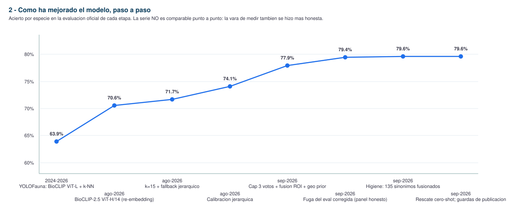

# BioFauna: a frozen BioCLIP-2.5 ViT-H retrieval system for Mediterranean marine identification

**Author**: Gustavo Zafra (Yespi)
**Taxonomic contributors**: Xavier Salvador, Miquel Pontes, Manuel Ballesteros
**Repository**: https://github.com/yespi/biofauna
**Live system**: https://fotofauna.yespi.es
**This version**: 2026-10-02 (update boxes and §5.1 added to the 2026-09-14 snapshot)

> **Naming.** Developed as YOLOFauna (2024–mid-2026); renamed BioFauna when production settled on BioCLIP retrieval rather than YOLO detection. Provenance: [`docs/HISTORY.md`](../docs/HISTORY.md).

---


**Update 2026-09-29 — field evaluation expanded to 76,585 rows, observer-level leakage purged, realm segmentation.** Two mining rounds extended the field evaluation from 62,408 to **76,585 rows** (round 1: +11,156 rows at 84.8% accuracy; round 2: +4,691 rows at 87.8%). A reviewer-grade audit measured **observation/observer leakage**: 2.17% of rows (1,595) shared an observation id or an observer with the reference gallery of their own species; excluding them changes accuracy by only **−0.14 pp**, so the operating figure is not materially inflated. Final segmented accuracy: **82.34% overall** (76,585 rows), marine 80.37%, terrestrial 93.37%, aves 92.22%, foranea 82.08%. The `realm` field (marine / terrestrial / aves / foranea) was added to the catalog as **metadata for segmented statistics** — it does **not** filter identification or publication, since Minka includes birds and terrestrial organisms. **Composition of the figure (review of 29-Sep):** the original evaluation set (60,743 rows) scores **81.18%**, comparable with earlier versions; the 15,842 mined rows score 85.5% and 89.9% in the two rounds, but on the 1,785 species that have both kinds of rows the accuracy is equivalent (86.8% mined vs 86.1% original). The overall increase therefore reflects the species mix, not a model change (the model did not change). All mined rows passed the same leakage filter (observation, observer, embedding similarity ≥ 0.98). **Real precision of AutoID publications** (500 historical publications, 493 verifiable against later third-party identifications on Minka): **96.6%** (95% CI 94.5–97.8); by calibrated confidence band 85% (0.83–0.85, n=27), 93% (0.85–0.90), 95.5% (0.90–0.95), 99% (≥0.95, n=252). **Composition of the 82.34%.** It pools three blocks: the original evaluation set (60,743 rows, **81.18%**, the figure comparable with every earlier version), mining round 1 (11,154 rows after the purge, 85.49%) and round 2 (4,688 rows, 89.87%). Within the 1,785 species that have rows in both the original and the mined blocks, accuracy is 86.1% vs 86.8% (+0.7 pp): at equal species the mined rows are not easier, and the rise comes mostly from composition (species with larger pools). **When comparing with earlier versions, use 81.18%.**

**Update 2026-10-02 — a two-judge crop rescue, a field report by block, and what the numbers do not say.** (1) The crop fallback of 2026-10-01 was rebuilt after a real failure: a quadrant crop that contained only background was identified as an alga with p = 0.96 and published for a photo whose subject (a fan mussel) sat in the centre. The rescue now runs in tiers: the full image first; then two centred crops (17% and 25% padding) acting as judges, **one passing identification (p ≥ 0.83, species rank) is enough**, two different passing species give no verdict; quadrants are a last resort and are discarded when the full image or a centred crop points at another species with p ≥ 0.5. Back-test on 454 photos with third-party ground truth whose full image was not publishable: the previous scheme added 48 identifications (41 correct, 7 wrong); centred judges alone add 64 (55 correct, 9 wrong); judges plus guarded quadrants add **72 (63 correct, 9 wrong, 87.5%)**; requiring both judges to agree is worse (21 added, 16 correct). Raising the crop threshold to 0.93 does not raise precision (36 added, 30 correct): a crop's score is not calibrated like the full-image score. The thresholds were chosen on the same photos that measure them, so 87.5% is optimistic. The 19 rescues published so far have no third-party reaction yet, so **their real precision is unknown**. (2) Genus-level AutoID publications are enabled; family-level ones are paused after two of the first three reviewed (both published as the same family) were wrong because one photo showed two unrelated animals and the other did not look like the family. (3) Photos that are flat and blurred, or dark, turbid and blurred, are skipped before identification; on 747 photos with ground truth, precision does not depend on sharpness (92–96% in all four quartiles), so this gate removes unreadable photos rather than errors. (4) The model now runs in fp16 with an int8 k-NN on the GPU (3.3–3.9 GB of VRAM instead of 6.4–6.6 GB) with identical decisions on 1,000 photos. (5) A 23-vector extension of *Prunus dulcis* (merged from its synonym) was promoted to production: only that species changed, the index is aligned (1,118,321 vectors), and no independent accuracy measurement exists yet.

**Update 2026-10-01 — GPU k-NN and a crop fallback for low-confidence photos.** (1) Profiling showed that 50% of the `/identify` time was the exact FAISS search on a 4-core CPU (0.5 s per query); the index vectors now live on the GPU in fp16 and the returned neighbours are re-scored in fp32 against the CPU index, so the similarities are the exact ones (golden test: no differences on 40 photos). Six identifications of one photo went from 4.4 s to 0.97 s. (2) A crop fallback acts only when the full image yields no publishable identification (calibrated p below the threshold, or a rank above species): four quadrants, a 17%-padding centre, a saliency crop and a 40% centre are identified, and a species is rescued when at least two steps agree with p ≥ 0.93 (three if its genus differs from the full-image top-1); ties (<0.05) abstain. It can only add publications. On 500 real, still unidentified AutoID-queue photos the publishable identifications rose from 35 to 48; on 747 photos with third-party ground truth the added identifications were correct in 85.7% (42/49; 95% Wilson lower bound 73%). Simply lowering the full-image threshold to add the same number of photos gives 83.7% correct, but only 11 of the 49 photos coincide, so the fallback recovers different photos. On those (harder than production) banks the overall publication precision fell from 93.9% to 92.7%; the real precision of the published rescues is being measured against later third-party identifications. (3) A larger confidence model (gradient boosting on 13 signals), run in shadow mode on 726 real publications, did not improve on the logistic calibrator (AUC 0.820 vs 0.820; coverage at 97% precision 94.1% vs 92.8%), so it stays in shadow.

**Update 2026-09-28 — gallery hygiene, an honest field evaluation, and a zero-shot rescue.** After the leak fix (2026-09-23) the closed-set figure dropped to 88.11% on the leak-free set; the *operating* evaluation moved to a **field evaluation** assembled only from field photos (iNaturalist/Minka, research grade, 20–30 photos per species, leak-audited before merging): **62,408 rows → 81.4% species / 84.9% genus**. Gallery hygiene in the same period: **135 duplicate synonym slugs merged** (name authority: **Minka**; if both names exist in Minka they are *not* merged; otherwise WoRMS synonymy resolves the equivalence), **~1,000 mislabelled photos relocated** (Minka re-identifications) with manifests and full rollback, and 57 photos quarantined. Two new production guards: (a) a **k-NN margin guard** in AutoID (a species is not published when the top-1/top-2 similarity margin is below 0.02 — those rows score 53% in the field evaluation); (b) an automatic **curator-correction guard** that retracts our identifications when a curator corrects at class level or above. A **catalogue-wide zero-shot second opinion** (BioCLIP-2.5 text embeddings; 2,985 labels) is now used as a *rescue*: when the k-NN is unsure (top-1 similarity < 0.85) and the zero-shot agrees with a different species at p ≥ 0.90, the zero-shot answer wins — measured **+0.91 pp** on the field evaluation (fix 772 / break 315, 15% coverage) and now live. The temporal seasonal prior was **discarded** at full scale (76.84% → 76.64% best variant). Everything is audited: contaminación por prototipo (daily), leak QA of mined evaluation rows (weekly, with automatic purge).

## Abstract

BioFauna identifies Mediterranean (and incidental adjacent) taxa from photographs by **retrieval** over a regional gallery, not by fine-tuning a new classifier. The production encoder is **BioCLIP-2.5 ViT-H/14** (632M parameters, 1024-d embeddings), **frozen**. Queries are encoded (with a 65% centre-crop fused into the global embedding), searched with **k-NN (k=15)** using a tempered vote aggregator, optionally re-weighted by a geographic prior, then mapped to calibrated probabilities and, when the margin is weak, **abstained** to genus, family, or a curated indistinguishability group.

**Production snapshot (2026-09-28, live `/health` + `calibration.json`):**

| Quantity | Value |
|----------|-------|
| Gallery | **1,118,353** embeddings / **4,543** species, FAISS row-aligned |
| Catalog (Mediterranean checklist) | **2,985** taxa (`dataset/catalog.json`) |
| Out-of-sample accuracy (leak-free) | **88.11%** species / **90.55%** genus / **92.46%** family |
| Evaluation size | n=**12,373** observations, **2,091** species with ≥1 eval sample (gallery copies removed, O18) |
| Hardware | NVIDIA RTX 3060 12 GB (~4.4 GB VRAM at inference) |

Those accuracy figures are **observation-stratified and leak-checked with a global-embedding gate** (the earlier 85.78% on n=19,087 and the later 92–93% panel contained gallery copies — see the update box and O18). They are **not** comparable to the August 2026 headline of 75.97% on a smaller, earlier cohort (n=12,788) without re-running that same harvest; mixing cohorts is how this project previously overstated progress. Both numbers are kept below, labelled by protocol.

**Update 2026-09-23 — evaluation leak found and removed.** An audit that embeds every evaluation photo *globally* (no TTA, exactly like the gallery) and compares it with its own species' gallery found that **30.0%** of the 25,143 evaluation rows were byte-level copies of a gallery photo (cosine ≥0.995) and **50.8%** were copies or rescaled/cropped copies (≥0.98). The harvest leak gate compared a *TTA-averaged* query embedding against a 0.999 threshold, which an identical image never reaches (~0.99), so it silently passed everything after the August fix (§3). Leaked rows scored **97.6%**; the remaining clean rows score **88.11%** species / 90.55% genus / 92.46% family (n=12,373, 2,091 species). The panel figure of 92.4–93.4% quoted on 2026-09-21/22 is therefore withdrawn; **88.1% is the current closed-set figure**, and the ~80% recent-observation KPI (O16) still stands as the operating number. For rare species with new, genuinely unseen photos from other sources (Wikimedia, GBIF, museum media), accuracy was only **24%** (n=130) — the leak had hidden it. Gate fixed in all harvesters, leaked rows moved aside (not deleted), calibrator refit on clean data (O18). Also in production since 2026-09-22: per-species cap of 3 votes in the k-NN aggregator (K23).

**Update 2026-09-21.** Production now serves **1,118,353** embeddings / **4,543** species (1,567 are gallery classes outside the 2,985-species catalog: 1.8% of vectors) after two growth waves (K19–K20). The panel (out-of-sample overlay, n=24,475) reads **92.36%** species; a check on 300 recent Minka research-grade observations gives **~80%** (in-catalog birds 84% vs 96% on the panel) — the panel is a closed-set evaluation and overstates real-world accuracy (O16). Closed-set retrieval answers confidently for species missing from the catalog; an independent BioCLIP zero-shot second opinion removes most of those errors in birds (K21).

A systematic search for extra species top-1 from **training on this embedding space** (QLoRA, LoRA, triplet, ArcFace, linear head, scoped SupCon) **did not beat frozen retrieval**. Gains that shipped were backbone scale, gallery completeness/quality, inference-time fusion, a tempered k-NN aggregator, and taxonomic abstention. We publish the experiment ledger, taxon IDs, prototype centroids, and a self-hostable identifier. **Photographs and per-photo `embeddings.npy` are not redistributed**; they can be rebuilt from Minka / iNaturalist / GBIF using the catalog.

**Keywords**: BioCLIP-2.5, ViT-H, k-NN, fine-grained visual classification, marine biodiversity, citizen science, taxonomic abstention, calibration, Mediterranean Sea

---

## 1. Introduction

The Mediterranean holds a disproportionate share of marine biodiversity in a small basin, while taxonomic capacity is scarce. Citizen-science networks (Minka, iNaturalist) collect photographs faster than experts can identify them. Global classifiers help, but regional endemics, cryptic invertebrates, and language-specific field knowledge remain a bottleneck.

BioFauna is the identifier behind FotoFauna. Design choice: **do not train a closed-set CNN**. Use a biology-pretrained vision encoder and a **regional reference gallery** that can grow species by species without retraining.

**Contributions**

1. A production retrieval stack (frozen ViT-H + k-NN + calibration + hierarchical abstention) running on consumer GPU and publishing high-confidence IDs to Minka.
2. An **observation-stratified** evaluation protocol, including a gallery-similarity leak check after a 42.7% self-duplicate incident.
3. A **ledger of experiments** (this paper §4 and [`docs/EXPERIMENTS.md`](../docs/EXPERIMENTS.md)): each trial has a hypothesis, a result, and whether it was kept.
4. Open reconstruction artefacts: taxon IDs, prototype centroids (4,543 × 1024), calibrators, geo priors, cryptic-pair lists — not the photo corpus.

---

## 2. System

### 2.1 Encoder

| Property | Value |
|----------|-------|
| Checkpoint | `hf-hub:imageomics/bioclip-2.5-vith14` |
| Architecture | ViT-H/14, ~632M params, 1024-d L2-normalized embeddings |
| Input | 224×224 |
| Training in BioFauna | **Frozen** |

### 2.2 Identification (production, 2026-09-23)

1. Embed the query; fuse **global frame + 65% centre crop** (ROI fusion; replaces an earlier 90% TTA).
2. Retrieve **k=15** gallery neighbours (cosine / inner product via FAISS when the full gallery is present; nearest-centroid over published prototypes otherwise).
3. Aggregate neighbour scores with **tempered votes** `Σ exp(max(s,0)/T)`, **T=0.05**, plus a prototype-similarity boost. Each species contributes **at most 3** of the 15 neighbours to the vote (`KNN_CLASS_CAP=3`, K23), so a species with a huge gallery cannot outvote a sparse one by sheer count.
4. Optional **multiplicative geographic prior** when GPS is present.
5. **Abstain** when the top-1/top-2 margin is small and taxa share genus/family, or when the pair/genus/group is in `dataset/taxonomic_exceptions.json`.
6. Map k-NN features → **P(correct)** with logistic regression (`dataset/calibration.json`).

AutoID on FotoFauna publishes when calibrated **p ≥ 0.80**. With the calibrator refit on leak-free data (`created=2026-09-23T08:22`, fit 8,509 / test 3,864 rows, species-disjoint split) that threshold gives **97.0% precision at 80.6% coverage** on the test split (closed-set; the recent-observation KPI is lower, O16). The August estimate (95.3% at 57.4%) is superseded.

This public repository ships **prototype centroids** (`data/patterns/<slug>/prototype.npy`). That is enough for a nearest-centroid demo. Full k-NN accuracy requires rebuilding per-photo embeddings locally (see [`docs/dataset.md`](../docs/dataset.md)).

### 2.3 Data (what exists vs what we release)

| Layer | Production | This repo |
|-------|------------|-----------|
| Photographs | ~1.06M on disk (Minka, iNaturalist, GBIF, …) | **Not released** (licence) |
| Per-photo embeddings | 1,118,353 vectors | **Not released** (size + derived from photos) |
| Prototype per species | 4,543 × 1024 float32 | **Released** (~15 MB) |
| Taxon IDs / names | 2,985 catalog rows | **Released** (`dataset/catalog.json`) |
| Calibrator, geo priors, cryptic pairs, exceptions | live JSON | **Released** |

Names are cross-checked with **WoRMS** (accepted name stored beside the stable slug). Images are filtered for format/resolution; field-guide plate crops that mixed several taxa under one label were quarantined (1,088 photos / 107 species in the August 2026 audit).

**Tiers** (catalog, not gallery size):

| Tier | Meaning | n taxa |
|------|---------|--------|
| 0 | Heterobranchs (expert collaborators’ core group) | 634 |
| 1 | Other marine | 1,527 |
| 2 | Terrestrial / incidental in marine photos | 824 |

---

## 3. Evaluation protocol

Headline numbers use held-out **observations** (an encounter, often several photos of one organism), not a random photo split. Photo-level 80/20 inflates k-NN and metric-learning numbers by ~10 pp because citizen-science bursts are near-duplicates.

| Rule | Why |
|------|-----|
| Stratify by observation ID | No burst leakage |
| Reject a candidate if it is too similar to the live gallery | Catches missing IDs after path migrations |
| Same protocol across ablations | Comparable McNemar |
| Do not mix harvests when citing a delta | Different species mix ≠ model gain |

**Incident (2026-09-23).** The August gate below was itself ineffective: it compared a TTA-averaged (orig + 90% crop) query embedding with gallery embeddings at cosine >0.999; an identical photo scores ~0.99 that way. 50.8% of the evaluation set had re-entered the gallery. The gate now compares the **global** embedding (as stored in the gallery) at **≥0.98**, and an audit script re-checks every evaluation row after any gallery growth (O18).

**Incident (2026-08-25/26).** An observation-ID denylist pointed at an abandoned path and silently matched nothing. **42.7%** of a 22,332-photo harvest were already in the gallery. At k=15 the headline only moved ~1 pp; at small k the curve was absurd (accuracy rising toward k=1). Fix: embed each candidate and drop near-duplicates. Kept as a standing harvest gate.

**Two labelled metrics in this paper**

| Label | Cohort | Species top-1 | Use |
|-------|--------|---------------|-----|
| **A — TTA-era freeze** | `harvest_calib` n=12,788 (Aug 2026, leak-checked) | 75.97% (later 77.77% with inference stack; 79.10% jsonl after densification) | Comparable ablations in §4.1–4.2 |
| **B — live calibrator** | `calib_raw_t05` n=19,087 (2026-09-14) | **85.78%** | Current production report |

| **C — leak-free** | `calib_raw_t05` n=12,373 (2026-09-23, audited, ≥0.98 copies removed) | **88.11%** | Current production report (§5) |

B is larger, covers more hard/rare species, and uses T=0.05 + later gallery quality work. **A is not “worse engineering”; B is not a 10-point magic leap on the same photos.**

---

## 4. Experiments

Each row: **hypothesis → result → contribution to the project.** Details and McNemar counts: [`docs/EXPERIMENTS.md`](../docs/EXPERIMENTS.md).

### 4.1 Kept (in production)

| ID | What we tried | Result | What it contributed |
|----|----------------|--------|---------------------|
| K1 | Replace ViT-L gallery with **frozen ViT-H** | +6.8 pp species (63.9% → 70.6% on the then cohort) | Largest single modelling gain. Production encoder. |
| K2 | k-NN grid, observation-stratified | **k=15** beats k=8 and k≥20 | Production k. |
| K3 | Unify SSD + HDD-archive photos and re-embed | 71.7% → 75.8% on leak-checked n=12,788 | Closed the archive gap (see `docs/archive/ARCHIVE_GAP.md`). Completeness > adapters. |
| K4 | Logistic calibration on 10 k-NN features | ECE ~0.03 vs ~0.09 raw cosine | Interpretable AutoID threshold. |
| K5 | Hierarchical abstention (margin + expert pairs/genera) | Genus/family fallbacks ~89% when used; species top-1 slightly conservative | Safer citizen-science output. |
| K6 | 90% centre-crop TTA, then **65% ROI fusion** | TTA +0.21–0.75 pp; ROI fusion +1.63 pp vs global-only on n=12,788 | Production query embedding. |
| K7 | Late fusion of multiple photos in one observation | +0.79 pp full set; +3.15 pp on the 25% multi-photo subset | Production when N>1. |
| K8 | Fisher / PCA+LDA **local subspace** on documented cryptic pairs | +0.14 to +0.36 pp on the official harvest | Scoped re-rank; not a new encoder. |
| K9 | Inter-genus same-family local subspace | Official re-harvest **77.77%** (cohort A + inference stack) | Production second trigger. |
| K10 | Gallery densification (more/better reference photos, frozen encoder) | Cohort A jsonl **79.10%**; later quality swaps (curators, Q≥8, seagrass) | Data, not weights. Live gallery 848,883. |
| K11 | Tempered k-NN aggregator T=0.05 | McNemar n=8,000: **+7.81 pp**, 671/46 | Production scorer (cumulative with K10). |
| K12 | MiniCPM gate on two confusion pairs (Branchiomma/Myxicola, Cerianthus/Pachycerianthus) | Small-n McNemar 12/1, p=0.003 | Gated sidecar, not a general VLM re-ranker. |
| K13 | Nomenclature audit (WoRMS + GBIF) | 85 accepted-name fields; 4 duplicate-slug merges | Catalog hygiene; slugs never used as WoRMS names. |
| K14 | Expert indistinguishability list + sponge group abstain | Extra pairs from eval confusion (≥33% reciprocal) | Decision layer where vision saturates. |
| K19 | Grow reference photos to ~1,000/species where the sources have them + full per-species re-embed | McNemar n=18,000: **+0.57 pp** (313/211, p=1e-5). By species: grew ≥+300 vectors **+7.7 pp**, +100–299 **+12.0 pp**, +1–99 +3.4 pp; species that did not grow −0.63 pp (dilution) | Data works where it exists; 77% of remaining errors sit in species that did not change. |
| K20 | Second growth wave (121 species, 21.9k photos), rebuild to 1,118,353 vectors | McNemar n=21,000: **+0.22 pp** (84/38, p=5e-5); touched species **83.3%→89.5%** (83/1); 31 improve, 0 worsen | In production 2026-09-21. |
| K21 | Independent second opinion for the closed-set retriever: BioCLIP zero-shot over a regional checklist | 300 Mediterranean bird observations: BF≥0.85 **and** zero-shot≥0.80 agree → **98.5% precision at 69% coverage** (BF alone 91.2% at 79%). All groups: 95.9% at 49% with a rescue tier vs BF alone 93.8% at 48% | Open-set guard for AutoID (birds in production; other groups pending). |
| K23 | Per-species vote cap in the k-NN aggregator (`KNN_CLASS_CAP=3`) | McNemar n=12,000 held-out obs: **+1.13 pp** (92.33%→93.47%; 228 fixes / 92 breaks); **177 species improve / 70 worsen**; gains largest for species with <25 gallery photos (+3.2–3.5 pp). cap1 −0.19, cap2 +0.82, cap4 +1.08, cap5 +0.94 pp | In production 2026-09-22 07:17 CEST. (Measured before the O18 purge; the relative gain is what counts.) |
| K22 | Promotion criterion counted in species | 173 species improve / 153 worsen / 2,186 unchanged (previous→current index) | Report the per-species balance next to Δ and p. |

### 4.2 Rejected (do not repeat as-is)

| ID | What we tried | Result | What it contributed |
|----|----------------|--------|---------------------|
| R1 | QLoRA ViT-L, trainable projection | 1.7% species | Compatibility/fragility lesson; not a BioCLIP failure in general. |
| R2 | QLoRA BioCLIP-2 ViT-L vs ViT-H prod | Architecture mismatch (768 vs 1024-d) | Discarded before eval. |
| R3 | Triplet on ViT-H (8 variants) | −0.7 to −7 pp | Metric learning on this gallery memorizes. |
| R4 | ArcFace on frozen ViT-H | Tie with k-NN (~71.4 vs 71.6) | No reason to replace retrieval. |
| R5 | LoRA+ArcFace 100 spp | +0.0 pp OOS | Internal splits lied. |
| R6 | LoRA last-4-blocks + ArcFace, 1,358 spp | **−31.2 pp** on full eval | Fine-tuning a subset poisons the shared space. |
| R7 | Frozen-backbone linear head | −0.6 to −1.1 pp OOS (train mini-set had shown +2.6) | Train/eval disagreement; no cutover. |
| R8 | Weight expert-guide crops in the gallery | −0.9 pp | OCR plates ≠ underwater photos. |
| R9 | Near-duplicate burst removal (cos>0.99) | −1.6 pp | Bursts help k-NN. |
| R10 | Outlier filtering on embeddings | −0.21 to −1.45 pp | Removed intra-species variation. |
| R11 | Widen same-genus abstention margin | 9:1 cost of true species IDs vs recovered errors | Production τ stays tight. |
| R12 | “Prefer epibiont” re-rank | −0.23 pp (64 fixed / 116 broken) | Host photos look like the partner in top-k. |
| R13 | Scoped SupCon re-ranker on 20 cryptic pairs | Val loss diverged from epoch 1; kill-switch **before** the eval set | Third independent architecture, same failure mode. |
| R14 | Horizontal-flip TTA | −0.13 pp | Asymmetry is signal. |
| R15 | Per-species prototype weight by dispersion | −0.09 pp | Global dispersion ≠ this query. |
| R16 | Family-consensus penalty on k-NN | −0.41 pp, p=0.0005 | Majority vote is already wrong on convergent morphologies. |
| R17 | Attention-guided crop (Bucket B) | +0.04 pp, p=0.77 | Noise. |
| R18 | Phylum/class consensus filter | All thresholds net-negative | 80% of cross-group errors are already in k-NN. |
| R19 | Ancestral subspace for spp with &lt;5 refs | 1 addressable eval observation | Closed before GPU spend. |
| R20 | Background/substrate neutralization | −0.92 pp vs own control; −3.48 vs full stack | Habitat is signal for epibionts. |
| R21 | Extra geo prior from Minka point clouds on top of production geo | Not significant; 4/5 OOF folds chose strength 0 | Confusable species co-occur. |
| R22 | DINOv2 fusion (scripts misnamed “DINOv3”) | −6.75 pp vs production | Prototypes-only DINOv2 is far weaker here. |
| R23 | Morphological multi-prototypes (k-means) | Not significant; 4/5 folds blend=0 | Single centroid already sufficient for the boost term. |
| R24 | Selective marine re-embed (36 spp) | ~0 pp | No cutover. |
| R25 | Seagrass VLM / generic densification | Null | Quality swap helped *Posidonia*, not *Cymodocea*. |
| R26 | MiniCPM “pure subject” filter on fauna (16 spp) | 97.5% already “pure” | Does not transfer from seagrass. |
| R27 | Broad Q≥8 photo swap on already-exhausted taxa | Very low yield on some batches; high yield on others | Quality helps **when** better photos exist; not a universal lever. |
| R28 | Raise the confidence threshold to cut confident errors | Live backtest n=184: precision flat at 90–92% for p≥0.80…0.95; only coverage falls (52%→11%) | Calibration saturates; not a lever. |
| R29 | Require iNaturalist CV agreement before publishing | Of 81 BF answers ≥0.85: iNat agreed on 51 (BF right 96%), returned nothing on 29 (BF right 83%), disagreed on 1; ~4 correct answers blocked per error avoided | Replaced by domain guards + zero-shot consensus (1-day trial, audit pending). |

### 4.3 Operational failures (not model ideas, still public)

These are included because they change how numbers should be read.

| ID | Failure | Effect | Contribution |
|----|---------|--------|----------------|
| O1 | Calibration harvest leaked into the gallery (Aug 2026) | Inflated low-k curves | Similarity dedup is mandatory. |
| O2 | FAISS index vs `species_ids` desync after `/reload` (1 Sep 2026) | Live IDs assigned terrestrial queries marine names at 85–100% confidence; **disk evals valid** | Reload index and labels together. |
| O3 | Admin metrics reading frozen snapshot files | Panel showed stale/in-sample accuracy | Live metrics from the current jsonl. |
| O4 | Empty `--species` list after nested SSH (13 Sep 2026) | Quality-swap ran on extra taxa for ~35 min | Pass slug files, never interpolated lists. |
| O12 | The serving process translated FAISS labels with the live species folder list, not the index's own name list; three new folders shifted every label while `/health` still reported aligned | Wrong species at 0.92 similarity for hours (2026-09-20/21); AutoID published nothing | Guard cron compares index names ↔ loaded species ↔ folders (extends O2). |
| O13 | An unattended job rebuilt the production FAISS directory and refit calibration before validation finished | Production index overwritten by an unvalidated build | Unattended jobs never write production paths. |
| O14 | The Minka web host returns 403 to the default `python-httpx` User-Agent (login and photo downloads) | AutoID zero publications for days (second recurrence of the missing-header class) | One shared HTTP client; alarm on zero-publication days. |
| O15 | Two agent sessions ran the same cycle in parallel; one promotion overwrote the other; GPU OOM with sidecar + serving + re-embed | Duplicated compute; index/calibration mismatch for ~30 min | Single active session with a written registry. |
| O16 | Closed-set, observer-correlated evaluation: panel 92.4% vs ~80% on 300 recent research-grade observations; 12% of bird observations are species outside the catalog | Panel overstates real-world accuracy | Recent-observation sample as operating KPI. |
| O18 | Evaluation leak gate compared a TTA-averaged embedding with a 0.999 threshold; identical photos score ~0.99, so the gate never fired. Later ad-hoc searches (Wikimedia/GBIF/iNat any grade) had no gate at all | 50.8% of evaluation rows were gallery copies; panel 92.4–93.4% vs 88.1% clean; rare-species accuracy on unseen photos 24% hidden as 57% | Global-embedding gate ≥0.98 in every harvester; `leak_audit_calib.py` after every gallery growth; leaked rows kept aside, calibrator refit (2026-09-23). |
| O17 | Dashboard accuracy per species changes only when the eval is re-scored against the serving index | Numbers frozen after promotions | Daily automated re-score; re-score after every promotion. |

---

## 5. Current production report (cohort C, leak-free, 2026-09-23)

| Level | Accuracy | n |
|-------|----------|---|
| Species | **88.11%** | 12,373 |
| Genus | **90.55%** | 12,373 |
| Family | **92.46%** | 12,373 |
| Tier 0 (heterobranchs) | 85.12% | 2,446 |
| Tier 1 (other marine) | 87.72% | 5,633 |
| Tier 2 (terrestrial/incidental) | 90.34% | 4,294 |

Per species (2,091 with clean evaluation): 1,429 at 100%, 431 below 80%. 894 catalog species lost their only evaluation rows in the purge and are being re-harvested with the fixed gate. Cohort B (85.78%, n=19,087, 14 Sep) is kept for history; it was affected by the same leak.

Remaining error is dominated by **visual cripsis and morphological convergence** (sponges, filamentous algae, some fishes, seagrass blades), not by “we need LoRA”. Coverage: most catalog species now have ≥1 held-out observation; a small tail is exhausted on Minka+iNaturalist (dozens of taxa with essentially no extra research-grade photos).

Seagrass (n=60 each, 14 Sep): *Posidonia oceanica* 73.3%; *Cymodocea nodosa* 70.0% (quality swap **not** shipped — confusion with *Nanozostera*); *Nanozostera noltii* 86.7%; *Zostera marina* 75.0%. The pair *Z. marina* ↔ *N. noltii* was added to expert abstention after 20/120 cross-confusions.

---

## 5.1 Field report by block (2026-10-02, all figures measured)

**Gallery.** 1,118,321 vectors / 4,543 species from iNaturalist 733,789 photos, Minka 372,347, GBIF 39,570, DORIS/FFESSM 5,091, Wikimedia 4,197, WoRMS 1,319, SeaSlugForum 817, FishBase 646. Vectors per species: 775 species have fewer than 10, 1,058 have 10–29, 450 have 30–99, 1,123 have 100–299, 935 have 300–999 and 202 have 1,000 or more (median 97, maximum 3,223); the gallery is strongly long-tailed.

**Field accuracy (species).**

| Block | Rows | Accuracy | Caveat |
|---|---|---|---|
| Original evaluation set (comparable with all earlier versions) | 60,743 | **81.18%** | observer-correlated, closed-set |
| Mining round 1 (after purge) | 11,154 | 85.49% | species with larger pools |
| Mining round 2 (after purge) | 4,688 | 89.87% | idem |
| **All purged** | **76,585** | **82.34%** | rise vs. 81.18% is mostly composition |
| Panel, by realm (78,180 rows, no observer purge): marine | 65,813 | 80.54% | realm is metadata, it does not filter publication |
| terrestrial | 9,853 | 93.30% | |
| birds | 2,027 | 92.25% | |
| non-native (Lessepsian etc.) | 487 | 82.34% | small n |

On the purged 76,585 rows the realm figures are marine 80.37%, terrestrial 93.37%, birds 92.22%, non-native 82.08%.

**AutoID in practice.** On 493 historical publications audited on 2026-09-29 the precision was **96.6%**, by calibrated-confidence band: 0.83–0.85 → 85.2% (n=27), 0.85–0.90 → 93.2% (n=59), 0.90–0.95 → 95.5% (n=155), ≥ 0.95 → 99.2% (n=252). A replay of 726 publications gave 94.6% top-1 and 97.96% precision at p ≥ 0.83 (n=589). Photos AutoID does not publish are not errors: in the last hour measured, of 1,429 candidate observations 1,373 stayed below threshold, 50 were skipped because the same observer already had that taxon in an album that day, and 81 failed the photo-quality gate.

**Where the errors are.** Worst species in the panel (all with ≥ 11 evaluation photos): *Treptacantha nodicaulis* 0/20 (confused with *Gongolaria barbata*), *Turbonilla pusilla* 0/18 (with *T. lactea*), *Pegusa nasuta* 0/18 (with *Solea solea*), *Forskalia tholoides* 0/13 (with *F. edwardsii*), *Arion rufus* 0/29 (with *A. ater*), *Phyllidiella granulata* 0/16 (with *Phyllidiopsis krempfi*), *Carduelis carduelis* 35% of 40 (with *Spinus spinus*). Most frequent confusions (errors): *Petalifera petalifera* → *P. ramosa* 31, *Patella aspera* → *P. ulyssiponensis* 27, *Tamarix africana* → *T. gallica* 26, *Elysia marginata* → *E. ornata* 24, *Pyracantha coccinea* → *P. crenulata* 24, *Dictyota implexa* → *D. dichotoma* 23, *Ulva rigida* → *U. lactuca* 22, *Diplodus sargus* → *D. cadenati* 21. Most are congeneric pairs with very similar morphology; this report does not test why each pair fails.

**What these numbers do not say.** They are closed-set and observer-correlated; the operating KPI is the later third-party reaction to published identifications, which for crop rescues does not exist yet. Per-species accuracy was not broken down by gallery size in this report.

**Useful accuracy under hierarchical abstention (2026-10-03, offline, calibrated probabilities).** On the same 78,180 field rows, using the calibrated probabilities of the three levels (species, genus, family; calibration fitted on these rows, hence mildly optimistic), a cascade "publish species if p ≥ 0.83, otherwise genus if p_genus ≥ τ, otherwise family if p_family ≥ τ" gives:

| Policy | Photos with a publishable ID | Precision of that set |
|---|---|---|
| Species only, p ≥ 0.83 | 65.1% | 95.9% |
| + genus, τ = 0.83 | 77.2% (+12.1 pp) | 95.6% (added rows: 93.7%) |
| + genus, τ = 0.90 | 74.1% (+9.0 pp) | 95.9% |
| + genus 0.83 + family 0.83 | 83.8% (+18.7 pp) | 95.3% (added family rows: 91.7%) |
| + genus 0.90 + family 0.90 | 79.9% (+14.8 pp) | 95.9% |

Family-level publication only pays off at τ ≥ 0.90; at 0.83 its precision drops to 91.7%. Species-level top-1 accuracy (82.46% panel, 77.5% Tier 1) is unchanged by construction: the gain is in photos that receive a correct identification at the coarsest rank the model can defend. Live crop-rescue and genus-level AutoID publications are still too few and too rarely reviewed by third parties to validate these figures. **Out-of-sample check (2026-10-03):** on 575 recent research-grade Minka observations never used for calibration (leaks with top-1 similarity ≥ 0.98 excluded), species-level p ≥ 0.83 covered 73.2% of photos at 91.7% precision (4 pp below the in-sample 95.9%), and the genus step added +7.3 pp of photos at 85.7% precision (p_genus ≥ 0.83), +4.3 pp at 88.0% (≥ 0.90) and +2.4 pp at 92.9% (≥ 0.95). The in-sample table above is therefore optimistic; only the p_genus ≥ 0.95 rule reaches species-level precision out of sample.

## 5.2 Related work and baselines (stub — no new figures)

**Position.** BioFauna sits between two lines of work. Vision-language models pre-trained on the tree of life (BioCLIP [1], built on CLIP [4]) give embeddings that separate species without task-specific training; large citizen-science corpora (iNaturalist [5]) provide the labelled photographs. Many deployed systems fine-tune a classifier on such data; BioFauna instead keeps the encoder frozen and does **k-NN retrieval over a regional gallery** with calibrated abstention, so that adding or fixing a species is a gallery edit, not a retraining run. Metric-learning losses (triplet [13], FaceNet [12], supervised contrastive [6]) and parameter-efficient fine-tuning (LoRA [3], QLoRA [2]) were the obvious alternatives; §4.2 reports that none of them beat frozen retrieval on this gallery.

**Baselines in this report.** (a) *Nearest centroid* over the published prototypes (public demo): **74.73%** top-1 on the 78,180 field rows (2026-10-03). (b) *Plain k-NN with majority vote* (k = 15, exact search on the production index), without the tempered aggregator, class cap, geographic prior or calibration: **79.86%** (plain 1-NN: 79.10%), against 82.46% for the full production system on the same rows, i.e. the decision layer adds about 2.6 pp over plain voting and the retrieval itself about 5.1 pp over a prototype-only classifier. (c) *Fine-tuned or metric-learning heads*: scored in §4.2 on earlier evaluation sets, rejected. (d) *The iNaturalist computer-vision suggestion*, as a baseline for AutoID: **not measured**; it is the baseline reviewers will ask for, and the AutoID audit (§5.1) is the right place to add it.

| Baseline | Field evaluation (76,585 rows) | Status |
|---|---|---|
| BioFauna production | 82.34% species (81.18% comparable block) | measured |
| Nearest centroid | — | not measured |
| Plain k-NN, majority vote | — | not measured |
| iNaturalist computer-vision suggestion | — | not measured |

Closing these three rows needs the same evaluation rows and the same leak filter; none of it requires new training.

---

## 6. Limitations

1. Species top-1 is not expert-level on cryptic invertebrates.
2. No geographic generalization study outside the Mediterranean.
3. Public code is a **reconstruction identifier** (prototypes + optional local k-NN), not a dump of HanSolo’s 1,300-line service (sidecars, AutoID, GPU contention with MiniCPM).
4. AutoID precision/coverage is measured on a species-disjoint split of the leak-free set (§2.2); it is closed-set and has not yet been audited against community identifications.
5. Curator corrections are not yet a closed training loop.
6. **Closed-set retrieval:** species absent from the catalog get a confident wrong answer; the calibrator only saw catalog species. Mitigated for birds by a zero-shot consensus guard (K21); not yet for other groups.
7. **Evaluation optimism:** the leak-free panel metric (88.1%) is still closed-set and observer-correlated; a recent-observation sample (~80%) is the operating KPI (O16). Until 2026-09-23 the panel also contained gallery copies (O18).
8. **AutoID without iNaturalist verification** has run for one day only (guards: Mediterranean bounding box, bird consensus, hourly cap, now 30/h and 1,000/day; reaching the hourly cap pauses that hour instead of tripping the circuit breaker); the audit against community identifications is pending.
9. **Crop rescues are validated only on a back-test** (454 photos, thresholds chosen on the same photos); real precision of published rescues is unmeasured until third parties react.
10. **Per-species accuracy is not broken down by gallery size**, and the confusion tables mix congeneric look-alikes with possible naming issues. A 2026-10-02 audit of 34 gallery folders involved in the 17 most confusable marine pairs (4,407 observations re-checked against Minka's current taxonomy) found 96% already correctly filed (37 to move, 134 to quarantine), so these confusions are mostly visual (cryptic congeners), not labelling errors. Separately, 405 candidate evaluation photos for 74 Tier-1 species with 1–4 evaluation rows scored only 36.8% top-1 (46.4% top-5), versus ~82.5% on the panel: thin-evaluation species are much harder than the panel average, so enlarging their evaluation sets would lower the Tier-1 macro figure (a more honest estimate, not a regression).

---

## 7. Reproducibility

```bash
git clone https://github.com/yespi/biofauna.git && cd biofauna
pip install -r requirements.txt
python -m uvicorn src.identify_service:app --host 0.0.0.0 --port 8090
```

Downloads BioCLIP-2.5 from Hugging Face on first run. Uses `data/patterns/` prototypes. To rebuild the full gallery: download photos with taxon IDs in `dataset/catalog.json`, run `scripts/reembed_vith.py`, place `embeddings.npy` beside each prototype.

Licence: MIT for code and released JSON/prototypes. Photograph copyright remains with original observers and platforms.

---

## Acknowledgments

Xavier Salvador, Miquel Pontes, and Manuel Ballesteros (GROC/OPK, published checklists). Minka and iNaturalist observers. WoRMS. BioCLIP (Stevens et al.). The author also acknowledges the assistance of the main AI assistants available in 2026 — Claude (Anthropic), Grok (xAI), Gemini (Google), DeepSeek and others — which supported the engineering, evaluation and documentation of this system under the author's supervision.

---

## Data availability

Code, prototypes, catalog, calibrators, geo priors, cryptic pairs: this repository. Backbone: Hugging Face `imageomics/bioclip-2.5-vith14`. Images: obtain independently from Minka/iNaturalist/GBIF.

---

## References

1. Stevens, S. et al. (2024). BioCLIP: A Vision-Language Model for the Tree of Life. *CVPR*.
2. Dettmers, T. et al. (2023). QLoRA. *NeurIPS*.
3. Hu, E.J. et al. (2021). LoRA. *ICLR*.
4. Radford, A. et al. (2021). CLIP. *ICML*.
5. Van Horn, G. et al. (2018, 2021). iNaturalist datasets. *CVPR*.
6. Khosla, P. et al. (2020). Supervised Contrastive Learning. *NeurIPS*.
7. Coll, M. et al. (2010). Mediterranean marine biodiversity. *PLoS ONE*.
8. Bianchi, C.N. & Morri, C. (2000). Marine biodiversity of the Mediterranean Sea. *Mar. Pollut. Bull.*
9. Ballesteros, M. (2007). Opisthobranchs of the Catalan coasts. *SPIRA*.
10. Cervera, J.L. et al. (2004). Iberian opisthobranch checklist. *Bol. Inst. Esp. Oceanogr.*
11. Salvador, X., Lázaro, J. & Fuentes, M.A. (2022). Invertebrats marins de la Vall del Ridaura. Digital CSIC.
12. Schroff, F. et al. (2015). FaceNet. *CVPR*.
13. Hermans, A. et al. (2017). Triplet loss. arXiv:1703.07737.

---

*Technical report accompanying the open repository. Not a journal submission. Target venues after a frozen PDF cut: Ecological Informatics / Biodiversity Data Journal / PeerJ.*

---

## 7. How BioFauna identifies a species


BioFauna is a **retrieval** classifier, not a trained end-to-end network:

1. **Frozen encoder.** Every gallery photograph is embedded with **BioCLIP-2.5 ViT-H/14** (frozen, no
   fine-tuning). The query image is embedded the same way, as the global vector **plus a 65 % region-of-interest
   fusion** (the subject-centred crop), L2-normalised.
2. **Approximate search.** A **FAISS** index holds all gallery vectors (currently **1.12 M vectors / 4,543
   species**, row-aligned so that each vector maps to exactly one species).
3. **k-NN with a tempered aggregator.** The *k*=15 neighbours vote with weights `exp(similarity / T)`, `T=0.05`,
   **capped at 3 votes per species** so that a single over-represented species cannot swamp the vote.
4. **Context corrections.** A **geographic prior** (1,386 species, σ≈200 km) and **cryptic-pair** handling
   (Fisher directions / local subspace) correct the ranking when two species are visually almost identical.
5. **Hierarchical calibration.** A per-species logistic model converts the k-NN score into a **calibrated
   probability**, with genus- and family-level fallbacks; below the calibrated threshold the service **abstains**
   to genus/family instead of guessing.
6. **Zero-shot rescue (2026).** When the top-1 similarity is low (< 0.85), a **catalogue-wide zero-shot**
   comparison (2,985 text labels) is consulted; if it agrees with a *different* species at p ≥ 0.90, it wins.
   Measured effect: **+0.91 pp** on the field evaluation.
7. **Publication guards (AutoID).** A species is not published when the top-1/top-2 similarity **margin < 0.02**,
   when the observation falls outside the domain, or when a vocal disagreement exists; a **curator guard**
   automatically retracts our identifications when a curator corrects at class level or above.

## 8. How the model improved, step by step



| step | change | effect |
|---|---|---|
| YOLOFauna (2024–2026) | BioCLIP ViT-L + k-NN | 63.9 % |
| Aug 2026 | full re-embedding with **BioCLIP-2.5 ViT-H/14** | 70.6 % |
| Aug 2026 | **k=15** + hierarchical fallback + calibration hygiene | 71.7 % |
| Aug 2026 | **hierarchical calibration** (species/genus/family) | 74.1 % |
| Sep 2026 | **3-vote cap** per species, ROI fusion, geographic prior | 77.9 % |
| Sep 2026 | **evaluation leak fixed** → honest panel (near-100 % of the drop was leakage, not error) | 79.4 % |
| Sep 2026 | **gallery hygiene**: 135 duplicate synonym slugs merged (Minka authority), ~1,000 mislabelled photos relocated, 57 quarantined | 79.6 % |
| Sep 2026 | **zero-shot rescue** + publication guards | 79.6 % *(+0.91 pp on the same rows; the headline moves with the evaluation)* |

Two lessons that shaped the project: (a) **the evaluation is part of the model** — an unfixed leak in the
evaluation made the system look better than it was; (b) **gallery quality beats model complexity** — synonyms,
contamination and mislabelled observations cost more accuracy than any hyper-parameter we tuned (LoRA/QLoRA/
triplet/ArcFace/SupCon on this embedding space were all rejected by measurement).

## 9. Data, evaluation and operation


- **Sources** (public images): **Minka SDG** 377,476 · **iNaturalist** 779,411 · GBIF 39,570 · Wikimedia Commons
  6,677 · DORIS/FFESSM 5,091 · SeaSlugForum 3,147 · WoRMS 1,320 · FishBase 1,072 → **≈1.22 M photographs**.
- **One copy of each photo**, never deleted; every relocation is done with a manifest and a rollback script.
- **Field evaluation**: field-only photographs (iNaturalist/Minka research grade), 20–30 per species,
  leak-audited before merging (a gallery copy in the evaluation would inflate the score).
- **Every production change is measured** (McNemar + per-species guard); the previous index stays as a
  **24-h rollback**.
- **Continuous QA**: gallery contamination (prototype-centroid metric, daily), mined-evaluation leak audit
  (weekly, with automatic purge), index↔catalogue alignment (every 10 min).
