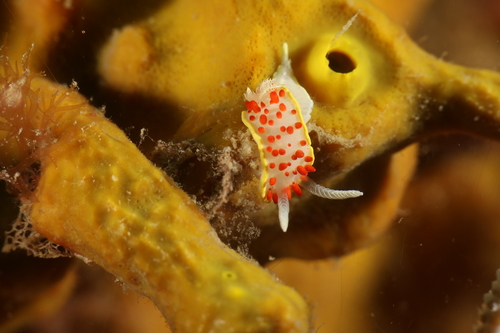
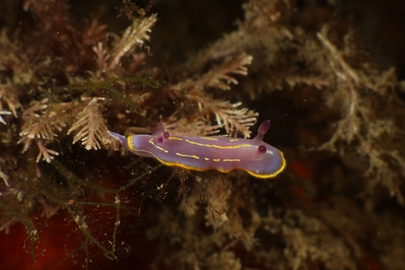
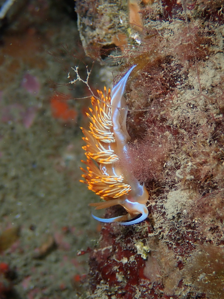
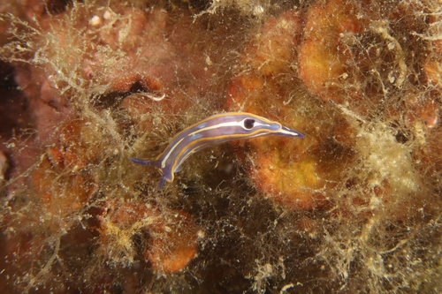

# Cuándo ver nudibranquios en Cataluña: un calendario fenológico a partir de ciencia ciudadana

**Autores:** Gustavo Zafra (Yespi); datos comunitarios Minka SDG e iNaturalist; curación taxonómica BioFauna  
**Fecha:** 2026-10-10  
**Repositorio:** https://github.com/yespi/biofauna (`papers/nudibranquios_calendario/`)

---

## Resumen

Presentamos un calendario de actividad mensual de nudibranquios (**Nudibranchia** y **doridoideos**, *sensu* catálogo BioFauna) en la costa catalana, a partir de **15,741** observaciones georreferenciadas en la base pública `public_observations` (iNaturalist + Minka). La intensidad mensual se **normaliza por el esfuerzo de muestreo**: en cada mes dividimos las observaciones de la especie entre el total de observaciones de **taxones marinos** del catálogo en la misma caja geográfica, para atenuar el sesgo estival del buceo. Incluimos dos láminas imprimibles (calendario por familias y rosas mensuales) y discutimos limitaciones de identificación automática y cobertura desigual.

**Palabras clave:** Nudibranchia, Doridida, fenología, ciencia ciudadana, Mediterráneo, Cataluña, Minka, iNaturalist

## 1. Introducción

Los nudibranquios concentran el interés de buceadores y naturalistas por su color y diversidad trofica. En Cataluña, proyectos como Minka SDG y iNaturalist acumulan miles de registros, pero las curvas crudas de «cuándo se fotografían» mezclan la biología con **cuándo sale la gente al mar**. Además, los informes previos del proyecto se apoyaban en listas cortas de aeolideos; aquí ampliamos el alcance a **doridoideos** (*Felimare*, *Peltodoris*, *Hypselodoris*, *Dendrodoris*, *Doris*, *Discodoris*, etc.) usando el catálogo vivo de BioFauna (351 especies potenciales).

## 2. Métodos

### 2.1 Área de estudio y fuentes

- **Región:** caja costera de Cataluña usada en BioQuest (lat 40.45–42.95° N; lon 0.1–3.4° E; definición 8-oct-2026).
- **Datos:** tabla `public_observations` (contenedor `postgres-global`, BD `fauna`), fuentes `13,396` Minka + `2,348` iNaturalist — **solo lectura (`SELECT`)**.
- **Taxonomía:** especies con `order` ∈ {Nudibranchia, Doridida, Dendronotida} en `dataset/target_species.json`, enriquecidas con familia desde `dataset/catalog.json`.

### 2.2 Normalización por esfuerzo

Para cada mes *m* y especie *s*:

\[
\text{actividad}_{s,m} = \frac{N_{s,m}}{E_m}
\]

donde \(N_{s,m}\) es el número de observaciones de *s* en el mes *m* dentro de la caja, y \(E_m\) el total de observaciones de **especies marinas del catálogo BioFauna** (`iconic` ∈ grupos marinos) en el mismo mes y caja. Para las figuras, dividimos por el máximo mensual de cada especie (escala 0–1 relativa).

**Esfuerzo mensual (obs. marinas):** Enero=7,033, Febrero=7,438, Marzo=8,111, Abril=19,174, Mayo=28,556, Junio=32,713, Julio=39,278, Agosto=55,345, Septiembre=35,529, Octubre=21,272, Noviembre=10,800, Diciembre=9,430.

### 2.3 Figuras y reproducibilidad

- Lámina 1: `LAMINA1_calendario_fenologico_20261010.png` (PNG 300 ppp + PDF).
- Lámina 2: `LAMINA2_rosas_estaciones_20261010.png` (PNG 300 ppp + PDF).
- Script: `scripts/nudibranquios_articulo_generar_20261010.py`.

## 3. Resultados

### 3.1 Especies más registradas

Entre las **30** especies más observadas en la caja figuran tanto aeolideos históricamente abundantes (*Cratena peregrina*, *Edmundsella pedata*, *Calmella cavolini*) como doridoideos antes ausentes del borrador aeolideo-only (*Felimare picta*, *Felimare tricolor*, *Peltodoris atromaculata*, *Hypselodoris picta*, *Dendrodoris limbata*, …).

| Especie | Familia | Obs. totales | Mes pico (normalizado) |
|---|---|---:|---|
| *Cratena peregrina* | Facelinidae | 4,371 | Enero |
| *Flabellina affinis* | Flabellinidae | 1,808 | Julio |
| *Peltodoris atromaculata* | Discodorididae | 1,436 | Enero |
| *Felimare picta* | Chromodorididae | 1,228 | Julio |
| *Edmundsella pedata* | Flabellinidae | 854 | Enero |
| *Felimare tricolor* | Chromodorididae | 797 | Junio |
| *Calmella cavolini* | Flabellinidae | 582 | Febrero |
| *Diaphorodoris papillata* | Calycidorididae | 398 | Abril |
| *Paradoris indecora* | Discodorididae | 386 | Enero |
| *Antiopella cristata* | Janolidae | 363 | Enero |
| *Polycera quadrilineata* | Polyceridae | 341 | Febrero |
| *Rudmania krohni* | Chromodorididae | 329 | Junio |
| *Nemesignis banyulensis* | Myrrhinidae | 289 | Marzo |
| *Diaphorodoris alba* | Calycidorididae | 231 | Abril |
| *Facelina annulicornis* | Facelinidae | 222 | Enero |

*(Tabla completa en `datos/especies_mensual_normalizado_20261010.csv`.)*

### 3.2 Calendario fenológico

La **Lámina 1** muestra ~30 especies agrupadas por familia; el color sigue la actividad normalizada mes a mes. Tras normalizar, algunos picos invernales de *Facelina* o *Doto* ganan peso relativo frente al verano bruto.

### 3.3 Rosas de actividad y estaciones

La **Lámina 2** representa las doce especies más frecuentes como diagramas radiales mensuales, más un panel orientativo «qué ver cada estación».

### 3.4 Fotografías de ejemplo (licencias libres)

<figure>

<figcaption>Figura 1. *Peltodoris atromaculata* — Pau Pagès Jaén · cc-by · 2024-08-06 · Empordà Marítim, Girona, Cataluña; España · <a href="https://minka-sdg.org/observations/324790">observación</a></figcaption>
</figure>

<figure>

<figcaption>Figura 2. *Edmundsella pedata* — Julien Renoult · cc0 · 2021-03-28 · Leucate Plage; 11370 Leucate; France · <a href="https://www.inaturalist.org/observations/72398362">observación</a></figcaption>
</figure>

<figure>

<figcaption>Figura 3. *Diaphorodoris papillata* — Julien Renoult · cc0 · 2021-05-08 · Pyrénées-Orientales; Languedoc-Roussillon; FR · <a href="https://www.inaturalist.org/observations/78025489">observación</a></figcaption>
</figure>

<figure>

<figcaption>Figura 4. *Rudmania krohni* — Julien Renoult · cc0 · 2021-05-23 · Cerbère; France · <a href="https://www.inaturalist.org/observations/80453313">observación</a></figcaption>
</figure>

<figure>

<figcaption>Figura 5. *Nemesignis banyulensis* — Julien Renoult · cc0 · 2019-06-08 · Pyrénées-Orientales; Languedoc-Roussillon; FR · <a href="https://www.inaturalist.org/observations/27235266">observación</a></figcaption>
</figure>

<figure>

<figcaption>Figura 6. *Felimare fontandraui* — Julien Renoult · cc0 · 2021-06-12 · Pyrénées-Orientales; Languedoc-Roussillon; FR · <a href="https://www.inaturalist.org/observations/82896567">observación</a></figcaption>
</figure>

## 4. Discusión

**Sesgo de esfuerzo.** Aunque normalizamos por observaciones marinas mensuales, el denominador incluye peces, cnidarios y algas fotografiados en las mismas salidas; no es un censo independiente de «horas de buceo». El verano sigue sobre-representado en *Cratena* o *Calmella* en datos brutos.

**Identificación.** Los nombres provienen de la comunidad y del pipeline BioFauna; pares crípticos (*Caloria*/*Luisella*, *Tenellia*/*Cratena*) pueden contaminar series. No sustituye revisión por especialistas (GROC, Minka).

**Cobertura geográfica.** La caja incluye tramos fuera de Cataluña administrativa; localidades dominantes (Costa Brava, Barcelona, Tarragona) reflejan clubs de buceo más que ausencia en el Ebro.

**Ampliación doridoidea.** Respecto al borrador de 8-oct (133 aeolideos), incorporar **Doridida** cambia el ranking: *Felimare picta* supera a muchos aeolideos en recuento regional.

## 5. Referencias

- Ballesteros, M., & Pontes, M. (coords.). *GROC* / guías de opistobranquis del Mediterráneo occidental.
- Cattaneo-Vietti, R., et al. (1990). *Atlas of Mediterranean Nudibranchs* (referencia clásica de distribución).
- BioFauna / FotoFauna: https://fotofauna.yespi.es — catálogo y metodología (`papers/biofauna/01_biofauna_es.md`).
- Minka SDG: https://minka-sdg.org — observaciones comunitarias.
- iNaturalist (2026). API pública v1 — https://api.inaturalist.org

---

*Manuscrito generado automáticamente a partir de datos abiertos; revisar antes de publicación en revista.*
