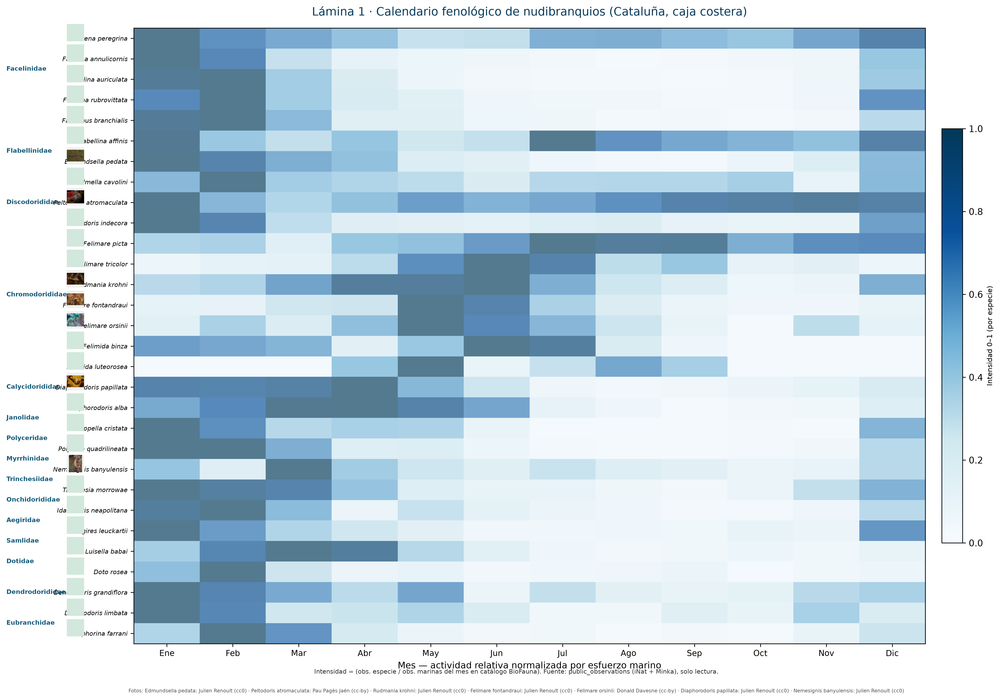
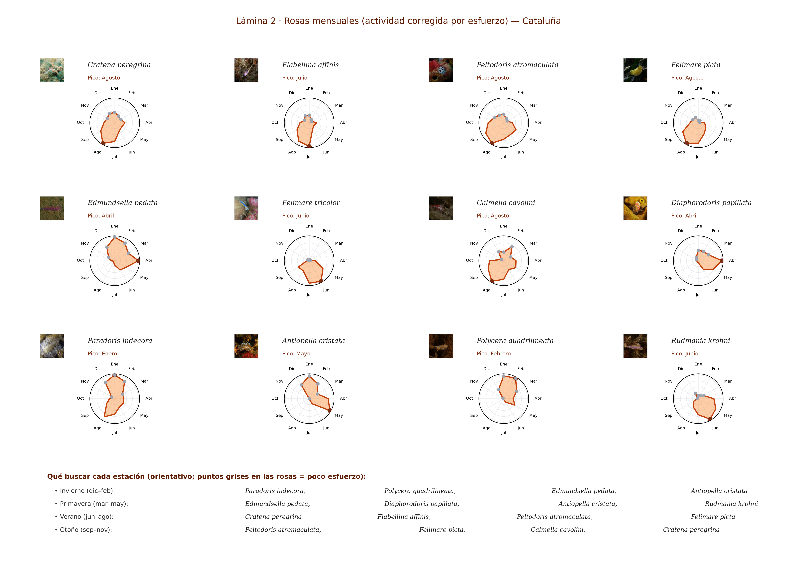
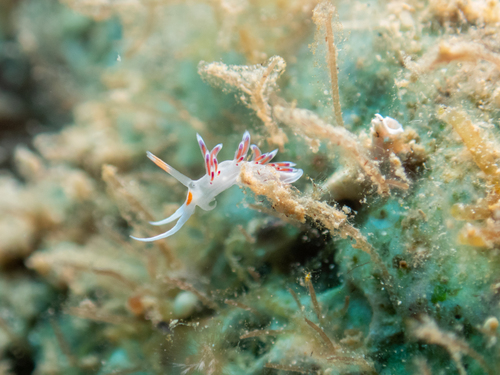
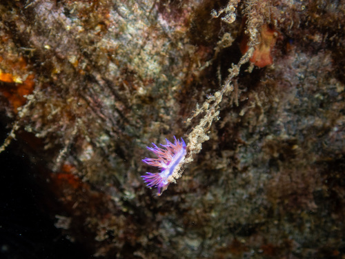
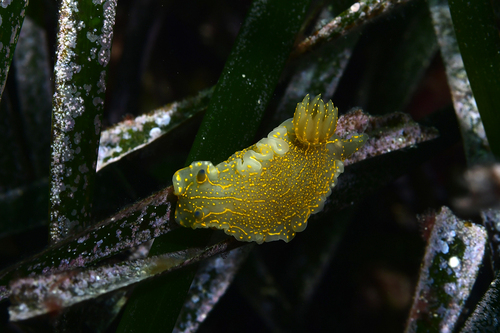
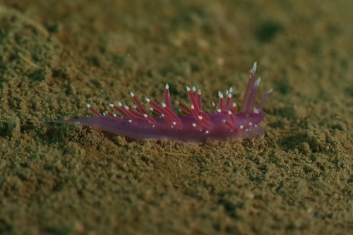
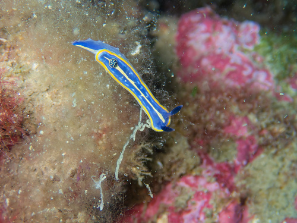
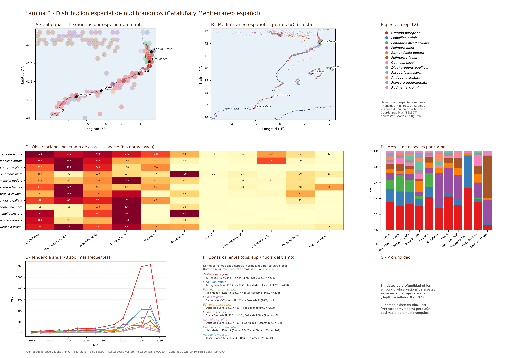

# Cuándo ver nudibranquios en Cataluña: un calendario fenológico a partir de ciencia ciudadana

**Autores:** Gustavo Zafra (Yespi); datos comunitarios Minka SDG e iNaturalist; curación taxonómica BioFauna  
**Fecha:** 2026-10-10  
**Repositorio:** https://github.com/yespi/biofauna (`papers/nudibranquios_calendario/`)

---

## Resumen

Presentamos un calendario de actividad mensual de nudibranquios (**Nudibranchia** y **doridoideos**, *sensu* catálogo BioFauna) en la costa catalana, a partir de **15,741** observaciones georreferenciadas en la base pública `public_observations` (iNaturalist + Minka). La intensidad mensual se **corrige por el esfuerzo de muestreo** con un suavizado (corrección parcial del denominador y prior bayesiano débil), para evitar que los meses con pocas salidas (sobre todo invierno) inflen artificialmente el cociente. Los meses de poco esfuerzo se marcan en las láminas. Incluimos tres láminas imprimibles A3 (calendario por familias, rosas mensuales y distribución espacial) con miniaturas de fotos de licencia libre cuando existen.

**Palabras clave:** Nudibranchia, Doridida, fenología, ciencia ciudadana, Mediterráneo, Cataluña, Minka, iNaturalist

## 1. Introducción

Los nudibranquios concentran el interés de buceadores y naturalistas por su color y diversidad trófica. En Cataluña, proyectos como Minka SDG y iNaturalist acumulan miles de registros, pero las curvas crudas de «cuándo se fotografían» mezclan la biología con **cuándo sale la gente al mar**. Además, los informes previos del proyecto se apoyaban en listas cortas de aeolideos; aquí ampliamos el alcance a **doridoideos** (*Felimare*, *Peltodoris*, *Hypselodoris*, *Dendrodoris*, *Doris*, *Discodoris*, etc.) usando el catálogo vivo de BioFauna (351 especies potenciales).

## 2. Métodos

### 2.1 Área de estudio y fuentes

- **Región:** caja costera de Cataluña usada en BioQuest (lat 40.45–42.95° N; lon 0.1–3.4° E; definición 8-oct-2026).
- **Datos:** tabla `public_observations` (contenedor `postgres-global`, BD `fauna`), fuentes `13,396` Minka + `2,348` iNaturalist — **solo lectura (`SELECT`)**.
- **Taxonomía:** especies con `order` ∈ {Nudibranchia, Doridida, Dendronotida} en `dataset/target_species.json`, enriquecidas con familia desde `dataset/catalog.json`.

### 2.2 Corrección del esfuerzo (suavizado)

Una división directa «observaciones de la especie / observaciones marinas del mes» hace explotar enero y febrero: el denominador es bajo y el cociente no refleja un pico biológico. Usamos un **índice suavizado**:

1. Pseudocuentas débiles repartidas según la cuota mensual de esfuerzo (prior bayesiano).
2. Corrección **parcial** del esfuerzo: se multiplica por \((E_{\mathrm{ref}} / E_m)^{\gamma}\) con \(\gamma = 0.35\) (no con exponente 1), de modo que el verano sigue pesando más en especies realmente estivales.
3. Normalización a 0–1 **por especie** (el máximo mensual de cada una vale 1).

Los meses con esfuerzo por debajo del 55 % de la mediana (Enero, Febrero, Marzo, Noviembre, Diciembre) se muestran con **tramado o gris** en las láminas: hay señal, pero con más incertidumbre.

**Esfuerzo mensual (obs. marinas del catálogo):** Enero=7,033, Febrero=7,438, Marzo=8,111, Abril=19,174, Mayo=28,556, Junio=32,713, Julio=39,278, Agosto=55,345, Septiembre=35,529, Octubre=21,272, Noviembre=10,800, Diciembre=9,430.

### 2.3 Figuras y reproducibilidad

- Lámina 1: `LAMINA1_calendario_fenologico_20261010.png` (PNG 300 ppp + PDF, A3).
- Lámina 2: `LAMINA2_rosas_estaciones_20261010.png` (PNG 300 ppp + PDF, A3).
- Lámina 3: `LAMINA3_distribucion_espacial_20261010.png` (PNG 300 ppp + PDF, A3): mapas Cataluña / Mediterráneo español, obs. por tramo × especie, mezcla, tendencia anual y zonas calientes normalizadas por esfuerzo.
- Scripts: `scripts/nudibranquios_articulo_generar_20261010.py` (láminas 1–2) y `scripts/nudibranquios_lamina3_espacial_20261010.py` (lámina 3).

### 2.4 Distribución espacial

- **Coordenadas:** `lat`/`lng` de `public_observations` (solo `SELECT`). Son las coordenadas **públicas** ya almacenadas; las observaciones con ubicación oculta u ofuscada sin punto publicable no figuran en la tabla y, por tanto, no se dibujan. No se intenta «desofuscar» nada.
- **Mapas:** costa occidental mediterránea (`datos/coast-western-med.geojson`, BioQuest). En Cataluña, hexágonos coloreados por la especie dominante del top-12 (intensidad ∝ conteo); en el Mediterráneo español, puntos semitransparentes. Marcamos zonas de buceo de referencia (Cap de Creus, Illes Medes, Tossa, Garraf, Tarragona).
- **Tramos de costa:** cajas lat/lng a lo largo de la costa catalana (Cap de Creus → Delta de l'Ebre), análogas a los gráficos regionales del Atlas BioQuest (sin polígonos de comarca).
- **Esfuerzo espacial:** denominador = total de nudibranquios georreferenciados del tramo. Tasa = obs. de la especie / esfuerzo.
- **Profundidad:** el campo `depth_m` existe, pero en esta extracción está vacío para los nudibranquios de la caja (0 registros con profundidad).

## 3. Resultados

### 3.1 Especies más registradas

Entre las **30** especies más observadas en la caja figuran tanto aeolideos históricamente abundantes (*Cratena peregrina*, *Edmundsella pedata*, *Calmella cavolini*) como doridoideos (*Felimare picta*, *Felimare tricolor*, *Peltodoris atromaculata*, *Dendrodoris limbata*, …).

| Especie | Familia | Obs. totales | Mes pico (suavizado) |
|---|---|---:|---|
| *Cratena peregrina* | Facelinidae | 4,371 | Agosto |
| *Flabellina affinis* | Flabellinidae | 1,808 | Julio |
| *Peltodoris atromaculata* | Discodorididae | 1,436 | Agosto |
| *Felimare picta* | Chromodorididae | 1,228 | Agosto |
| *Edmundsella pedata* | Flabellinidae | 854 | Abril |
| *Felimare tricolor* | Chromodorididae | 797 | Junio |
| *Calmella cavolini* | Flabellinidae | 582 | Agosto |
| *Diaphorodoris papillata* | Calycidorididae | 398 | Abril |
| *Paradoris indecora* | Discodorididae | 386 | Enero |
| *Antiopella cristata* | Janolidae | 363 | Mayo |
| *Polycera quadrilineata* | Polyceridae | 341 | Febrero |
| *Rudmania krohni* | Chromodorididae | 329 | Junio |
| *Nemesignis banyulensis* | Myrrhinidae | 289 | Marzo |
| *Diaphorodoris alba* | Calycidorididae | 231 | Mayo |
| *Facelina annulicornis* | Facelinidae | 222 | Enero |

*(Tabla completa en `datos/especies_mensual_normalizado_20261010.csv`.)*

### 3.2 Calendario fenológico

La **Lámina 1** agrupa ~30 especies por familia, con columnas **familia | miniatura | nombre** y el mapa de calor mensual. Tras el suavizado, el patrón de los cromodóridos (*Felimare*) se concentra en **primavera–verano** (*Felimare picta* → Agosto, *Felimare tricolor* → Junio, *Felimare fontandraui* → Mayo, *Felimare orsinii* → Mayo), coherente con la fenología mediterránea conocida, y no en un artefacto invernal. Aeolideos como *Cratena peregrina* y *Flabellina affinis* mantienen picos estivales; *Edmundsella pedata*, *Antiopella cristata* y *Diaphorodoris* destacan en primavera.

### 3.3 Rosas de actividad y estaciones

La **Lámina 2** muestra las doce especies más frecuentes como una rosa mensual (una sola serie por especie, etiqueta del mes pico y miniatura). El panel «Qué buscar» se calcula sobre los mismos valores suavizados.

### 3.4 Fotografías de ejemplo (licencias libres)

<figure>

<figcaption>Figura 1. *Cratena peregrina* — Vsevolod Rudyi · cc-by ·  ·  · <a href="">observación</a></figcaption>
</figure>

<figure>

<figcaption>Figura 2. *Flabellina affinis* — Justin Philbois · cc0 ·  ·  · <a href="">observación</a></figcaption>
</figure>

<figure>

<figcaption>Figura 3. *Peltodoris atromaculata* — Pau Pagès Jaén · cc-by ·  ·  · <a href="">observación</a></figcaption>
</figure>

<figure>

<figcaption>Figura 4. *Felimare picta* — Xavier Mas · cc-by ·  ·  · <a href="">observación</a></figcaption>
</figure>

<figure>

<figcaption>Figura 5. *Edmundsella pedata* — Julien Renoult · cc0 ·  ·  · <a href="">observación</a></figcaption>
</figure>

<figure>

<figcaption>Figura 6. *Felimare tricolor* — Donald Davesne · cc-by ·  ·  · <a href="">observación</a></figcaption>
</figure>

### 3.5 Distribución espacial (Lámina 3)

La **Lámina 3** sitúa las **12** especies más registradas sobre la costa: **12,896** puntos en la caja catalana y **14,855** en el Mediterráneo español (misma lista de especies; coordenadas públicas). Los hexágonos de Cataluña muestran la especie dominante por celda; el panel B evita el solapamiento con transparencia. Los paneles C–D resumen observaciones y mezcla por tramo de costa; el E, la tendencia anual (estilo Atlas BioQuest); el F señala **zonas calientes** normalizadas por el total de nudibranquios del tramo.

Ejemplos de zonas calientes (máxima tasa local): *Cratena peregrina* → Tarragona–Salou (48% del esfuerzo local, n=364); *Flabellina affinis* → Tarragona–Salou (36% del esfuerzo local, n=277); *Peltodoris atromaculata* → Illes Medes / Estartit (18% del esfuerzo local, n=469); *Felimare picta* → Barcelonès (38% del esfuerzo local, n=439); *Edmundsella pedata* → Delta de l'Ebre (10% del esfuerzo local, n=52); *Felimare tricolor* → Costa Daurada N (11% del esfuerzo local, n=13).

Profundidad: sin señal útil (`depth_m` nulo en 12,896/12,896 obs. de la caja).

## 4. Discusión

**Sesgo de esfuerzo.** La corrección parcial y el prior evitan picos espurios en enero–febrero, pero el denominador sigue siendo un proxy (taxones marinos del catálogo), no horas de buceo. Los meses tramados deben leerse con reserva.

**Identificación.** Los nombres provienen de la comunidad y del pipeline BioFauna; pares crípticos (*Caloria*/*Luisella*, *Tenellia*/*Cratena*) pueden contaminar series. No sustituye revisión por especialistas (GROC, Minka).

**Cobertura geográfica.** La caja incluye tramos fuera de Cataluña administrativa; localidades dominantes (Costa Brava, Barcelona, Tarragona) reflejan clubs de buceo más que ausencia en el Ebro. La Lámina 3 cuantifica ese sesgo por tramo y lo normaliza por esfuerzo (nudibranquios del tramo).

**Ampliación doridoidea.** Respecto al borrador de 8-oct (133 aeolideos), incorporar **Doridida** cambia el ranking: *Felimare picta* supera a muchos aeolideos en recuento regional.

## 5. Referencias

- Ballesteros, M., & Pontes, M. (coords.). *GROC* / guías de opistobranquis del Mediterráneo occidental.
- Cattaneo-Vietti, R., et al. (1990). *Atlas of Mediterranean Nudibranchs* (referencia clásica de distribución).
- BioFauna / FotoFauna: https://fotofauna.yespi.es — catálogo y metodología (`papers/biofauna/01_biofauna_es.md`).
- Minka SDG: https://minka-sdg.org — observaciones comunitarias.
- iNaturalist (2026). API pública v1 — https://api.inaturalist.org

---

*Manuscrito generado automáticamente a partir de datos abiertos; revisar antes de publicación en revista.*
