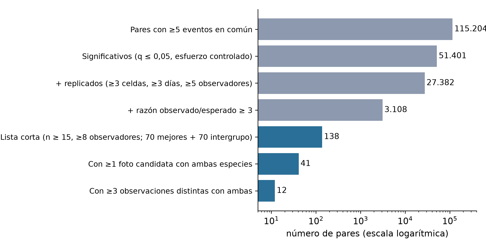
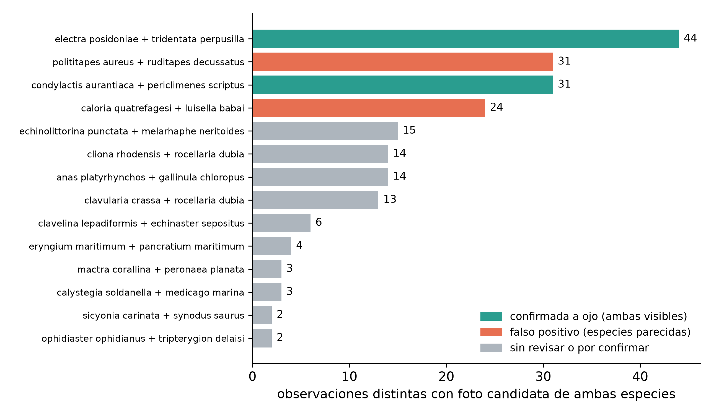
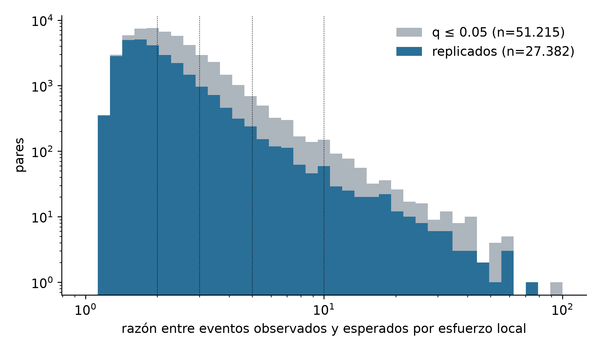
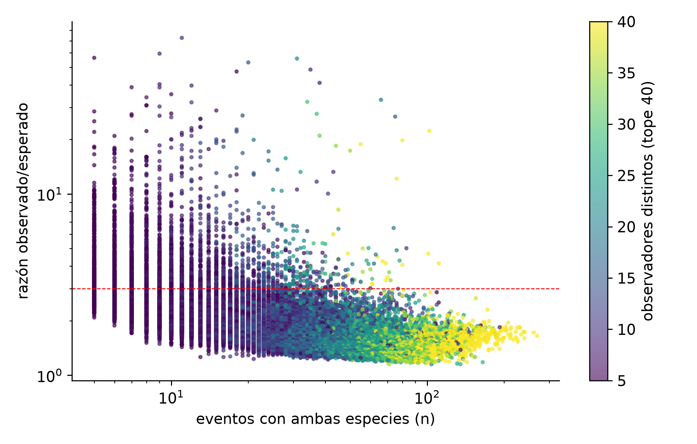

# Species associations in marine life verified by joint appearance in the same photograph: a screening with an automatic identifier over 1.2 million citizen-science photographs

**Author: Gustavo Zafra** · Creator and developer of BioFauna (BioCLIP-2.5 ViT-H/14 + FAISS identifier) and of the FotoFauna and BioQuest applications; collaborator of the citizen-science platform Minka SDG.

**Version v20 — 6 Oct 2026** · Correlation project (BioFauna). Rewrite: conclusions rest only on **real proximity (centimetres)**, i.e. photographs in which both species appear at once.

---

## Abstract

Seeing two species on the same dive does not show they are related: a diver sees many different species in one outing. We therefore require **real proximity: both species in the same photograph**. We start from **1,222,170 photographs** and **759,207 geolocated observations** (Minka SDG, iNaturalist and other sources), identified by **BioFauna**. A screening by *events* (observer × ~1 km cell × day × 3 h slot), with local effort controlled, serves only to **generate hypotheses**: 115,204 supported pairs, of which 51,401 are significant, so significance alone does not discriminate. For a shortlist of 138 pairs (highest effect and support) we searched the gallery, applying the identifier to the whole photo and to regions, for images where both species appear: 41 pairs had at least one candidate photo and 12 had three or more distinct observations, but visual review showed **many false positives between look-alike species**. Pairs with both species visible were confirmed by eye (*Peltodoris atromaculata* on *Petrosia ficiformis*, *Cratena peregrina* on hydroids, *Condylactis aurantiaca* with the shrimp *Periclimenes scriptus*, *Lysmata grabhami* with *Telmatactis cricoides*, and *Electra posidoniae* with *Tridentata perpusilla* on the same *Posidonia* leaf), and for others no joint photograph was found. Proximity in a photo shows coexistence at centimetre scale, **not interaction**, and the second species is proposed by the identifier without curator confirmation.

**Keywords:** citizen science, interspecific associations, proximity, deep learning, Mediterranean, underwater photography.

## 1. Introduction

Amateur underwater photography is a massive source of biodiversity data. Citizen-science platforms (**Minka SDG**, driven from the **FECDAS** ecosystem; **iNaturalist**; **GBIF**) accumulate millions of observations, but most analyses are limited to inventories and distribution maps. Inferring species associations from co-occurrence in participatory data has known effort and observer biases (Isaac et al., 2014; Johnston et al., 2018; Milanesi et al., 2020; Boyd et al., 2021): two species appear in the same outing because they share habitat or because the same observer photographs them on the same day, not because they are related. We propose a stricter criterion: **only the appearance of both species in the same photograph counts as an association**, that is, at centimetre scale.

## 2. Materials and methods

### 2.1 Data
1,222,170 photographs from the BioFauna gallery (Minka SDG 377,476; iNaturalist 779,411; GBIF, Wikimedia Commons, DORIS/FFESSM, SeaSlugForum, WoRMS, FishBase and others) and 759,207 observations with coordinates, date and (92 %) time. Catalogue of 2,985 Mediterranean taxa.

### 2.2 Identifier
BioFauna retrieves the most likely species of an image with k-NN over BioCLIP-2.5 ViT-H/14 embeddings in a FAISS index (k = 15, T = 0.05, at most 3 votes per species) and hierarchical calibration. On the out-of-sample field panel (78,145 rows, 2,970 species) it identifies **82.85 %** of species; accuracy increases with the species' reference photos (Figure 3). This conditions the study: species with few photos and small or camouflaged ones are recognised less well.

### 2.3 Event screening (hypothesis generation only)
An *event* is what the same observer recorded in the same ~1 km cell, on the same day and 3 h slot. For each pair with ≥5 shared events we test, with local effort controlled (null conditioned on the number and size of events per 0.1° cell·day block, Benjamini–Hochberg over the whole family), whether they co-occur more than expected. **This result is not interpreted as association**; it only ranks pairs by effect size and replication (≥3 cells, ≥3 days, ≥5 observers) to choose which to verify. Details in the Supplement.

### 2.4 Verification by real proximity (main criterion)
For each pair (A, B) of the shortlist we analysed up to 60 gallery photos of A and of B. Each photo is split into five views (whole and four quadrants) and embedded; the live index is searched (300 neighbours) and a pair has a **candidate photo** if the other species appears in some view with similarity ≥ 0.82 (or as first choice with ≥ 0.86). The detector only proposes: **every candidate is checked by eye** and accepted only if both species are visible in the image. Look-alike pairs (same genus or family) produce false positives and are discarded in review.

### 2.5 Evidence levels
**Level 0:** event co-occurrence (a lead only). **Level 1:** both species in the same photo in ≥3 independent observations. **Level 2:** plus visible contact (on, inside, feeding). The absence of joint photos leaves the pair *unconfirmed*, not refuted: the gallery is mostly centred portraits of a single species.

### 2.6 Licences and attribution
We use CC0, CC BY, CC BY-SA and CC BY-NC / CC BY-NC-SA photographs; unlicensed and CC BY-NC-ND photos are excluded. Each photo states author, licence, local date and time, place and link to the observation. Those marked † (non-commercial) **must be replaced with CC0, CC BY or CC BY-SA photos, or used with the author's permission, if the article is published in a commercial journal**.

## 3. Results

### 3.1 From event screening to the shortlist
Of 115,204 pairs with ≥5 events, 51,401 are significant with effort controlled and 3,108 combine replication and an observed/expected ratio ≥3 (Figure 1). Since almost half of the supported pairs are "significant", significance does not discriminate and is not used as a conclusion.

<figure class="fig"><figcaption><b>Figure 1. From event screening to pairs with a joint photograph.</b> Number of pairs passing each filter (logarithmic scale). Grey: event screening (hypotheses); blue: shortlist of 138 pairs (the 70 highest-scoring and the 70 highest-scoring among different taxonomic groups, with n ≥ 15 events and ≥ 8 observers), pairs with at least one candidate photo and pairs with three or more distinct observations. Data: <code>data/</code> and <a href="https://github.com/yespi/biofauna/blob/master/data/copresencia_pares_20261006.csv">data/copresencia_pares_20261006.csv</a>.</figcaption></figure>

### 3.2 Detecting both species in the same photo
Of the 138 pairs, 41 had at least one candidate photo and 12 three or more distinct observations (Figure 2). Visual review of the first ones showed **false positives between look-alike species** (e.g. two clams, *Polititapes aureus* and *Ruditapes decussatus*, or two nudibranchs, *Caloria quatrefagesi* and *Luisella babai*): the identifier recognises the look-alike species in another region of the image. This confirms that automatic detection only proposes and that many "significant" coincidences do not survive review.

<figure class="fig"><figcaption><b>Figure 2. Candidate photos per pair and visual review outcome.</b> Distinct observations with a candidate photo of both species for the 14 pairs with most candidates. Green: confirmed by eye with both species visible; red: false positive due to look-alike species; grey: not reviewed or to be confirmed (<i>Echinolittorina</i>–<i>Melarhaphe</i>, <i>Cliona</i>/<i>Clavularia</i>–<i>Rocellaria</i>, <i>Anas</i>–<i>Gallinula</i>).</figcaption></figure>

### 3.3 Pairs with both species visible
Table 2 lists the pairs confirmed by eye and Plates 1–6 show the photographs. *Peltodoris atromaculata* on *Petrosia ficiformis* (Avila, 1996) and *Cratena peregrina* on hydroids serve as **positive controls**: they are documented relations and the method finds photos with both visible. *Condylactis aurantiaca* with *Periclimenes scriptus* (the shrimp among the anemone's tentacles) came from the shortlist; it is consistent with the known commensalism of *Periclimenes* with anemones, although pair-specific literature has not been checked. *Lysmata grabhami* with *Telmatactis cricoides* (cleaner shrimp and anemone) and *Electra posidoniae* with *Tridentata perpusilla* (bryozoan and hydroid on the same *Posidonia* leaf) show real proximity, but the latter is **shared microhabitat, not demonstrated interaction**. The second species in each photo is identified by BioFauna and is **not confirmed by curators**.

| Table 2. Pairs with photographs of both species in the same image | Level | Photos (distinct obs.) | Origin |
|---|---|---:|---|
| *Peltodoris atromaculata* on *Petrosia ficiformis* (predation) | 2 | 4 (4) | positive control (documented relation) |
| *Cratena peregrina* on hydroid colonies (*Eudendrium racemosum*; kleptoparasitism) | 2 | 4 (4) | positive control (documented relation) |
| *Condylactis aurantiaca* with the shrimp *Periclimenes scriptus* (commensalism) | 2 | 4 (4) | screening shortlist |
| *Lysmata grabhami* and *Telmatactis cricoides* (cleaning) | 1 | 4 (4) | earlier selection (cleaner) |
| *Scyllaea pelagica* on floating *Sargassum* | 0–1 | 1 (1) | earlier selection |
| *Electra posidoniae* and *Tridentata perpusilla* on *Posidonia* leaves (shared microhabitat) | 1 | 4 (4) | screening shortlist |

### 3.4 Pairs without a joint photo
No photo with both species was found for *Felimare picta*–*Ircinia oros*, *Muraena helena*–*Ophidiaster ophidianus* or *Fistularia commersonii*–*Pterois miles*. This does not show they do not coexist and does not allow any relation to be claimed: they remain *unconfirmed*.

<b>Plate 1. <i>Peltodoris atromaculata</i> on <i>Petrosia ficiformis</i> (predation).</b> <i>Sponge identified by BioFauna as <i>Petrosia ficiformis</i> (purple, reddish and cream variants); not confirmed by curators.</i>

<figure><figcaption>Plate 1.1: Pau Pagès Jaén · CC BY · 2024-08-06 12:08 (Europe/Madrid) · Spain · Minka obs 324790.</figcaption></figure>
<figure><figcaption>Plate 1.2: Dean Zagorac · CC BY-NC † · 2023-08-07 16:40 (Europe/Zagreb) · Kostrena, Primorsko-Goranska, Croatia · iNaturalist obs 184319097.</figcaption></figure>
<figure><figcaption>Plate 1.3: jmturon · CC BY-NC † · 2022-07-23 10:16 (Europe/Madrid) · Spain · Minka obs 205860.</figcaption></figure>
<figure><figcaption>Plate 1.4: Óscar Comellas Garcia · CC BY-NC † · 2023-11-11 11:43 (Europe/Madrid) · Girona, España · Minka obs 203388.</figcaption></figure>

<b>Plate 2. <i>Cratena peregrina</i> on hydroid colonies (<i>Eudendrium racemosum</i>; kleptoparasitism).</b> <i>Hydroid identified by BioFauna as <i>Eudendrium racemosum</i>; not confirmed by curators.</i>

<figure><figcaption>Plate 2.1: xavi salvador costa · CC BY-NC † · 2024-11-02 22:52 (Europe/Paris) · Le Ponton · Minka obs 392849.</figcaption></figure>
<figure><figcaption>Plate 2.2: xatrac · CC BY-NC † · 2022-08-27 10:08 (Europe/Paris) · 17310 Lloret de Mar, Girona, España · Minka obs 88838.</figcaption></figure>
<figure><figcaption>Plate 2.3: xatrac · CC BY-NC † · 2022-08-10 09:42 (Europe/Paris) · 17310 Lloret de Mar, Girona, España · Minka obs 88546.</figcaption></figure>
<figure><figcaption>Plate 2.4: xatrac · CC BY-NC † · 2022-08-07 09:16 (Europe/Paris) · 17310 Lloret de Mar, Girona, España · Minka obs 88528.</figcaption></figure>

<b>Plate 3. <i>Condylactis aurantiaca</i> with the shrimp <i>Periclimenes scriptus</i> (commensalism).</b> <i>Shrimp identified by BioFauna as <i>Periclimenes scriptus</i>; not confirmed by curators.</i>

<figure><figcaption>Plate 3.1: xavi salvador costa · CC BY-NC † · 2016-09-10 22:07 (Europe/Paris) · Spain · Minka obs 28492.</figcaption></figure>
<figure><figcaption>Plate 3.2: Sylvain Le Bris · CC BY-NC † · 2026-04-08 22:17 (Europe/Paris) · Montredon, Marseille, France · iNaturalist obs 348576200.</figcaption></figure>
<figure><figcaption>Plate 3.3: xavi salvador costa · CC BY-NC † · 2016-07-09 22:18 (Europe/Paris) · Spain · Minka obs 28862.</figcaption></figure>
<figure><figcaption>Plate 3.4: xavi salvador costa · CC BY-NC † · 2018-09-01 16:03 (Europe/Paris) · Spain · Minka obs 35885.</figcaption></figure>

<b>Plate 4. <i>Lysmata grabhami</i> and <i>Telmatactis cricoides</i> (cleaning).</b> <i>Cleaner shrimp and anemone identified by BioFauna; the shrimp is small in two photos.</i>

<figure><figcaption>Plate 4.1: jmturon · CC BY-NC † · 2023-12-05 10:57 (Atlantic/Canary) · Las Coloradas · Minka obs 210346.</figcaption></figure>
<figure><figcaption>Plate 4.2: jmturon · CC BY-NC † · 2023-12-06 20:06 (Atlantic/Canary) · Playa Flamingo · Minka obs 210532.</figcaption></figure>
<figure><figcaption>Plate 4.3: phil_newman · CC BY-NC † · 2025-11-22 11:50 (Atlantic/Canary) · Playa Flamingo Playa Blanca Lanzarote · iNaturalist obs 329826704.</figcaption></figure>
<figure><figcaption>Plate 4.4: whodden · CC BY-NC † · 2007-04-04 00:00 (Europe/Madrid) · la caleta punta prieta tenerife · iNaturalist obs 2354980.</figcaption></figure>

<b>Plate 5. <i>Scyllaea pelagica</i> on floating <i>Sargassum</i>.</b> <i>Only the camouflaged nudibranch is clearly visible; <i>Latreutes</i> and <i>Hippolyte</i> cannot be told apart by eye.</i>

<figure><figcaption>Plate 5.1: Ben Eddy · CC BY-NC † · 2023-06-27 13:52 (Atlantic/Bermuda) · Southampton, BM · iNaturalist obs 170761288.</figcaption></figure>

<b>Plate 6. <i>Electra posidoniae</i> and <i>Tridentata perpusilla</i> on <i>Posidonia</i> leaves (shared microhabitat).</b> <i>Encrusting bryozoan and hydroid on the same leaf; shared microhabitat, interaction not demonstrated.</i>

<figure><figcaption>Plate 6.1: xavi salvador costa · CC BY-NC † · 2023-08-09 11:01 (Europe/Madrid) · Spain · Minka obs 153028.</figcaption></figure>
<figure><figcaption>Plate 6.2: conxi · CC BY-NC † · 2025-05-31 11:48 (Europe/Madrid) · 17300 Blanes, Girona, España · Minka obs 511234.</figcaption></figure>
<figure><figcaption>Plate 6.3: ester serrao · CC BY · 2024-06-30 07:17 (America/Costa_Rica) · Parrita, Puntarenas, CR · Minka obs 629063.</figcaption></figure>
<figure><figcaption>Plate 6.4: Manel Ortega · CC BY · 2025-08-10 10:13 (Europe/Madrid) · Cap Ras · Minka obs 544263.</figcaption></figure>

## 4. Discussion

**What this shows and what it does not.** A photo with both species shows proximity at centimetre scale at one instant; it does not show that they seek, avoid or interact with each other. Three or more independent observations with both visible give replication, and visible contact (on, inside, feeding) points to a relation that must be confirmed with curators and literature. Event co-occurrence, by contrast, only flags species that share place and date and is **not used as a result**: requiring the same photo removes most coincidences.

**Biases.** The gallery consists mostly of centred portraits of one species, which underestimates the share of photos with a second species; the identifier recognises small or camouflaged species less well and confuses look-alike species (false positives); only the first candidates have been reviewed by eye; and the photographs come with very diverse licences, which limits the plates.

## 5. Limitations

Proximity in a photo is not interaction. The identity of the second species is a proposal by the identifier. The shortlist was chosen by effect size and support, not at random, and the positive-control pairs and earlier plate candidates were chosen by the author's judgement. The novelty of no pair has yet been checked against the literature or by curators. CC BY-NC photos must be replaced in a commercial journal.

## 6. Conclusions

1. Event co-occurrence screening, even with effort controlled, is not evidence of association: it generates thousands of coincidences of which only a small part survives review by real proximity.
2. Real proximity (both species in the same photograph) is a criterion any reader can verify; with it, five pairs have been confirmed by eye, two of them with visible contact between organisms of different groups in addition to the positive controls.
3. The method serves to propose pairs and photographs that curators can verify; it does not replace their judgement.

## Acknowledgements

To the observer community and, most especially, to the **curators** who sustain the reliability of the
identifications —in particular **Miquel Pontes**, **Xavier Salvador** and **Berta Companys**— and to the wider
curatorial community of **Minka SDG** and **iNaturalist**. Special mention to **FECDAS** and its **Aneris
Project** for driving marine citizen science and observer training; to **Minka SDG** and **iNaturalist** for
the platforms and the data; and to **GBIF**, **Wikimedia Commons**, **DORIS/FFESSM**, **SeaSlugForum**,
**WoRMS** and **FishBase** for images and taxonomic data. This analysis has been possible thanks to the
**BioFauna identifier** (BioCLIP-2.5 ViT-H/14 + FAISS), created and developed by **Gustavo Zafra** (author of
this manuscript), with the author's contribution to the Minka SDG platform.

**Acknowledgement to artificial-intelligence models (2026).** This work benefited from the assistance of the
main AI assistants available in 2026, which participated in the development of the identifier, the
experimental design, the co-occurrence analysis, the review of the biological literature and the drafting of
the manuscript: **Claude (Anthropic)**, **Grok (xAI)**, **Gemini (Google)**, **DeepSeek** and other
language/vision models of the time. Their contribution was that of research-assistance tools under the
author's supervision and direction.

## References

- Aceves-Bueno, E., Adeleye, A. S., Feraud, M., Huang, Y., Tao, M., Yang, Y., & Anderson, S. E. (2017). The accuracy of citizen science data: a quantitative review. *The Bulletin of the Ecological Society of America*, 98(4), 278–290.
- Avila, C. (1996). The growth of *Peltodoris atromaculata* Bergh, 1880 (Gastropoda, Nudibranchia) in the laboratory. *Journal of Molluscan Studies*, 62, 151–157. — diet exclusively on *Petrosia ficiformis*.
- Boyd, R. J., Powers, M., & Pescott, O. L. (2021). occAssess: an R package for assessing potential biases in species occurrence data. *Ecology and Evolution*, 11(22).
- Isaac, N. J. B., van Strien, A. J., August, T. A., de Zeeuw, M. P., & Roy, D. B. (2014). Statistics for citizen science: extracting signals of change from noisy ecological data. *Methods in Ecology and Evolution*, 5(10), 1052–1060.
- Johnston, A., Fink, D., Hochachka, W. M., & Kelling, S. (2018). Estimates of observer expertise improve species distributions from citizen science data. *Methods in Ecology and Evolution*, 9(4), 880–890.
- McDonald, G. R., & Nybakken, J. W. (2001). A worldwide review of the food of nudibranch mollusks. II. The suborder Doridacea. *The Veliger*.
- Milanesi, P., Mori, E., & Menchetti, M. (2020). Observer-oriented approach improves species distribution models from citizen science data. *Ecology and Evolution*, 10(21), 12104–12114.
- Peraza, E., Pérez, J. A., Abdul-Jalbar, B., Chinea, J., & Clemente, S. (2024). Exploring the association between the arrow crab *Stenorhynchus lanceolatus* and the sea anemone *Telmatactis cricoides* in the Canary Islands. *Regional Studies in Marine Science*.

## Data availability

**All material is in the public GitHub repository: https://github.com/yespi/biofauna** (branch `master`). Full paths:
- Shortlist pairs and their candidate photos: [`data/copresencia_pares_20261006.csv`](https://github.com/yespi/biofauna/blob/master/data/copresencia_pares_20261006.csv) and [`data/copresencia_hits_20261006.jsonl`](https://github.com/yespi/biofauna/blob/master/data/copresencia_hits_20261006.jsonl).
- Plate manifest with author, licence, date and time, place and link for each photo: [`papers/proyecto_correlacion/lamina_fotos/lamina_manifest_20261006.json`](https://github.com/yespi/biofauna/blob/master/papers/proyecto_correlacion/lamina_fotos/lamina_manifest_20261006.json).
- Event-screening lists (hypotheses only) and their description: [`data/README_correlacion.md`](https://github.com/yespi/biofauna/blob/master/data/README_correlacion.md) and the files `data/nulo_exacto_pares_*.csv` and `data/pares_*_20261005.csv`.
- Extended methods and results, figures and plates: folder [`papers/proyecto_correlacion/`](https://github.com/yespi/biofauna/blob/master/papers/proyecto_correlacion/) (article in Spanish and English, `LAMINAS`, `METODOS.md`, `RESULTADOS.md`, `figuras/`, `lamina_fotos/`). The unnumbered versions (`ARTICULO_ES_latest.pdf`, `ARTICLE_EN_latest.pdf`, `LAMINAS_latest.pdf`) are always updated; the two latest numbered versions are kept.
- BioFauna identifier (code, prototypes, calibrators, evaluation scripts): folders [`src/`](https://github.com/yespi/biofauna/blob/master/src/), [`scripts/`](https://github.com/yespi/biofauna/blob/master/scripts/), [`data/`](https://github.com/yespi/biofauna/blob/master/data/) and [`papers/biofauna/`](https://github.com/yespi/biofauna/blob/master/papers/biofauna/).
- **Not redistributable**: gallery photographs (Minka SDG, iNaturalist and other licences; those in the plates are included with attribution) and per-photo embeddings.

## Supplementary material

**Supplement S1. Event screening (hypotheses).** Description of the effort-controlled test and full lists in [`NULO_EXACTO_TODOS_PARES_20261005.md`](https://github.com/yespi/biofauna/blob/master/papers/proyecto_correlacion/NULO_EXACTO_TODOS_PARES_20261005.md). Figures S1 and S2 in [`papers/proyecto_correlacion/figuras/`](https://github.com/yespi/biofauna/blob/master/papers/proyecto_correlacion/figuras/).

<figure class="fig"><figcaption><b>Figure S1. Effect-size distribution.</b> Ratio of observed to effort-expected events for pairs with q ≤ 0.05 (grey) and replicated pairs (blue); logarithmic axes and lines at 2, 3, 5 and 10. A large part of the significant pairs have low ratios.</figcaption></figure>
<figure class="fig"><figcaption><b>Figure S2. Support versus effect in replicated pairs.</b> Each point is a pair: events with both species (n) against observed/expected ratio, coloured by distinct observers; the red line marks ratio 3.</figcaption></figure>

**Photo plates** (`LAMINAS_latest.pdf`): the same plates as section 3.3, with full attribution.
