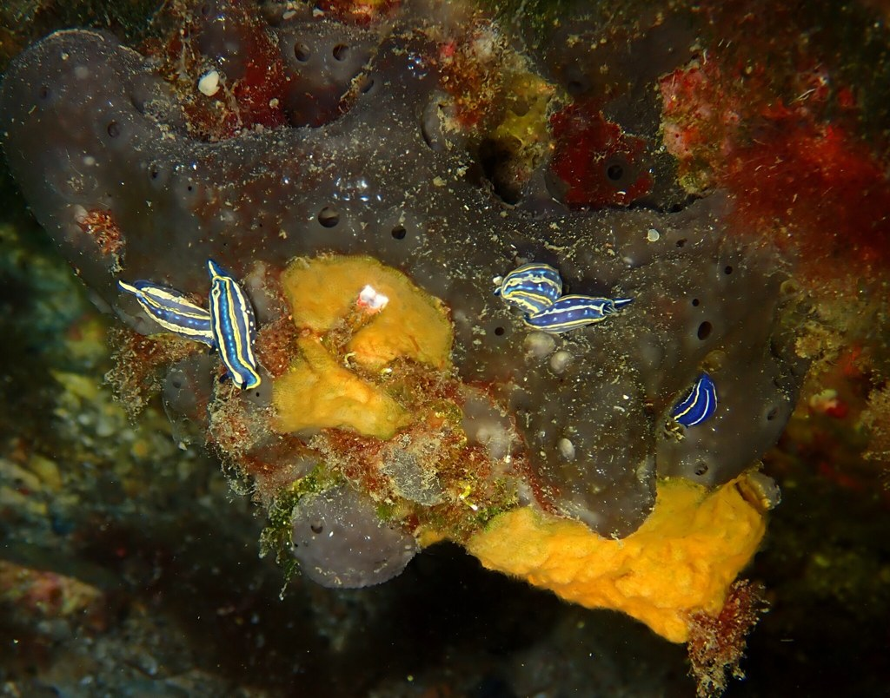
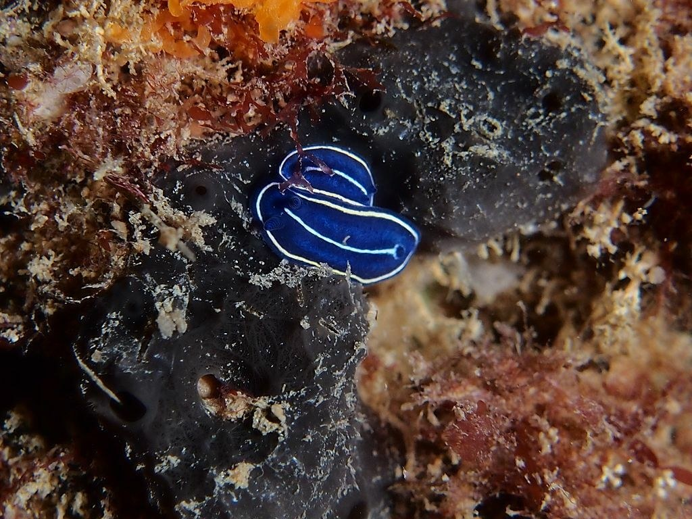
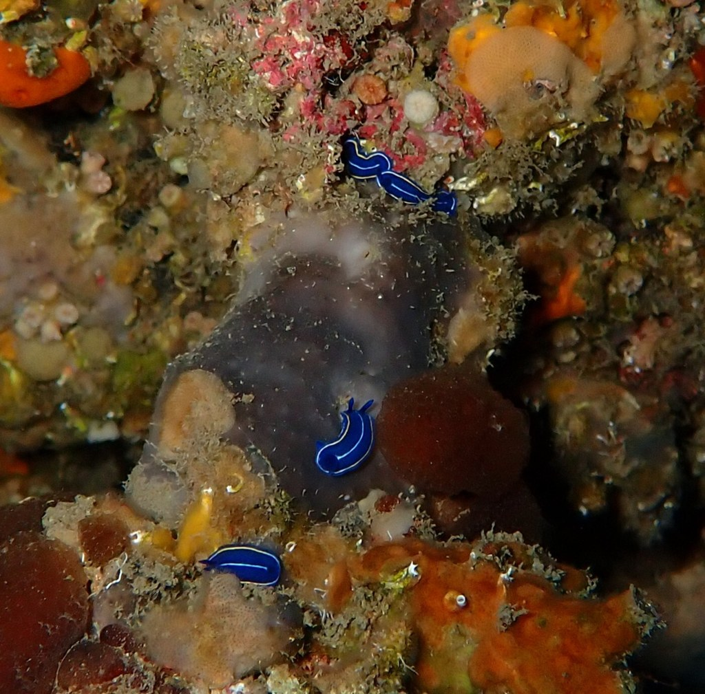
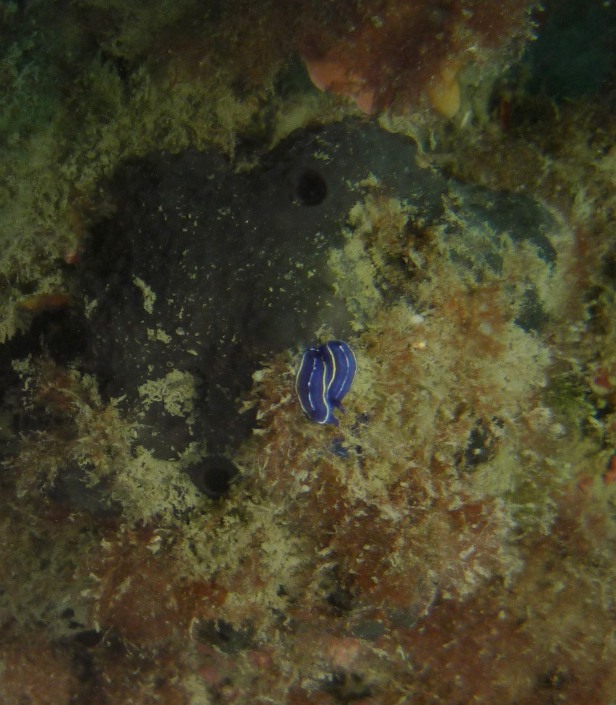
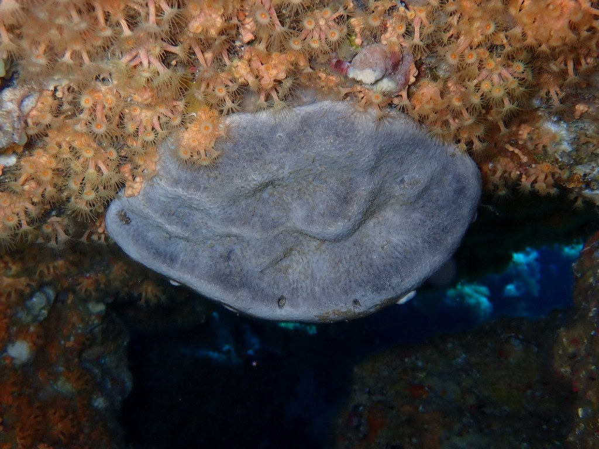
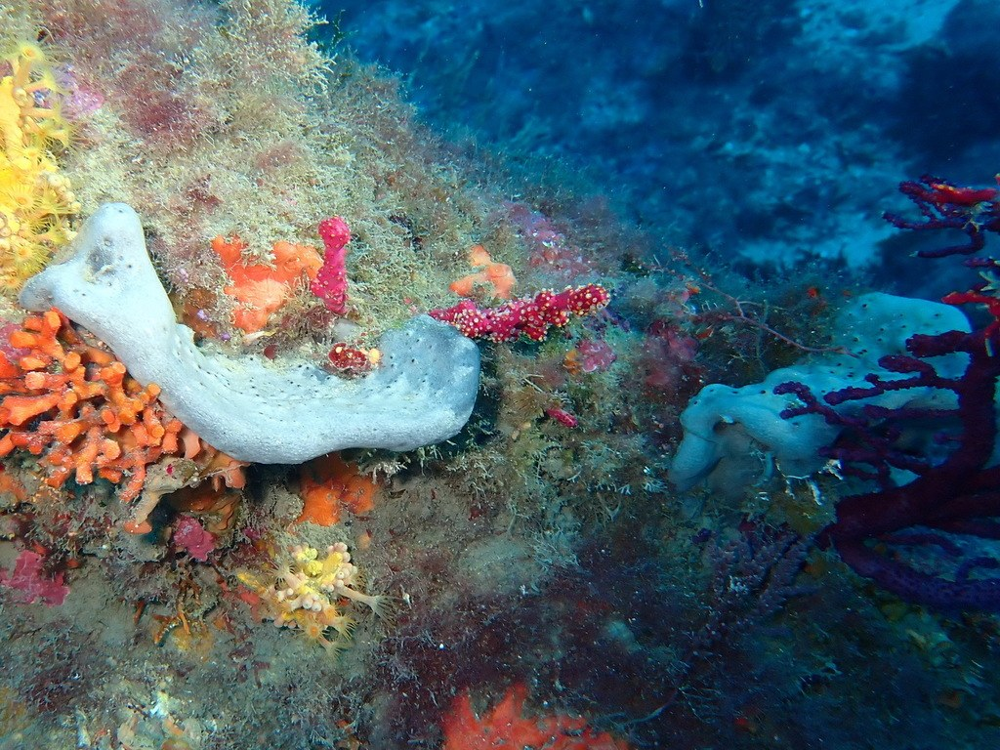
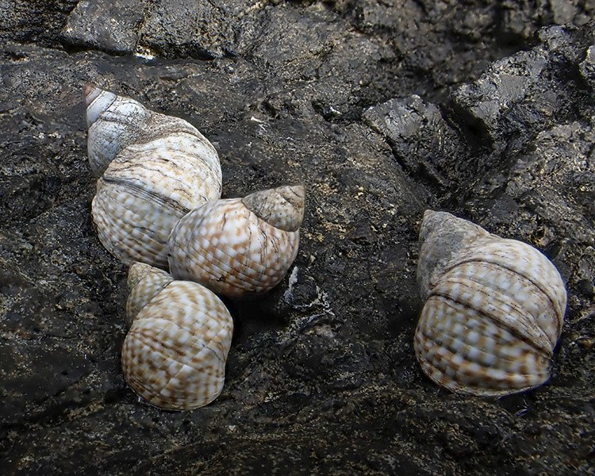
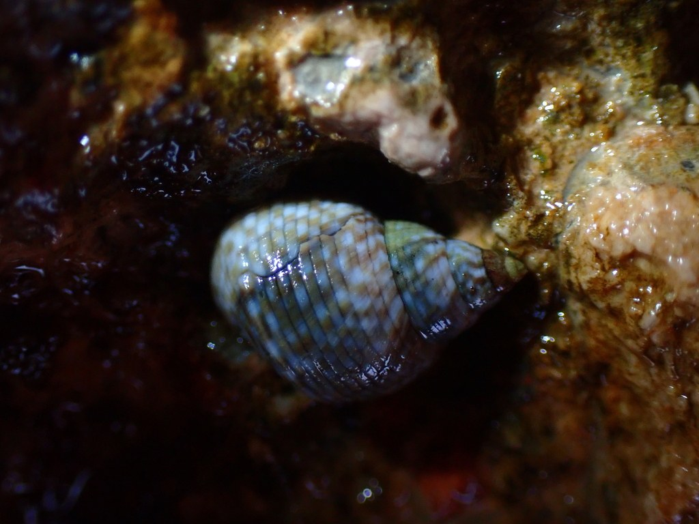
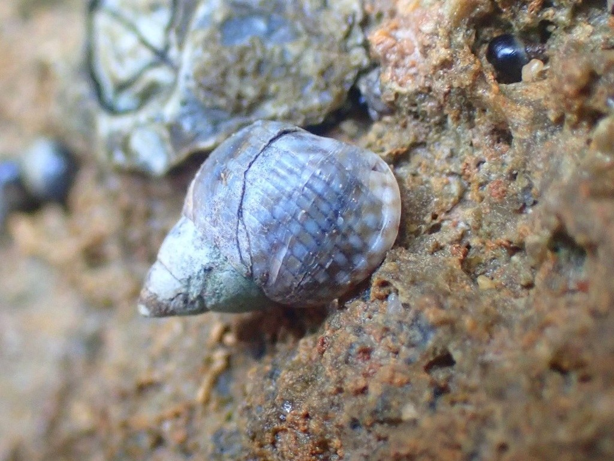

# Asociaciones entre especies marinas verificadas por su aparición conjunta en la misma fotografía: un cribado con un identificador automático sobre 1,2 millones de fotografías de ciencia ciudadana

**Autor: Gustavo Zafra** · Creador y desarrollador de BioFauna (identificador BioCLIP-2.5 ViT-H/14 + FAISS) y de las aplicaciones FotoFauna y BioQuest; colaborador de la plataforma de ciencia ciudadana Minka SDG.

**Versión v22 — 8-oct-2026** · Proyecto Correlación (BioFauna). Reescritura: las conclusiones se basan solo en la **proximidad real (centímetros)**, es decir, en fotografías donde aparecen las dos especies a la vez.

---

## Resumen

Que dos especies se observen en la misma inmersión no demuestra que estén relacionadas: un buceador ve muchas especies distintas en una salida. Aquí proponemos exigir **proximidad real: ambas especies en la misma fotografía**. Partimos de **1.222.170 fotografías** y **759.207 observaciones geolocalizadas** (Minka SDG, iNaturalist y otras fuentes), identificadas por **BioFauna**. Un cribado por *eventos* (observador × celda ~1 km × día × franja de 3 h), con el esfuerzo local controlado, solo sirve para **generar hipótesis**: 115.204 pares con soporte, de los cuales 51.401 son significativos, de modo que la significación por sí sola no discrimina. Para una lista corta de 138 parejas (las de mayor efecto y soporte) se buscó en la galería, con el identificador aplicado a la foto entera y a regiones, si aparecen las dos especies en una misma imagen: 41 parejas tuvieron al menos una foto candidata y 12 tres o más observaciones distintas, pero la revisión a ojo mostró **numerosos falsos positivos entre especies parecidas**. Se confirmaron a ojo parejas con ambas especies visibles (*Peltodoris atromaculata* sobre *Petrosia ficiformis*, *Cratena peregrina* sobre hidrozoos, *Condylactis aurantiaca* con el camarón *Periclimenes scriptus*, *Lysmata grabhami* con *Telmatactis cricoides* y *Electra posidoniae* con *Tridentata perpusilla* sobre una misma hoja de *Posidonia*), y para otras no apareció ninguna foto conjunta. La proximidad en una foto muestra convivencia a escala de centímetros, **no interacción**, y la segunda especie la propone el identificador sin confirmación de curadores.

**Palabras clave:** ciencia ciudadana, asociaciones interespecíficas, proximidad, aprendizaje profundo, Mediterráneo, fotografía submarina.

## 1. Introducción

La fotografía submarina *amateur* es una fuente masiva de datos de biodiversidad. Las plataformas de ciencia ciudadana (**Minka SDG**, impulsada desde el ecosistema **FECDAS**; **iNaturalist**; **GBIF**) acumulan millones de observaciones, pero la mayoría de los análisis se limitan a inventarios y mapas de distribución. Inferir asociaciones entre especies a partir de la co-ocurrencia en datos participativos tiene sesgos conocidos de esfuerzo y de observador (Isaac et al., 2014; Johnston et al., 2018; Milanesi et al., 2020; Boyd et al., 2021): dos especies aparecen en la misma salida porque comparten hábitat o porque el mismo observador las fotografía el mismo día, no porque estén relacionadas. Proponemos un criterio más exigente: **solo cuenta como asociación la aparición de las dos especies en la misma fotografía**, es decir, a escala de centímetros.

## 2. Material y métodos

### 2.1 Datos
1.222.170 fotografías de la galería BioFauna (Minka SDG 377.476; iNaturalist 779.411; GBIF, Wikimedia Commons, DORIS/FFESSM, SeaSlugForum, WoRMS, FishBase y otras) y 759.207 observaciones con coordenadas, fecha y (92 %) hora. Catálogo de 2.985 taxones mediterráneos.

### 2.2 Identificador
BioFauna recupera, con k-NN sobre *embeddings* BioCLIP-2.5 ViT-H/14 con índice FAISS (k = 15, T = 0,05, máximo 3 votos por especie) y calibración jerárquica, la especie más probable de una imagen. En el panel de campo fuera de muestra (78.145 filas, 2.970 especies) acierta el **82,85 %** de las especies; el acierto crece con las fotos de referencia de la especie (Figura 3). Esto condiciona el estudio: las especies con pocas fotos y las pequeñas o camufladas se reconocen peor.

### 2.3 Cribado por eventos (solo generación de hipótesis)
Un *evento* es lo observado por el mismo observador en la misma celda de ~1 km, el mismo día y la misma franja de 3 h. Para cada pareja con ≥5 eventos en común se contrasta, con el esfuerzo local controlado (nulo condicionado al número y tamaño de eventos por bloque celda 0,1°·día, corrección de Benjamini-Hochberg sobre toda la familia), si co-ocurren más de lo esperado. **Este resultado no se interpreta como asociación**; solo ordena las parejas por tamaño de efecto y replicación (≥3 celdas, ≥3 días, ≥5 observadores) para elegir cuáles verificar. Detalle en el Suplemento.

### 2.4 Verificación por proximidad real (criterio principal)
Para cada pareja (A, B) de la lista corta se analizaron hasta 60 fotos de A y de B de la galería. Cada foto se divide en cinco vistas (entera y cuatro cuadrantes) y se calcula su *embedding*; se busca en el índice vivo (300 vecinos) y una pareja tiene **foto candidata** si la otra especie aparece en alguna vista con similitud ≥ 0,82 (o como primera opción con ≥ 0,86). El detector solo propone: **cada candidata se revisa a ojo** y solo se acepta si ambas especies son visibles en la imagen. Las parejas de especies parecidas (mismo género o familia) producen falsos positivos y se descartan en la revisión.

### 2.5 Niveles de evidencia
**Nivel 0:** co-ocurrencia por evento (solo pista). **Nivel 1:** ambas especies en la misma foto en ≥3 observaciones independientes. **Nivel 2:** además, contacto visible (sobre, dentro, alimentándose). La ausencia de fotos conjuntas deja la pareja *sin confirmar*, no refutada: la galería son sobre todo retratos centrados de una especie.

### 2.6 Licencias y atribución
Se usan fotografías CC0, CC BY, CC BY-SA y CC BY-NC / CC BY-NC-SA; se excluyen las que no tienen licencia y las CC BY-NC-ND. Cada foto indica autor, licencia, fecha y hora local, lugar y enlace a la observación. Las marcadas con † (no comerciales) **deben sustituirse por fotos CC0, CC BY o CC BY-SA, o contar con permiso del autor, si el artículo se publica en una revista comercial**.

## 3. Resultados

### 3.1 Del cribado por eventos a la lista corta
De 115.204 parejas con ≥5 eventos, 51.401 son significativas con el esfuerzo controlado y 3.108 combinan replicación y razón observado/esperado ≥3 (Figura 1). Como casi la mitad de las parejas con soporte son «significativas», la significación no discrimina y no se usa como conclusión.

<figure class="fig"><figcaption><b>Figura 1. Del cribado por eventos a las parejas con fotografía conjunta.</b> Número de parejas que superan cada filtro (escala logarítmica). Gris: cribado por eventos (hipótesis); azul: lista corta de 138 parejas (las 70 de mayor puntuación y las 70 de mayor puntuación entre grupos taxonómicos distintos, con n ≥ 15 eventos y ≥ 8 observadores), parejas con al menos una foto candidata y parejas con tres o más observaciones distintas. Datos: <a href="https://github.com/yespi/biofauna/blob/master/data/copresencia_pares_20261006.csv">data/copresencia_pares_20261006.csv</a>.</figcaption></figure>

### 3.2 Detección de ambas especies en la misma foto
De las 138 parejas, 41 tuvieron al menos una foto candidata y 12 tres o más observaciones distintas (Figura 2). La revisión a ojo de las primeras mostró **falsos positivos entre especies parecidas** (por ejemplo dos almejas, *Polititapes aureus* y *Ruditapes decussatus*, o dos nudibranquios, *Caloria quatrefagesi* y *Luisella babai*): el identificador reconoce a la especie parecida en otra región de la imagen. Esto confirma que la detección automática solo propone y que muchas coincidencias «significativas» no resisten la revisión.

<figure class="fig"><figcaption><b>Figura 2. Fotos candidatas por pareja y resultado de la revisión visual.</b> Observaciones distintas con foto candidata de ambas especies para las 14 parejas con más candidatas. Verde: confirmada a ojo con ambas especies visibles; rojo: falso positivo por especies parecidas; gris: sin revisar o por confirmar (<i>Echinolittorina</i>–<i>Melarhaphe</i>, <i>Cliona</i>/<i>Clavularia</i>–<i>Rocellaria</i>, <i>Anas</i>–<i>Gallinula</i>).</figcaption></figure>

### 3.3 Parejas con ambas especies visibles
La Tabla 2 recoge las parejas confirmadas a ojo y las Láminas 1–9 las fotografías. *Peltodoris atromaculata* sobre *Petrosia ficiformis* (Avila, 1996) y *Cratena peregrina* sobre hidrozoos sirven de **control positivo**: son relaciones documentadas y el método encuentra fotos con ambas visibles. *Condylactis aurantiaca* con *Periclimenes scriptus* (el camarón entre los tentáculos de la anémona) salió de la lista corta; es coherente con el comensalismo conocido de los *Periclimenes* con anémonas, sin que se haya comprobado bibliografía específica para esta pareja. *Lysmata grabhami* con *Telmatactis cricoides* (camarón limpiador y anémona) y *Electra posidoniae* con *Tridentata perpusilla* (briozoo y hidrozoo sobre una misma hoja de *Posidonia*) muestran proximidad real, pero en el segundo caso es **microhábitat compartido, no interacción demostrada**. La segunda especie de cada foto la identifica BioFauna y **no está confirmada por curadores**.

| Tabla 2. Parejas con fotografías de ambas especies en la misma imagen | Nivel | Fotos (obs. distintas) | Origen |
|---|---|---:|---|
| *Peltodoris atromaculata* sobre *Petrosia ficiformis* (predación) | 2 | 4 (4) | control positivo (relación documentada) |
| *Cratena peregrina* sobre colonias de hidrozoos (*Eudendrium racemosum*; kleptopredación) | 2 | 4 (4) | control positivo (relación documentada) |
| *Condylactis aurantiaca* con el camarón *Periclimenes scriptus* (comensalismo) | 2 | 4 (4) | lista corta del cribado |
| *Lysmata grabhami* y *Telmatactis cricoides* (limpieza) | 1 | 4 (4) | selección previa (limpiador) |
| *Scyllaea pelagica* sobre *Sargassum* flotante | 0–1 | 1 (1) | selección previa |
| *Electra posidoniae* y *Tridentata perpusilla* sobre hojas de *Posidonia* (microhábitat compartido) | 1 | 4 (4) | lista corta del cribado |
| *Felimare orsinii* sobre una esponja oscura (*Scalarispongia scalaris*) | 1 | 4 (4) | pares de misma foto (revisión a ojo 8-oct) |
| *Parazoanthus axinellae* junto a *Spongia lamella* | 1 | 2 (2) | pares de misma foto (revisión a ojo 8-oct) |
| *Echinolittorina punctata* y *Melarhaphe neritoides* (zona de salpicadura) | 0–1 | 3 (3) | pares de misma foto (con cautela) |

### 3.5 Otras relaciones detectadas (candidatas del cribado)
El cribado dejó 41 parejas con al menos una foto candidata (incluidas 8 parejas de aves acuáticas de la lista corta de 138: el título habla de especies marinas, pero el criterio de la misma foto no depende del grupo, y las aves figuran sin revisar a ojo). La Tabla 3 las lista con su estado de revisión; las que figuran «sin revisar a ojo» son hipótesis pendientes de comprobación visual, no resultados. Las parejas de las láminas 7–9 se añaden en esta versión (v22).

Tabla 3. Parejas candidatas con foto de ambas especies según el detector

| Pareja | Obs. distintas con foto candidata | Estado |
|---|---:|---|
| *Electra posidoniae* – *Tridentata perpusilla* | 43 | lámina 6 |
| *Polititapes aureus* – *Ruditapes decussatus* | 31 | falso positivo (especies parecidas) |
| *Condylactis aurantiaca* – *Periclimenes scriptus* | 31 | lámina 3 |
| *Caloria quatrefagesi* – *Luisella babai* | 24 | falso positivo (especies parecidas) |
| *Echinolittorina punctata* – *Melarhaphe neritoides* | 15 | lámina 9, con cautela |
| *Anas platyrhynchos* – *Gallinula chloropus* | 14 | aves acuáticas; sin revisar a ojo |
| *Cliona rhodensis* – *Rocellaria dubia* | 14 | descartada (no se ve el bivalvo) |
| *Clavularia crassa* – *Rocellaria dubia* | 13 | sin revisar a ojo |
| *Clavelina lepadiformis* – *Echinaster sepositus* | 6 | débil (ascidia no confirmable) |
| *Eryngium maritimum* – *Pancratium maritimum* | 4 | no confirmada (no se distingue *Eryngium*) |
| *Calystegia soldanella* – *Medicago marina* | 3 | 1 obs.; sin decidir |
| *Mactra corallina* – *Peronaea planata* | 3 | sin revisar a ojo |
| *Chamelea gallina* – *Glycymeris glycymeris* | 2 | sin revisar a ojo |
| *Chamelea gallina* – *Spisula subtruncata* | 2 | sin revisar a ojo |
| *Donax trunculus* – *Spisula subtruncata* | 2 | sin revisar a ojo |
| *Sicyonia carinata* – *Synodus saurus* | 2 | sin revisar a ojo |
| *Ophidiaster ophidianus* – *Tripterygion delaisi* | 2 | sin revisar a ojo |
| *Holothuria forskali* – *Reptadeonella violacea* | 2 | sin revisar a ojo |
| *Columbella rustica* – *Conus ventricosus* | 1 | sin revisar a ojo |
| *Chroicocephalus ridibundus* – *Gallinula chloropus* | 1 | aves acuáticas; sin revisar a ojo |
| *Ardea cinerea* – *Gallinula chloropus* | 1 | aves acuáticas; sin revisar a ojo |
| *Diaphorodoris alba* – *Luisella babai* | 1 | sin revisar a ojo |
| *Mactra corallina* – *Turritellinella tricarinata* | 1 | sin revisar a ojo |
| *Donax semistriatus* – *Spisula subtruncata* | 1 | sin revisar a ojo |
| *Barbatia barbata* – *Limaria tuberculata* | 1 | sin revisar a ojo |
| *Chamelea gallina* – *Mactra corallina* | 1 | sin revisar a ojo |
| *Anas platyrhynchos* – *Phalacrocorax carbo* | 1 | aves acuáticas; sin revisar a ojo |
| *Chamelea gallina* – *Ensis minor* | 1 | sin revisar a ojo |
| *Fistularia commersonii* – *Siganus rivulatus* | 1 | sin revisar a ojo |
| *Cotylorhiza tuberculata* – *Diplodus vulgaris* | 1 | sin revisar a ojo |
| *Acanthocardia tuberculata* – *Cymodocea nodosa* | 1 | sin revisar a ojo |
| *Chthamalus stellatus* – *Echinolittorina punctata* | 1 | sin revisar a ojo |
| *Semicassis undulata* – *Synodus saurus* | 1 | sin revisar a ojo |
| *Ophisurus serpens* – *Sicyonia carinata* | 1 | sin revisar a ojo |
| *Condylactis aurantiaca* – *Gobius geniporus* | 1 | sin revisar a ojo |
| *Holothuria forskali* – *Pleraplysilla spinifera* | 1 | sin revisar a ojo |
| *Epinephelus costae* – *Pinna rudis* | 1 | sin revisar a ojo |
| *Muraena helena* – *Octopus vulgaris* | 1 | sin revisar a ojo |
| *Chthamalus stellatus* – *Cystoseira compressa* | 1 | sin revisar a ojo |
| *Conger conger* – *Galathea strigosa* | 1 | sin revisar a ojo |
| *Bispira volutacornis* – *Phycis phycis* | 1 | sin revisar a ojo |

### 3.4 Parejas sin foto conjunta
No apareció ninguna foto con ambas especies para *Felimare picta*–*Ircinia oros*, *Muraena helena*–*Ophidiaster ophidianus* ni *Fistularia commersonii*–*Pterois miles*. Eso no prueba que no convivan, y no permite afirmar ninguna relación: quedan *sin confirmar*.

<b>Lámina 1. <i>Peltodoris atromaculata</i> sobre <i>Petrosia ficiformis</i> (predación).</b> <i>Esponja identificada por BioFauna como <i>Petrosia ficiformis</i> (variantes púrpura, rojiza y crema); sin confirmación de curadores.</i>

<figure><figcaption>Lámina 1.1: Pau Pagès Jaén · CC BY · 2024-08-06 12:08 (Europe/Madrid) · Empordà Marítim, Girona, Cataluña; España · 42.0999° N, 3.1866° E (±36 m) · Minka obs 324790.</figcaption></figure>
<figure><figcaption>Lámina 1.2: Dean Zagorac · CC BY-NC † · 2023-08-07 16:40 (Europe/Zagreb) · Rožići, Kostrena, Općina Kostrena, Primorsko-goranska županija, Croacia; Dolina Ričine, Bakar, Primorsko-Goranska · 45.3024° N, 14.4878° E · iNaturalist obs 184319097.</figcaption></figure>
<figure><figcaption>Lámina 1.3: jmturon · CC BY-NC † · 2022-07-23 10:16 (Europe/Madrid) · Empordà Marítim, Girona, Cataluña; España · 42.0860° N, 3.1988° E (±287 m) · Minka obs 205860.</figcaption></figure>
<figure><figcaption>Lámina 1.4: Óscar Comellas Garcia · CC BY-NC † · 2023-11-11 11:43 (Europe/Madrid) · Girona, España; Empordà Marítim, Girona, Cataluña · 42.0736° N, 3.2055° E (±55 m) · Minka obs 203388.</figcaption></figure>

<b>Lámina 2. <i>Cratena peregrina</i> sobre colonias de hidrozoos (<i>Eudendrium racemosum</i>; kleptopredación).</b> <i>Hidrozoo identificado por BioFauna como <i>Eudendrium racemosum</i>; sin confirmación de curadores.</i>

<figure><figcaption>Lámina 2.1: xavi salvador costa · CC BY-NC † · 2024-11-02 22:52 (Europe/Paris) · La Peyrade, Frontignan, Montpellier, Hérault, Francia; ABC de la Lagune, Hérault, Languedoc-Roussillon · 43.4247° N, 3.7000° E (±88 m) · Minka obs 392849.</figcaption></figure>
<figure><figcaption>Lámina 2.2: xatrac · CC BY-NC † · 2022-08-27 10:08 (Europe/Paris) · Venta de Goya, Lloret de Mar, la Selva, Cataluña, España; Comarca de la Selva, Girona, Cataluña · 41.6913° N, 2.8299° E (±183 m) · Minka obs 88838.</figcaption></figure>
<figure><figcaption>Lámina 2.3: xatrac · CC BY-NC † · 2022-08-10 09:42 (Europe/Paris) · Venta de Goya, Lloret de Mar, la Selva, Cataluña, España; Comarca de la Selva, Girona, Cataluña · 41.6913° N, 2.8299° E (±183 m) · Minka obs 88546.</figcaption></figure>
<figure><figcaption>Lámina 2.4: xatrac · CC BY-NC † · 2022-08-07 09:16 (Europe/Paris) · Venta de Goya, Lloret de Mar, la Selva, Cataluña, España; Comarca de la Selva, Girona, Cataluña · 41.6913° N, 2.8299° E (±183 m) · Minka obs 88528.</figcaption></figure>

<b>Lámina 3. <i>Condylactis aurantiaca</i> con el camarón <i>Periclimenes scriptus</i> (comensalismo).</b> <i>Camarón identificado por BioFauna como <i>Periclimenes scriptus</i>; sin confirmación de curadores.</i>

<figure><figcaption>Lámina 3.1: xavi salvador costa · CC BY-NC † · 2016-09-10 22:07 (Europe/Paris) · Begur, Bajo Ampurdán, Cataluña, España; Empordà Marítim, Girona, Cataluña · 41.9355° N, 3.2176° E (±185 m) · Minka obs 28492.</figcaption></figure>
<figure><figcaption>Lámina 3.2: Sylvain Le Bris · CC BY-NC † · 2026-04-08 22:17 (Europe/Paris) · Montredon, Marseille, France; Bouches-Du-Rhône, Bouches-du-Rhône, Provence-Alpes-Côte d'Azur; Francia · 43.2325° N, 5.3502° E (±101 m) · iNaturalist obs 348576200.</figcaption></figure>
<figure><figcaption>Lámina 3.3: xavi salvador costa · CC BY-NC † · 2016-07-09 22:18 (Europe/Paris) · Begur, Bajo Ampurdán, Cataluña, España; Empordà Marítim, Girona, Cataluña · 41.9366° N, 3.2201° E (±185 m) · Minka obs 28862.</figcaption></figure>
<figure><figcaption>Lámina 3.4: xavi salvador costa · CC BY-NC † · 2018-09-01 16:03 (Europe/Paris) · Begur, Bajo Ampurdán, Cataluña, España; Empordà Marítim, Girona, Cataluña · 41.9357° N, 3.2176° E (±142 m) · Minka obs 35885.</figcaption></figure>

<b>Lámina 4. <i>Lysmata grabhami</i> y <i>Telmatactis cricoides</i> (limpieza).</b> <i>Camarón limpiador y anémona identificados por BioFauna; en dos fotos el camarón es pequeño.</i>

<figure><figcaption>Lámina 4.1: jmturon · CC BY-NC † · 2023-12-05 10:57 (Atlantic/Canary) · Las Coloradas; LANZAROTE with iselets and seashore, Las Palmas, Islas Canarias; España · 28.8506° N, 13.7995° W (±662 m) · Minka obs 210346.</figcaption></figure>
<figure><figcaption>Lámina 4.2: jmturon · CC BY-NC † · 2023-12-06 20:06 (Atlantic/Canary) · Playa Flamingo; LANZAROTE with iselets and seashore, Las Palmas, Islas Canarias; España · 28.8552° N, 13.8439° W (±361 m) · Minka obs 210532.</figcaption></figure>
<figure><figcaption>Lámina 4.3: phil_newman · CC BY-NC † · 2025-11-22 11:50 (Atlantic/Canary) · Playa Flamingo Playa Blanca Lanzarote; LANZAROTE with iselets and seashore, Las Palmas, Islas Canarias; España · 28.8568° N, 13.8428° W (±100 m) · iNaturalist obs 329826704.</figcaption></figure>
<figure><figcaption>Lámina 4.4: whodden · CC BY-NC † · 2007-04-04 00:00 (Europe/Madrid) · Punta Prieta, Güímar, Canarias, España; TENERIFE with seashore, Santa Cruz de Tenerife, Islas Canarias · 28.2660° N, 16.3869° W (±14 m) · iNaturalist obs 2354980.</figcaption></figure>

<b>Lámina 5. <i>Scyllaea pelagica</i> sobre <i>Sargassum</i> flotante.</b> <i>Solo se ve con claridad el nudibranquio camuflado; <i>Latreutes</i> e <i>Hippolyte</i> no se distinguen a ojo.</i>

<figure><figcaption>Lámina 5.1: Ben Eddy · CC BY-NC † · 2023-06-27 13:52 (Atlantic/Bermuda) · Southampton, BM; Bermuda Marine, Sandys; Bermudas · 32.2556° N, 64.8742° W (±105 m) · iNaturalist obs 170761288.</figcaption></figure>

<b>Lámina 6. <i>Electra posidoniae</i> y <i>Tridentata perpusilla</i> sobre hojas de <i>Posidonia</i> (microhábitat compartido).</b> <i>Briozoo incrustante y hidrozoo sobre la misma hoja; microhábitat compartido, no interacción demostrada.</i>

<figure><figcaption>Lámina 6.1: xavi salvador costa · CC BY-NC † · 2023-08-09 11:01 (Europe/Madrid) · Vegueria de Barcelona, Barcelona, Cataluña; España · 41.3957° N, 2.2114° E (±115 m) · Minka obs 153028.</figcaption></figure>
<figure><figcaption>Lámina 6.2: conxi · CC BY-NC † · 2025-05-31 11:48 (Europe/Madrid) · Valldolig, Blanes, la Selva, Cataluña, España; Vegueria de Barcelona, Barcelona, Cataluña · 41.6732° N, 2.8022° E (±178 m) · Minka obs 511234.</figcaption></figure>
<figure><figcaption>Lámina 6.3: ester serrao · CC BY · 2024-06-30 07:17 (America/Costa_Rica) · Esterillos Oeste, Parrita, Puntarenas, Costa Rica · 9.5237° N, 84.5099° W · Minka obs 629063.</figcaption></figure>
<figure><figcaption>Lámina 6.4: Manel Ortega · CC BY · 2025-08-10 10:13 (Europe/Madrid) · Llançà, Alto Ampurdán, Cataluña, España; Orientales, Girona, Cataluña · 42.3875° N, 3.1612° E (±622 m) · Minka obs 544263.</figcaption></figure>

<b>Lámina 7. <i>Felimare orsinii</i> sobre una esponja oscura (<i>Scalarispongia scalaris</i>).</b> <i>Esponja identificada solo por BioFauna a partir de la foto (sin confirmación de curadores): se presenta como nivel 1 (aparece sobre), sin afirmar depredación.</i>

<figure><figcaption>Lámina 7.1: motalec · CC BY-NC † · 2026-08-02 14:01 (Europe/Paris) · 8e Arrondissement, Marseille, France; Bouches-Du-Rhône, Bouches-du-Rhône, Provence-Alpes-Côte d'Azur · 43.1907° N, 5.3827° E · iNaturalist obs 389401988.</figcaption></figure>
<figure><figcaption>Lámina 7.2: xavi salvador costa · CC BY-NC † · 2016-07-25 23:04 (Europe/Madrid) · Empordà Marítim, Girona, Cataluña · 41.7658° N, 3.0026° E · Minka obs 418034.</figcaption></figure>
<figure><figcaption>Lámina 7.3: motalec · CC BY-NC † · 2025-04-26 09:37 (Europe/Paris) · Impérial du Milieu; Bouches-Du-Rhône, Bouches-du-Rhône, Provence-Alpes-Côte d'Azur · 43.1716° N, 5.3938° E · iNaturalist obs 275056747.</figcaption></figure>
<figure><figcaption>Lámina 7.4: Alessandro Diotallevi · CC BY-NC † · 2024-04-28 10:06 (Etc/GMT-1) · lugar no indicado · 41.2450° N, 12.3467° E · iNaturalist obs 212560581.</figcaption></figure>

<b>Lámina 8. <i>Parazoanthus axinellae</i> junto a <i>Spongia lamella</i>.</b> <i>Esponja laminar gris junto a colonias de <i>Parazoanthus</i>: coexistencia en el mismo plano, sin interacción demostrada.</i>

<figure><figcaption>Lámina 8.1: Sylvain Le Bris · CC BY-NC † · 2025-08-15 10:55 (Europe/Paris) · Pierre à Joseph, Marseille, France; Bouches-Du-Rhône, Bouches-du-Rhône, Provence-Alpes-Côte d'Azur · 43.1851° N, 5.3894° E · iNaturalist obs 307095607.</figcaption></figure>
<figure><figcaption>Lámina 8.2: Sylvain Le Bris · CC BY-NC † · 2026-05-17 09:42 (Europe/Paris) · Pharillons, Marseille, France; Bouches-Du-Rhône, Bouches-du-Rhône, Provence-Alpes-Côte d'Azur · 43.2074° N, 5.3380° E · iNaturalist obs 362838925.</figcaption></figure>

<b>Lámina 9. <i>Echinolittorina punctata</i> y <i>Melarhaphe neritoides</i> (zona de salpicadura).</b> <i>Caracoles de la zona de salpicadura sobre la misma roca. Son especies muy parecidas: la separación depende de BioFauna y requiere confirmación de un experto (nivel 0–1).</i>

<figure><figcaption>Lámina 9.1: Golfopolikayak · CC BY · 2020-06-19 16:58 (Europe/Paris) · 87029 Scalea CS, Italia; Pollino, Cosenza, Calabria · 39.8191° N, 15.7775° E · iNaturalist obs 56350676.</figcaption></figure>
<figure><figcaption>Lámina 9.2: Mar Humet Caballero · CC BY-NC † · 2026-08-03 17:51 (Europe/Madrid) · Camping Cases, Carrer a l'Ombra del Montsià, les Cases d'Alcanar, Alcanar, Montsià, Tarragona, Catalunya, 43530, Espanya; RB ESP 44. Reserva de la Biosfera.Terras de L’Ebre. Cataluña. España., Castellón, Cataluña · 40.5557° N, 0.5335° E · Minka obs 834586.</figcaption></figure>
<figure><figcaption>Lámina 9.3: Calum McLennan · CC BY-NC † · 2021-08-25 11:24 (Europe/London) · Alicante, Spain; Javea - Xabia, Alicante, Comunidad Valenciana · 38.8169° N, 0.1688° E · iNaturalist obs 92485321.</figcaption></figure>

## 4. Discusión

**Qué demuestra y qué no.** Una foto con las dos especies demuestra proximidad a escala de centímetros en un instante; no demuestra que se busquen, se eviten o interactúen. Tres o más observaciones independientes con ambas visibles dan replicación, y el contacto visible (sobre, dentro, comiendo) apunta a una relación, que debe confirmarse con curadores y bibliografía. La co-ocurrencia por evento, en cambio, solo señala especies que comparten sitio y fecha y **no se usa como resultado**: al exigir la misma foto desaparecen la mayoría de las coincidencias.

**Sesgos.** La galería está formada sobre todo por retratos centrados de una especie, lo que subestima la proporción de fotos con una segunda especie; el identificador reconoce peor las especies pequeñas o camufladas, y confunde especies parecidas (falsos positivos); solo se han revisado a ojo las primeras candidatas; y el análisis parte de fotos con licencias muy diversas, lo que limita las láminas.

## 5. Limitaciones

**Cifra del identificador.** El 82,85 % procede del panel de evaluación y una parte de sus filas (≈12,6 % con similitud ≥ 0,95 con la galería) puede coincidir con fotos ya indexadas, por lo que puede estar sobreestimado; se recalculará sin fuga contra el índice vivo. **Validación externa.** Se probó el cruce con la base de interacciones GloBI y no mostró señal en los grupos de este trabajo (la coincidencia procedía de 7 parejas de solo 5 especies de aves acuáticas, no independientes y con el tipo genérico «interactúa con»; sin ellas no hay enriquecimiento, p = 0,68; la API no permite separar los registros de iNaturalist), por lo que no se usa como validación. La proximidad en una foto no es interacción. La identidad de la segunda especie es una propuesta del identificador. La lista corta se eligió por tamaño de efecto y soporte, no por azar, y las parejas de control positivo y las candidatas de láminas previas se eligieron por criterio del autor. La novedad de ninguna pareja se ha contrastado todavía con la bibliografía ni con curadores. Las fotos CC BY-NC deben sustituirse en una revista comercial.

## 6. Conclusiones

1. El cribado por co-ocurrencia de eventos, aun con el esfuerzo controlado, no es evidencia de asociación: genera miles de coincidencias, de las que solo una pequeña parte resiste la revisión por proximidad real.
2. La proximidad real (ambas especies en la misma fotografía) es un criterio verificable por cualquier lector; con él se han confirmado a ojo siete parejas (dos de ellas nuevas en la v22, de nivel 1), dos de ellas con contacto visible entre organismos de grupos distintos además de los controles positivos.
3. El método sirve para proponer parejas y fotografías que los curadores pueden verificar; no sustituye su criterio.

## Agradecimientos

A la comunidad observadora y, muy especialmente, a las **personas curadoras** que sostienen la fiabilidad de
las identificaciones —en especial **Miquel Pontes**, **Xavier Salvador** y **Berta Companys**— y al conjunto de
la comunidad de curaduría de **Minka SDG** e **iNaturalist**. Mención especial a la **FECDAS** y a su
**Projecte Aneris** por impulsar la ciencia ciudadana marina y la formación de observadores; a **Minka SDG** e
**iNaturalist** por las plataformas y los datos; y a **GBIF**, **Wikimedia Commons**, **DORIS/FFESSM**,
**SeaSlugForum**, **WoRMS** y **FishBase** por las imágenes y los datos taxonómicos. Este análisis ha sido
posible gracias al **identificador BioFauna** (BioCLIP-2.5 ViT-H/14 + FAISS), creado y desarrollado por
**Gustavo Zafra** (autor de este manuscrito), con la colaboración del autor en la plataforma Minka SDG.

**Agradecimiento a los modelos de inteligencia artificial (2026).** Este trabajo se ha beneficiado del
acompañamiento de los principales asistentes de IA disponibles en 2026, que participaron en el desarrollo del
identificador, el diseño experimental, el análisis de co-ocurrencia, la revisión de la literatura biológica y
la redacción del manuscrito: **Claude (Anthropic)**, **Grok (xAI)**, **Gemini (Google)**, **DeepSeek** y
otros modelos de lenguaje y visión de la época. Su contribución fue la de herramientas de asistencia a la
investigación bajo la supervisión y dirección del autor.

## Referencias

- Aceves-Bueno, E., Adeleye, A. S., Feraud, M., Huang, Y., Tao, M., Yang, Y., & Anderson, S. E. (2017). The accuracy of citizen science data: a quantitative review. *The Bulletin of the Ecological Society of America*, 98(4), 278–290.
- Avila, C. (1996). The growth of *Peltodoris atromaculata* Bergh, 1880 (Gastropoda, Nudibranchia) in the laboratory. *Journal of Molluscan Studies*, 62, 151–157. — dieta exclusiva sobre *Petrosia ficiformis*.
- Boyd, R. J., Powers, M., & Pescott, O. L. (2021). occAssess: an R package for assessing potential biases in species occurrence data. *Ecology and Evolution*, 11(22).
- Isaac, N. J. B., van Strien, A. J., August, T. A., de Zeeuw, M. P., & Roy, D. B. (2014). Statistics for citizen science: extracting signals of change from noisy ecological data. *Methods in Ecology and Evolution*, 5(10), 1052–1060.
- Johnston, A., Fink, D., Hochachka, W. M., & Kelling, S. (2018). Estimates of observer expertise improve species distributions from citizen science data. *Methods in Ecology and Evolution*, 9(4), 880–890.
- McDonald, G. R., & Nybakken, J. W. (2001). A worldwide review of the food of nudibranch mollusks. II. The suborder Doridacea. *The Veliger*.
- Milanesi, P., Mori, E., & Menchetti, M. (2020). Observer-oriented approach improves species distribution models from citizen science data. *Ecology and Evolution*, 10(21), 12104–12114.
- Peraza, E., Pérez, J. A., Abdul-Jalbar, B., Chinea, J., & Clemente, S. (2024). Exploring the association between the arrow crab *Stenorhynchus lanceolatus* and the sea anemone *Telmatactis cricoides* in the Canary Islands. *Regional Studies in Marine Science*.

## Disponibilidad de datos

## Disponibilidad de datos

**Todo el material está en el repositorio público de GitHub: https://github.com/yespi/biofauna** (rama `master`). Rutas completas:
- Parejas de la lista corta y sus fotos candidatas: [`data/copresencia_pares_20261006.csv`](https://github.com/yespi/biofauna/blob/master/data/copresencia_pares_20261006.csv) y [`data/copresencia_hits_20261006.jsonl`](https://github.com/yespi/biofauna/blob/master/data/copresencia_hits_20261006.jsonl).
- Manifiesto de las láminas con autor, licencia, fecha y hora, lugar y enlace de cada foto: [`papers/proyecto_correlacion/lamina_fotos/lamina_manifest_20261008.json`](https://github.com/yespi/biofauna/blob/master/papers/proyecto_correlacion/lamina_fotos/lamina_manifest_20261008.json).
- Listados del cribado por eventos (solo hipótesis), con su descripción: [`data/README_correlacion.md`](https://github.com/yespi/biofauna/blob/master/data/README_correlacion.md) y los ficheros `data/nulo_exacto_pares_*.csv` y `data/pares_*_20261005.csv`.
- Métodos y resultados ampliados, figuras y láminas: carpeta [`papers/proyecto_correlacion/`](https://github.com/yespi/biofauna/blob/master/papers/proyecto_correlacion/) (artículo en español e inglés, `LAMINAS`, `METODOS.md`, `RESULTADOS.md`, `figuras/`, `lamina_fotos/`). Las versiones sin número (`ARTICULO_ES_latest.pdf`, `ARTICLE_EN_latest.pdf`, `LAMINAS_latest.pdf`) se actualizan siempre; las versionadas se conservan las dos últimas.
- Identificador BioFauna (código, prototipos, calibradores, scripts de evaluación): carpetas [`src/`](https://github.com/yespi/biofauna/blob/master/src/), [`scripts/`](https://github.com/yespi/biofauna/blob/master/scripts/), [`data/`](https://github.com/yespi/biofauna/blob/master/data/) y [`papers/biofauna/`](https://github.com/yespi/biofauna/blob/master/papers/biofauna/).
- **No redistribuibles**: las fotografías de la galería (licencias de Minka SDG, iNaturalist y otras fuentes; las de las láminas se incluyen con atribución) y los *embeddings* por foto.

## Material suplementario

**Suplemento S1. Cribado por eventos (hipótesis).** Descripción del contraste con esfuerzo controlado y listados completos en [`NULO_EXACTO_TODOS_PARES_20261005.md`](https://github.com/yespi/biofauna/blob/master/papers/proyecto_correlacion/NULO_EXACTO_TODOS_PARES_20261005.md). Figuras S1 y S2 en [`papers/proyecto_correlacion/figuras/`](https://github.com/yespi/biofauna/blob/master/papers/proyecto_correlacion/figuras/).

<figure class="fig"><figcaption><b>Figura S1. Distribución del tamaño de efecto.</b> Razón entre eventos observados y esperados por el esfuerzo local, para las parejas con q ≤ 0,05 (gris) y las replicadas (azul); escala logarítmica en ambos ejes y líneas en 2, 3, 5 y 10. Una gran parte de las parejas significativas tiene razones bajas.</figcaption></figure>
<figure class="fig"><figcaption><b>Figura S2. Soporte frente a efecto en las parejas replicadas.</b> Cada punto es una pareja: eventos con ambas especies (n) frente a razón observado/esperado, coloreado por observadores distintos; la línea roja marca razón 3.</figcaption></figure>

**Láminas fotográficas** (`LAMINAS_latest.pdf`): las mismas láminas que la sección 3.3, con atribución completa.
