# Láminas fotográficas — Proyecto Correlación

**6-oct-2026 v7** · Cada lámina muestra **fotografías en las que se ven las dos especies de la asociación en la misma imagen**. Selección: de la galería BioFauna se analizaron hasta 300 fotos por pareja; cada foto se identificó entera y en regiones (cuadrantes, mitades, centro) y se conservaron las que contienen una región reconocida como la especie A y otra como la B; la selección final se revisó **a ojo**. La identidad de la segunda especie la propone BioFauna y no está confirmada por curadores.

† Fotografías con licencia no comercial (CC BY-NC / CC BY-NC-SA): **deben sustituirse por fotos CC0, CC BY o CC BY-SA, o contar con permiso del autor, si el artículo se publica en una revista comercial.** Atribución: autor, licencia, fecha y hora (hora local de la observación), lugar y enlace a la observación original.

No hay lámina de *Felimare picta*–*Ircinia oros*, *Muraena helena*–*Ophidiaster ophidianus* ni *Fistularia commersonii*–*Pterois miles*: en las fotos analizadas no apareció ninguna imagen con ambas especies. Eso no prueba que no convivan (la galería son sobre todo retratos centrados de una especie).

## Índice

- *Peltodoris atromaculata* sobre *Petrosia ficiformis* (predación) (4 fotos)
- *Cratena peregrina* sobre colonias de hidrozoos (*Eudendrium racemosum*; kleptopredación) (4 fotos)
- *Condylactis aurantiaca* con el camarón *Periclimenes scriptus* (comensalismo) (4 fotos)
- *Lysmata grabhami* y *Telmatactis cricoides* (limpieza) (4 fotos)
- *Scyllaea pelagica* sobre *Sargassum* flotante (1 fotos)
- *Electra posidoniae* y *Tridentata perpusilla* sobre hojas de *Posidonia* (microhábitat compartido) (4 fotos)

## *Peltodoris atromaculata* sobre *Petrosia ficiformis* (predación)

*Esponja identificada por BioFauna como *Petrosia ficiformis* (variantes púrpura, rojiza y crema); sin confirmación de curadores.*

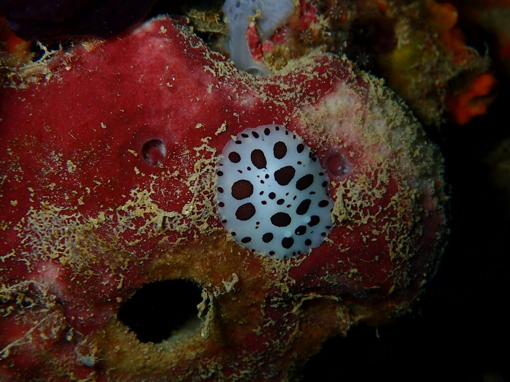

<small>Lámina 1.1: Pau Pagès Jaén · CC BY · 2024-08-06 12:08 (Europe/Madrid) · Spain · Minka obs 324790 — [observación](https://minka-sdg.org/observations/324790)</small>

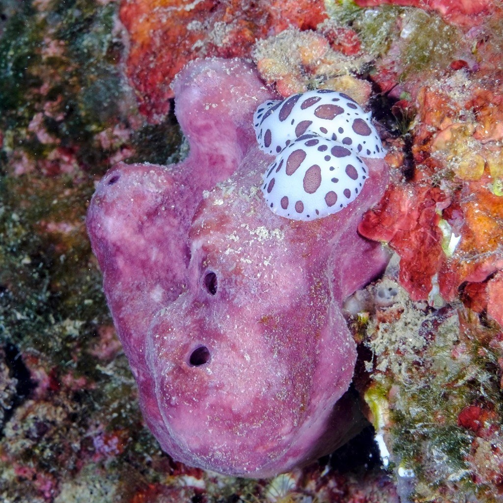

<small>Lámina 1.2: Dean Zagorac · CC BY-NC † · 2023-08-07 16:40 (Europe/Zagreb) · Kostrena, Primorsko-Goranska, Croatia · iNaturalist obs 184319097 — [observación](https://www.inaturalist.org/observations/184319097)</small>

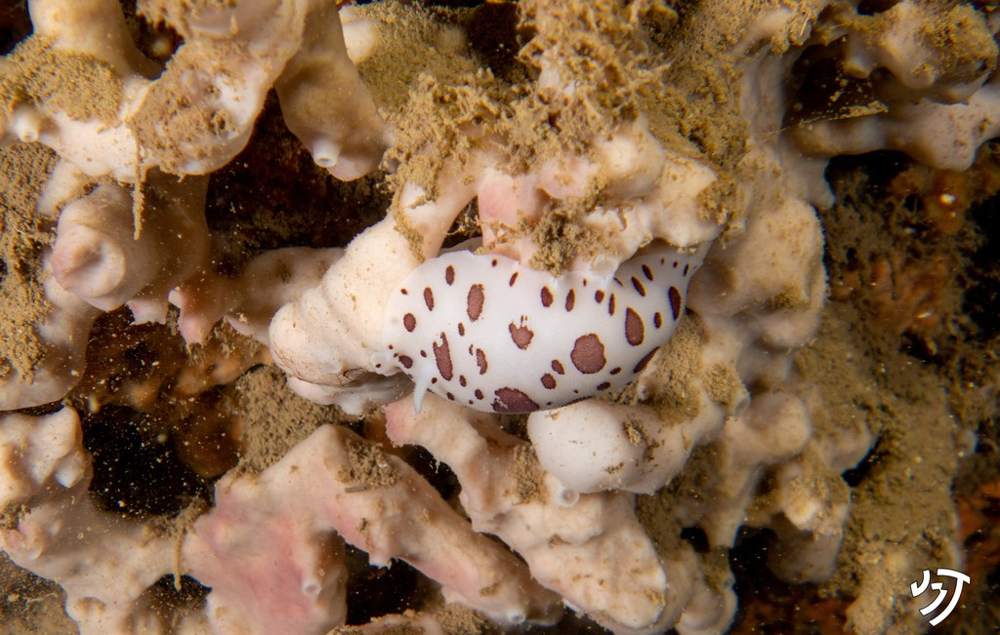

<small>Lámina 1.3: jmturon · CC BY-NC † · 2022-07-23 10:16 (Europe/Madrid) · Spain · Minka obs 205860 — [observación](https://minka-sdg.org/observations/205860)</small>

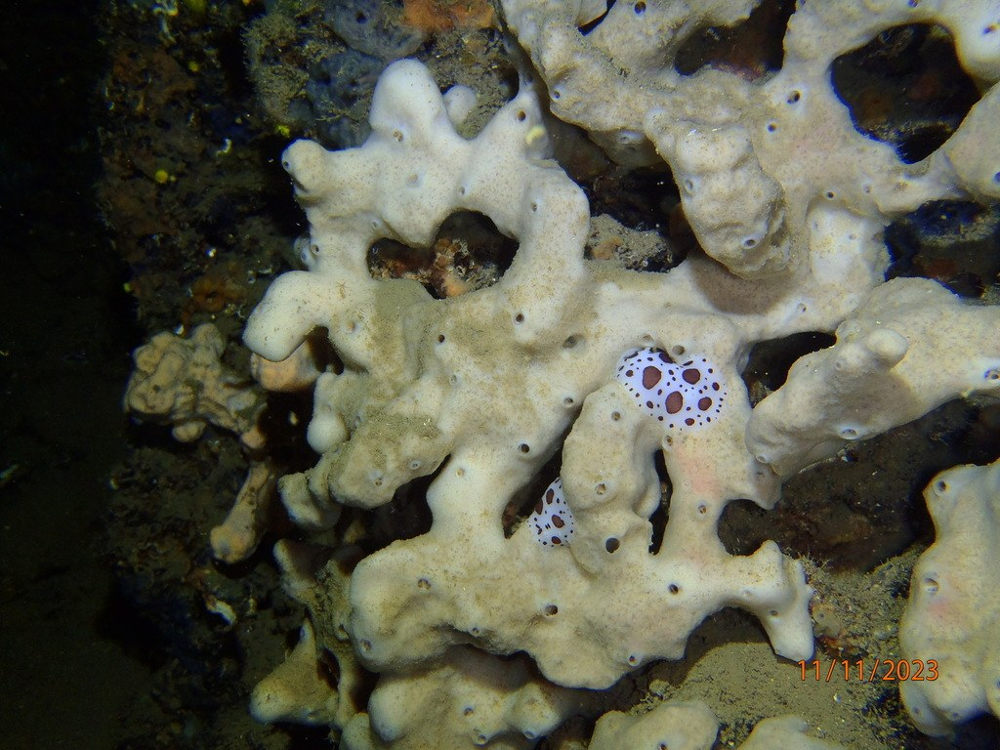

<small>Lámina 1.4: Óscar Comellas Garcia · CC BY-NC † · 2023-11-11 11:43 (Europe/Madrid) · Girona, España · Minka obs 203388 — [observación](https://minka-sdg.org/observations/203388)</small>

## *Cratena peregrina* sobre colonias de hidrozoos (*Eudendrium racemosum*; kleptopredación)

*Hidrozoo identificado por BioFauna como *Eudendrium racemosum*; sin confirmación de curadores.*

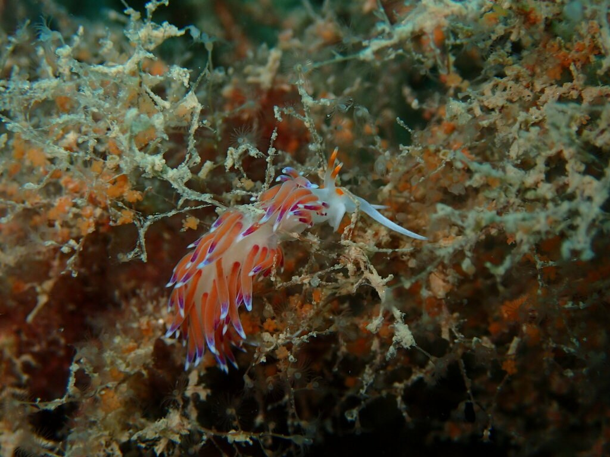

<small>Lámina 2.1: xavi salvador costa · CC BY-NC † · 2024-11-02 22:52 (Europe/Paris) · Le Ponton · Minka obs 392849 — [observación](https://minka-sdg.org/observations/392849)</small>

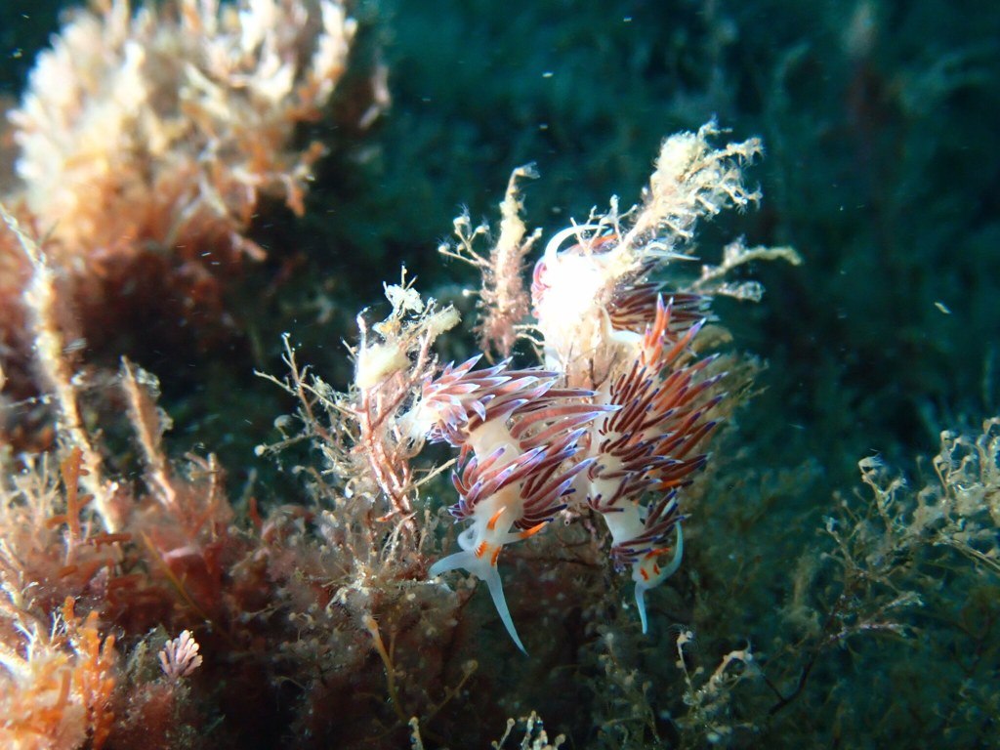

<small>Lámina 2.2: xatrac · CC BY-NC † · 2022-08-27 10:08 (Europe/Paris) · 17310 Lloret de Mar, Girona, España · Minka obs 88838 — [observación](https://minka-sdg.org/observations/88838)</small>

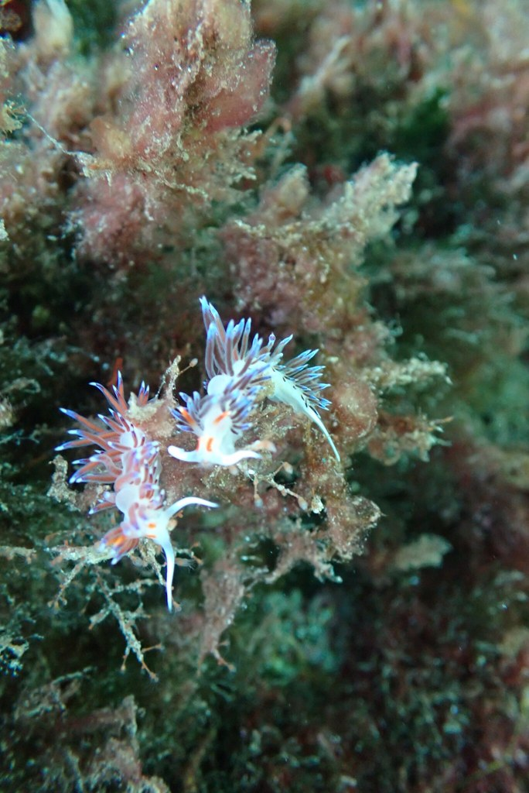

<small>Lámina 2.3: xatrac · CC BY-NC † · 2022-08-10 09:42 (Europe/Paris) · 17310 Lloret de Mar, Girona, España · Minka obs 88546 — [observación](https://minka-sdg.org/observations/88546)</small>

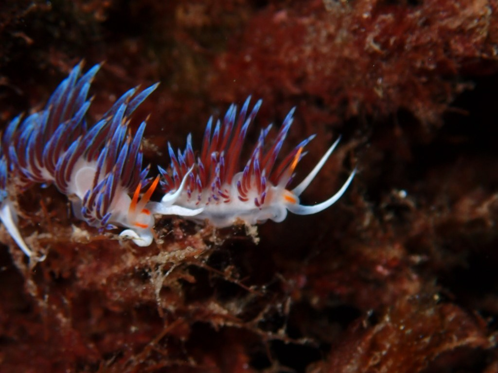

<small>Lámina 2.4: xatrac · CC BY-NC † · 2022-08-07 09:16 (Europe/Paris) · 17310 Lloret de Mar, Girona, España · Minka obs 88528 — [observación](https://minka-sdg.org/observations/88528)</small>

## *Condylactis aurantiaca* con el camarón *Periclimenes scriptus* (comensalismo)

*Camarón identificado por BioFauna como *Periclimenes scriptus*; sin confirmación de curadores.*

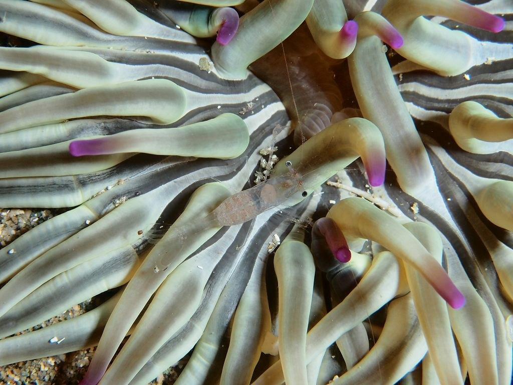

<small>Lámina 3.1: xavi salvador costa · CC BY-NC † · 2016-09-10 22:07 (Europe/Paris) · Spain · Minka obs 28492 — [observación](https://minka-sdg.org/observations/28492)</small>

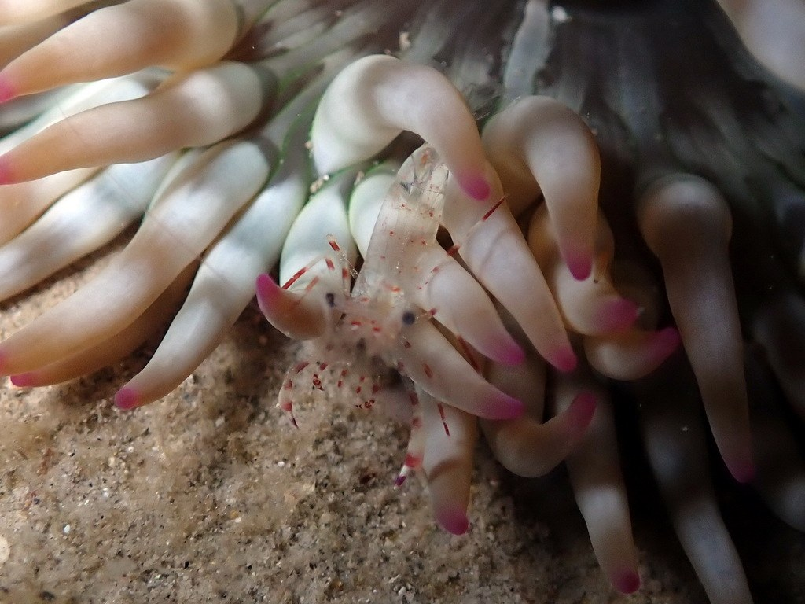

<small>Lámina 3.2: Sylvain Le Bris · CC BY-NC † · 2026-04-08 22:17 (Europe/Paris) · Montredon, Marseille, France · iNaturalist obs 348576200 — [observación](https://www.inaturalist.org/observations/348576200)</small>

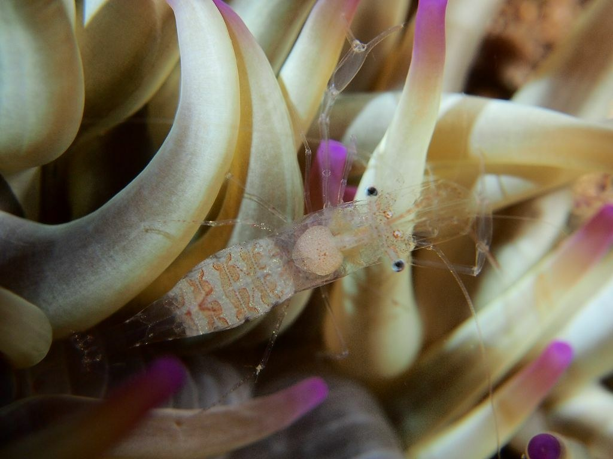

<small>Lámina 3.3: xavi salvador costa · CC BY-NC † · 2016-07-09 22:18 (Europe/Paris) · Spain · Minka obs 28862 — [observación](https://minka-sdg.org/observations/28862)</small>

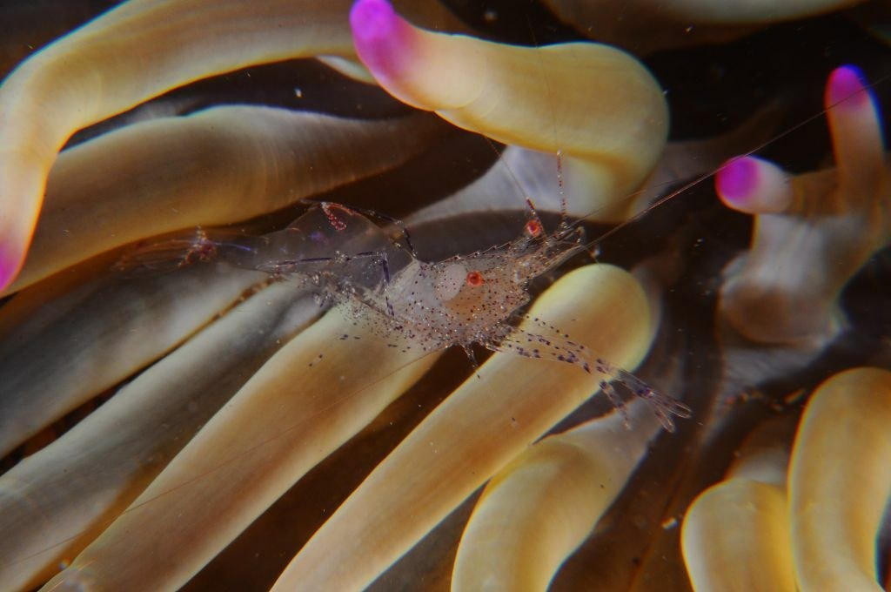

<small>Lámina 3.4: xavi salvador costa · CC BY-NC † · 2018-09-01 16:03 (Europe/Paris) · Spain · Minka obs 35885 — [observación](https://minka-sdg.org/observations/35885)</small>

## *Lysmata grabhami* y *Telmatactis cricoides* (limpieza)

*Camarón limpiador y anémona identificados por BioFauna; en dos fotos el camarón es pequeño.*

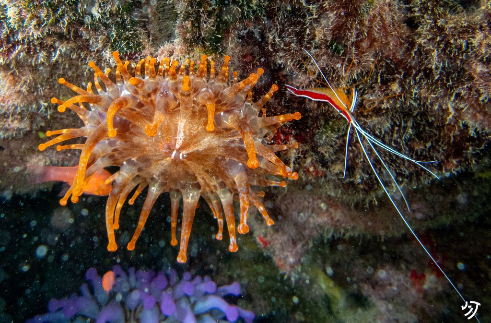

<small>Lámina 4.1: jmturon · CC BY-NC † · 2023-12-05 10:57 (Atlantic/Canary) · Las Coloradas · Minka obs 210346 — [observación](https://minka-sdg.org/observations/210346)</small>

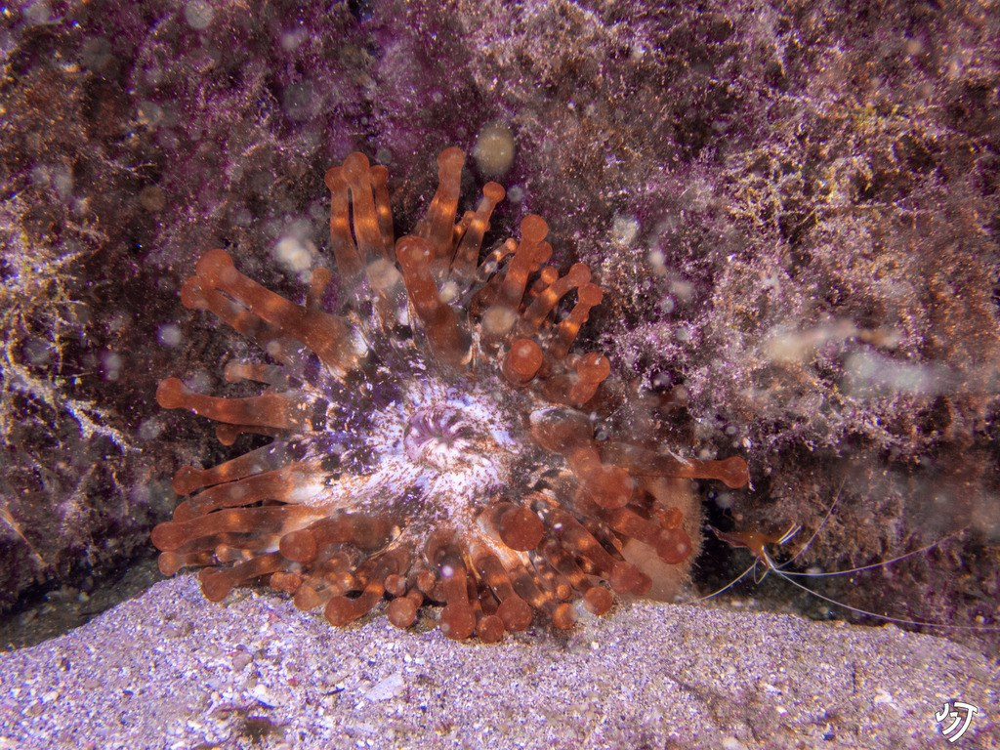

<small>Lámina 4.2: jmturon · CC BY-NC † · 2023-12-06 20:06 (Atlantic/Canary) · Playa Flamingo · Minka obs 210532 — [observación](https://minka-sdg.org/observations/210532)</small>

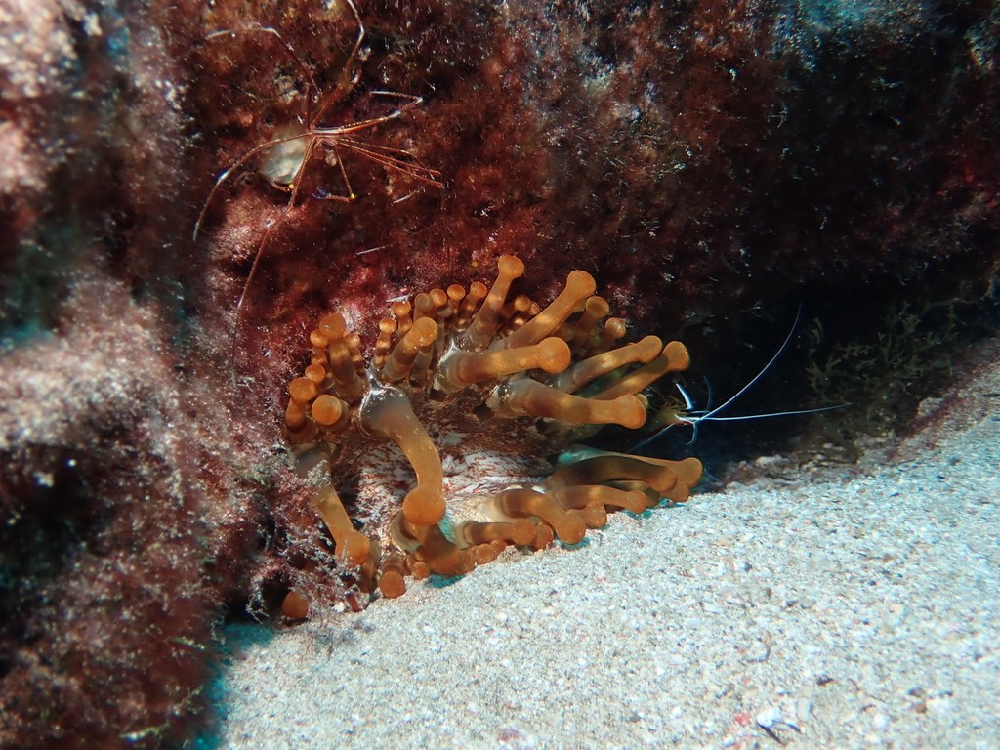

<small>Lámina 4.3: phil_newman · CC BY-NC † · 2025-11-22 11:50 (Atlantic/Canary) · Playa Flamingo Playa Blanca Lanzarote · iNaturalist obs 329826704 — [observación](https://www.inaturalist.org/observations/329826704)</small>

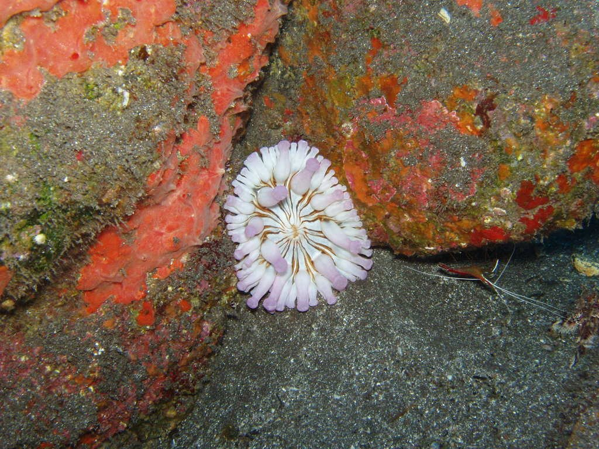

<small>Lámina 4.4: whodden · CC BY-NC † · 2007-04-04 00:00 (Europe/Madrid) · la caleta punta prieta tenerife · iNaturalist obs 2354980 — [observación](https://www.inaturalist.org/observations/2354980)</small>

## *Scyllaea pelagica* sobre *Sargassum* flotante

*Solo se ve con claridad el nudibranquio camuflado; *Latreutes* e *Hippolyte* no se distinguen a ojo.*

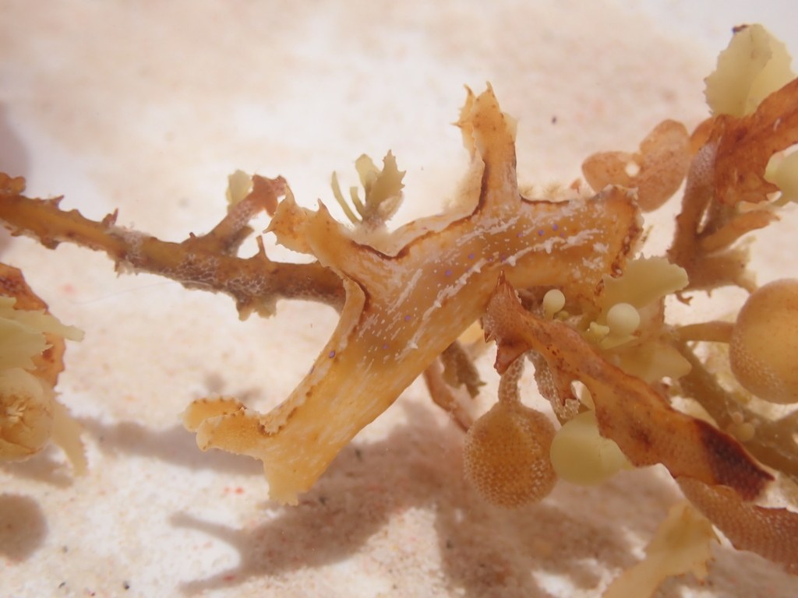

<small>Lámina 5.1: Ben Eddy · CC BY-NC † · 2023-06-27 13:52 (Atlantic/Bermuda) · Southampton, BM · iNaturalist obs 170761288 — [observación](https://www.inaturalist.org/observations/170761288)</small>

## *Electra posidoniae* y *Tridentata perpusilla* sobre hojas de *Posidonia* (microhábitat compartido)

*Briozoo incrustante y hidrozoo sobre la misma hoja; microhábitat compartido, no interacción demostrada.*

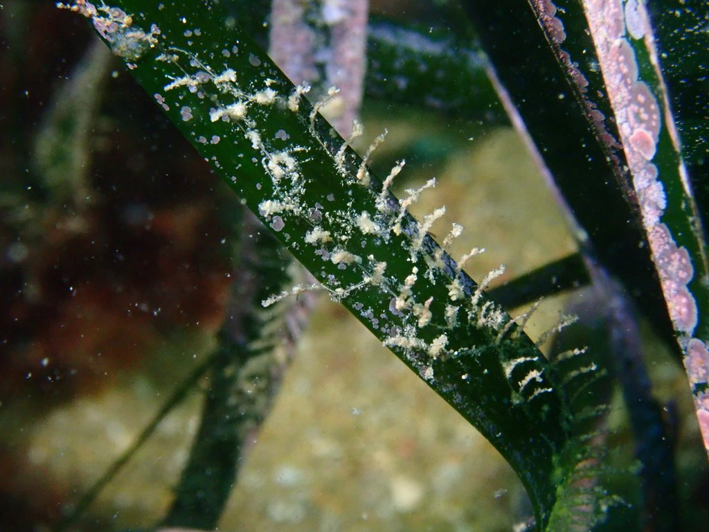

<small>Lámina 6.1: xavi salvador costa · CC BY-NC † · 2023-08-09 11:01 (Europe/Madrid) · Spain · Minka obs 153028 — [observación](https://minka-sdg.org/observations/153028)</small>

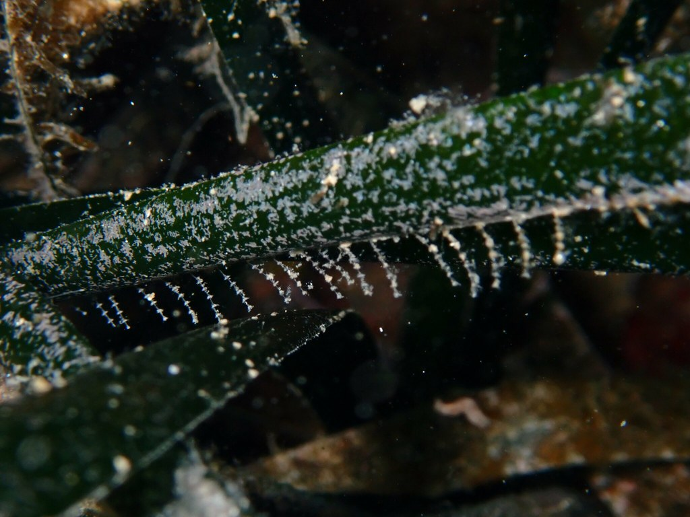

<small>Lámina 6.2: conxi · CC BY-NC † · 2025-05-31 11:48 (Europe/Madrid) · 17300 Blanes, Girona, España · Minka obs 511234 — [observación](https://minka-sdg.org/observations/511234)</small>

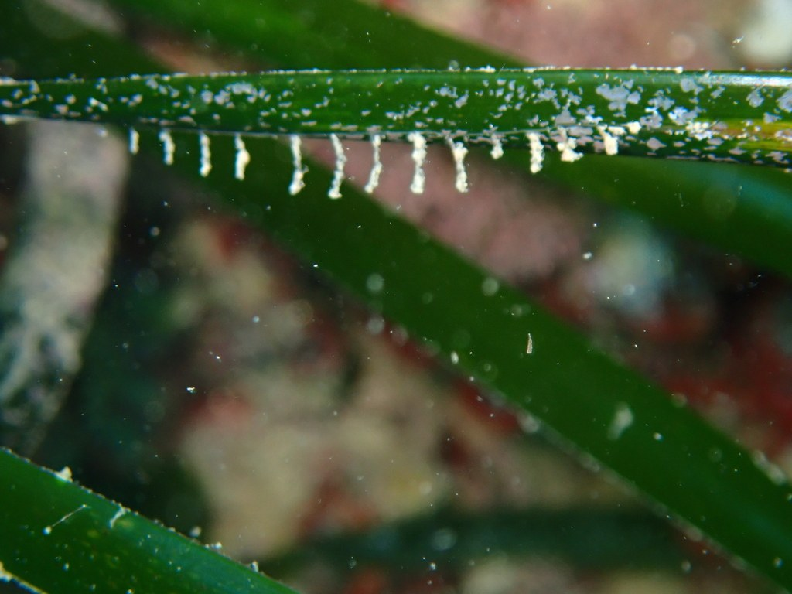

<small>Lámina 6.3: ester serrao · CC BY · 2024-06-30 07:17 (America/Costa_Rica) · Parrita, Puntarenas, CR · Minka obs 629063 — [observación](https://minka-sdg.org/observations/629063)</small>

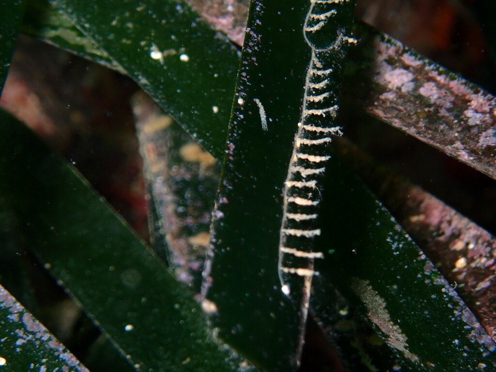

<small>Lámina 6.4: Manel Ortega · CC BY · 2025-08-10 10:13 (Europe/Madrid) · Cap Ras · Minka obs 544263 — [observación](https://minka-sdg.org/observations/544263)</small>

† Fotografías con licencia no comercial (CC BY-NC / CC BY-NC-SA): **deben sustituirse por fotos CC0, CC BY o CC BY-SA, o contar con permiso del autor, si el artículo se publica en una revista comercial.** Atribución: autor, licencia, fecha y hora (hora local de la observación), lugar y enlace a la observación original.

## Figuras de datos (v6, 6-oct-2026)

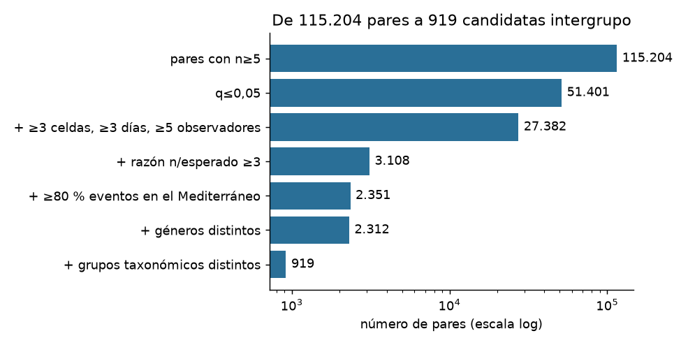

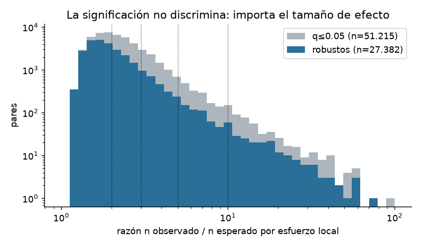

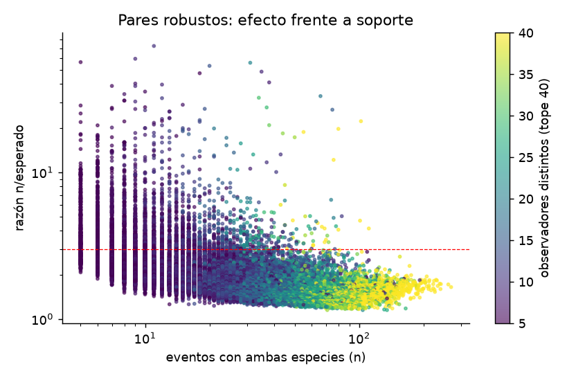

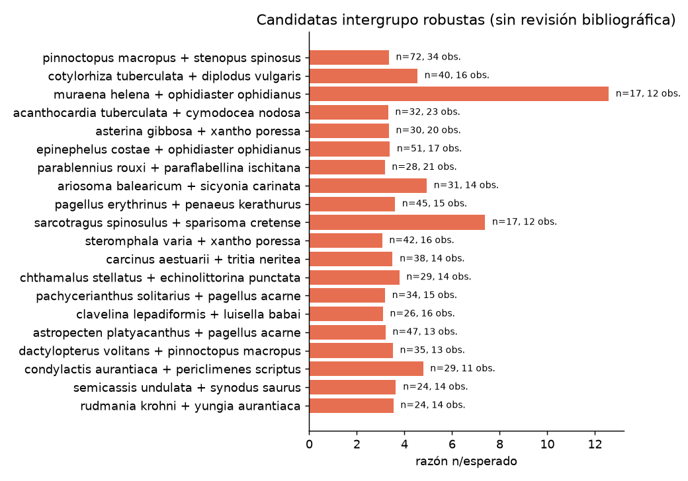

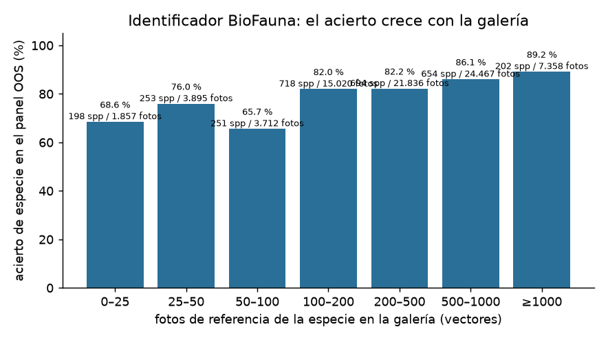
