# Láminas fotográficas — Proyecto Correlación

**29-sep-2026 v2** · Fotografías de **iNaturalist** con licencia reutilizable (CC0 / CC BY 4.0 / CC BY-SA 4.0).
Selección por **clasificador de calidad** (research-grade + acuerdos de identificación + curador de confianza + resolución; `obs_score` de BioFauna, 0-13).
Cada lámina incluye la atribución de su autor y el enlace a la observación.

## Peltodoris atromaculata sobre Petrosia ficiformis (predación)

### Peltodoris atromaculata — calidad 8.1/13

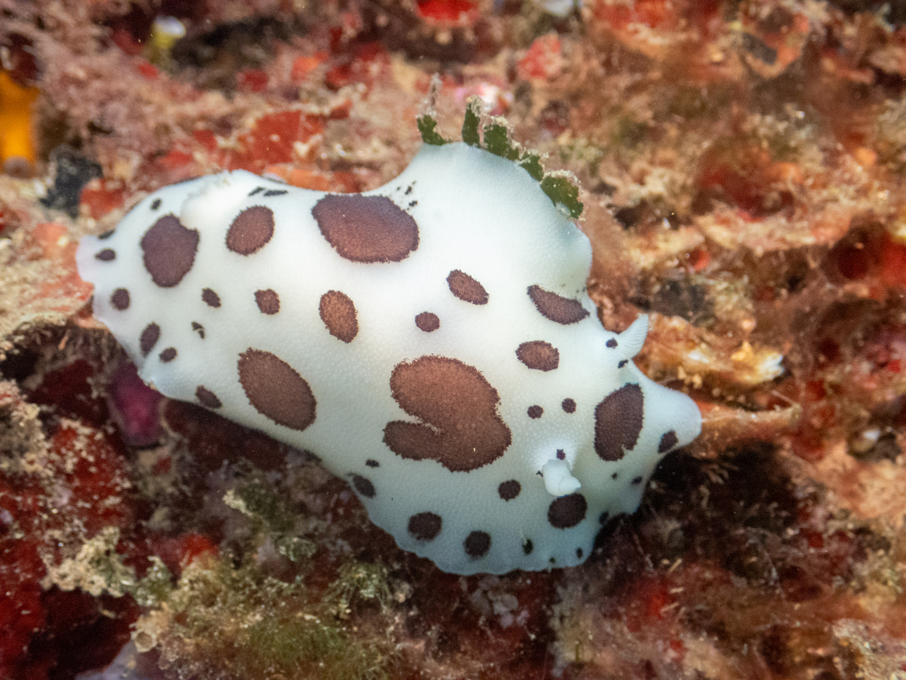
*CC BY 4.0 · © ruseva (iNaturalist) · [observación](https://www.inaturalist.org/observations/383094709) · calidad 8.1/13*

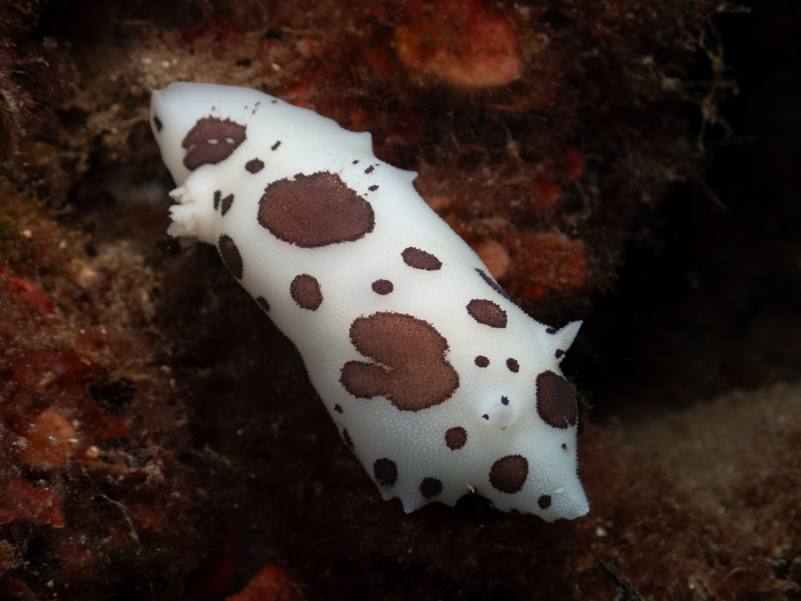
*CC BY 4.0 · © ruseva (iNaturalist) · [observación](https://www.inaturalist.org/observations/383094684) · calidad 8.1/13*

### Petrosia ficiformis — calidad 6.0/13

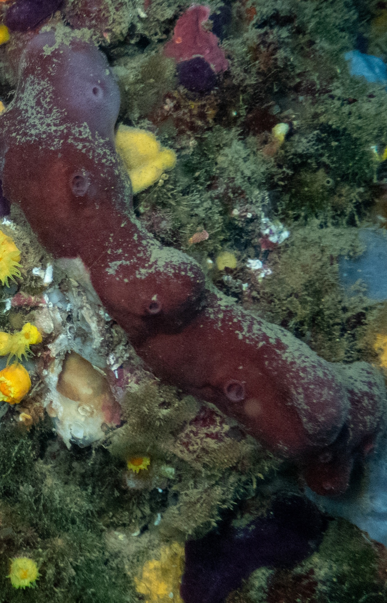
*CC BY 4.0 · © ruseva (iNaturalist) · [observación](https://www.inaturalist.org/observations/383094721) · calidad 6.0/13*

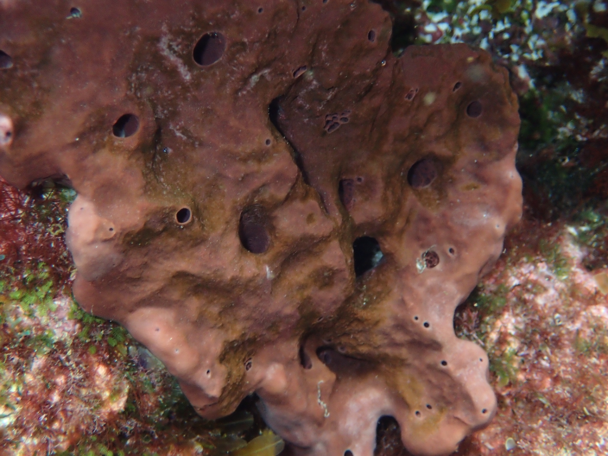
*CC BY 4.0 · © borjitaaa (iNaturalist) · [observación](https://www.inaturalist.org/observations/351531856) · calidad 6.0/13*

## Felimare picta e Ircinia (dieta)

### Felimare picta — calidad 7.0/13

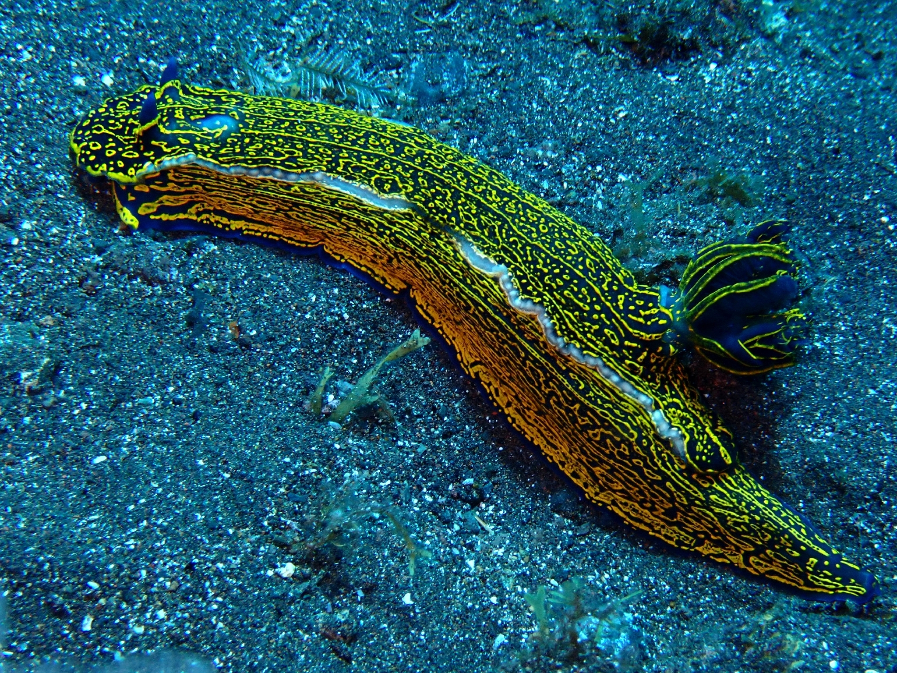
*CC BY 4.0 · © benjobson (iNaturalist) · [observación](https://www.inaturalist.org/observations/399931553) · calidad 7.0/13*

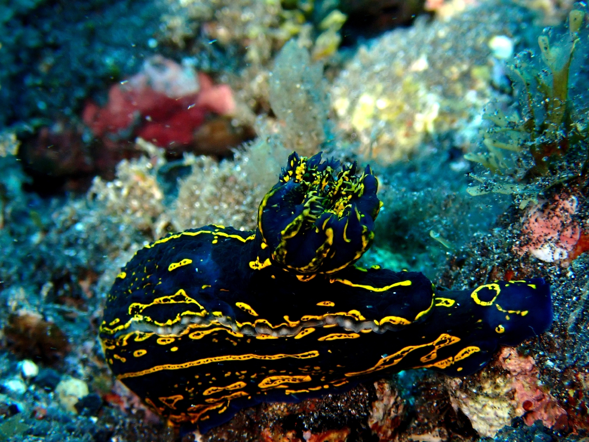
*CC BY 4.0 · © benjobson (iNaturalist) · [observación](https://www.inaturalist.org/observations/399931405) · calidad 7.0/13*

### Ircinia oros — calidad 6.0/13

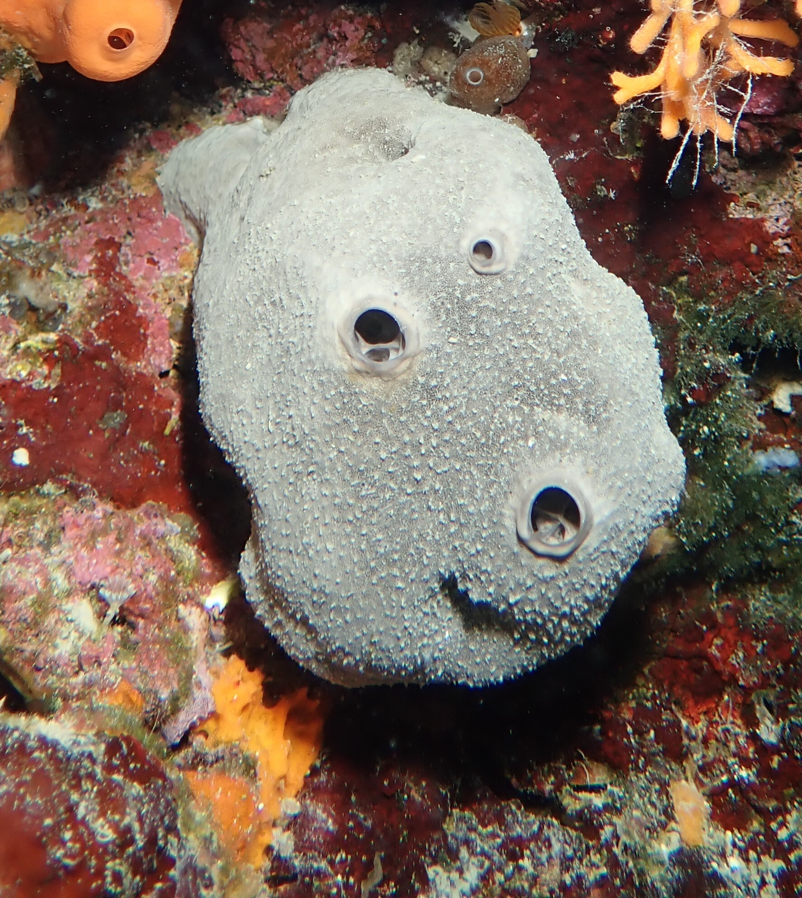
*CC BY 4.0 · © phil_newman (iNaturalist) · [observación](https://www.inaturalist.org/observations/379337407) · calidad 6.0/13*

## Cratena peregrina sobre Eudendrium racemosum (kleptopredación)

### Cratena peregrina — calidad 6.0/13

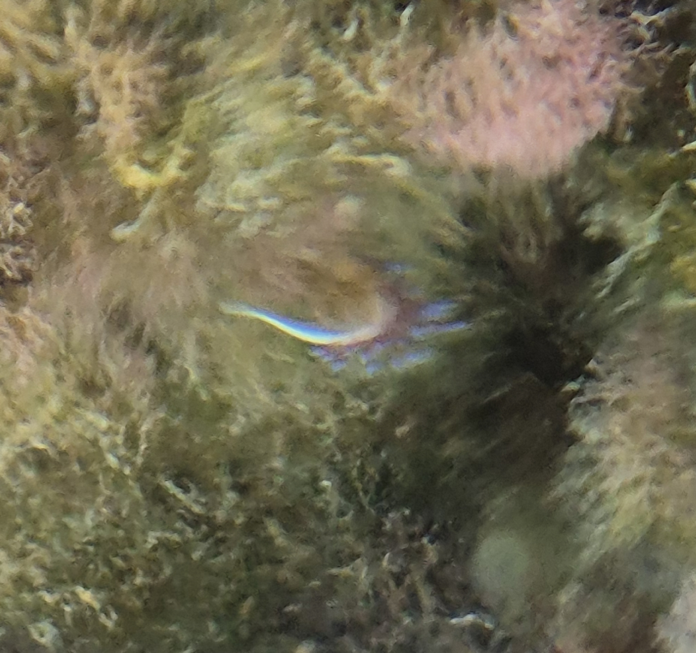
*CC BY 4.0 · © jamiekingscott (iNaturalist) · [observación](https://www.inaturalist.org/observations/397024372) · calidad 6.0/13*

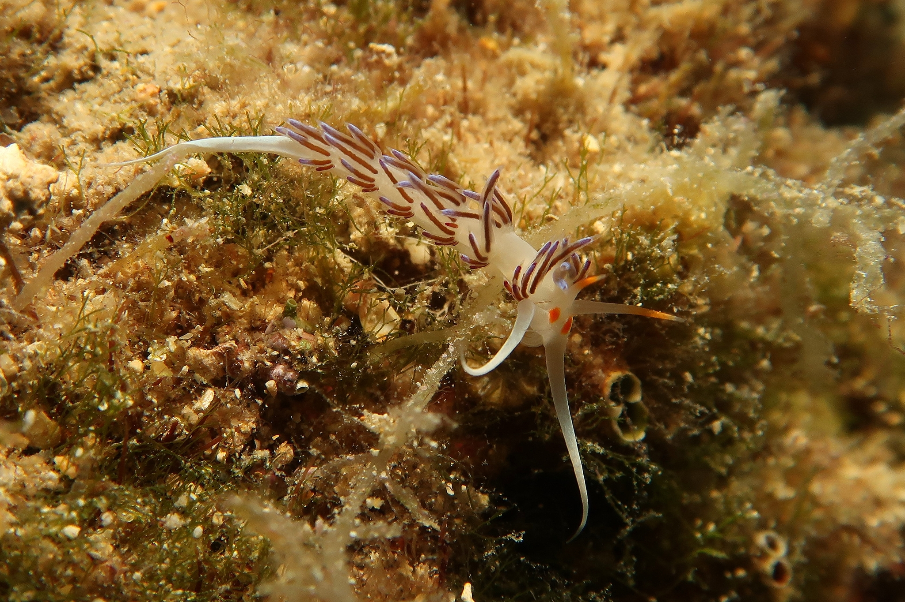
*CC BY 4.0 · © benake (iNaturalist) · [observación](https://www.inaturalist.org/observations/395273288) · calidad 6.0/13*

### Eudendrium racemosum — calidad 6.0/13

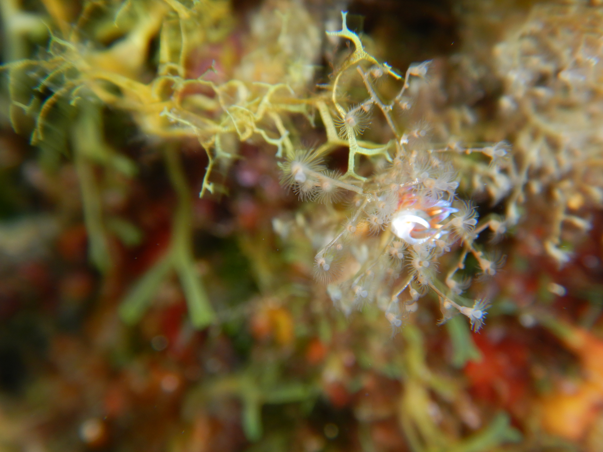
*CC BY 4.0 · © ctaklis (iNaturalist) · [observación](https://www.inaturalist.org/observations/289557156) · calidad 6.0/13*

*CC BY 4.0 · © ctaklis (iNaturalist) · [observación](https://www.inaturalist.org/observations/84409279) · calidad 6.0/13*

## Comunidad del Sargassum flotante

### Scyllaea pelagica — calidad 6.5/13

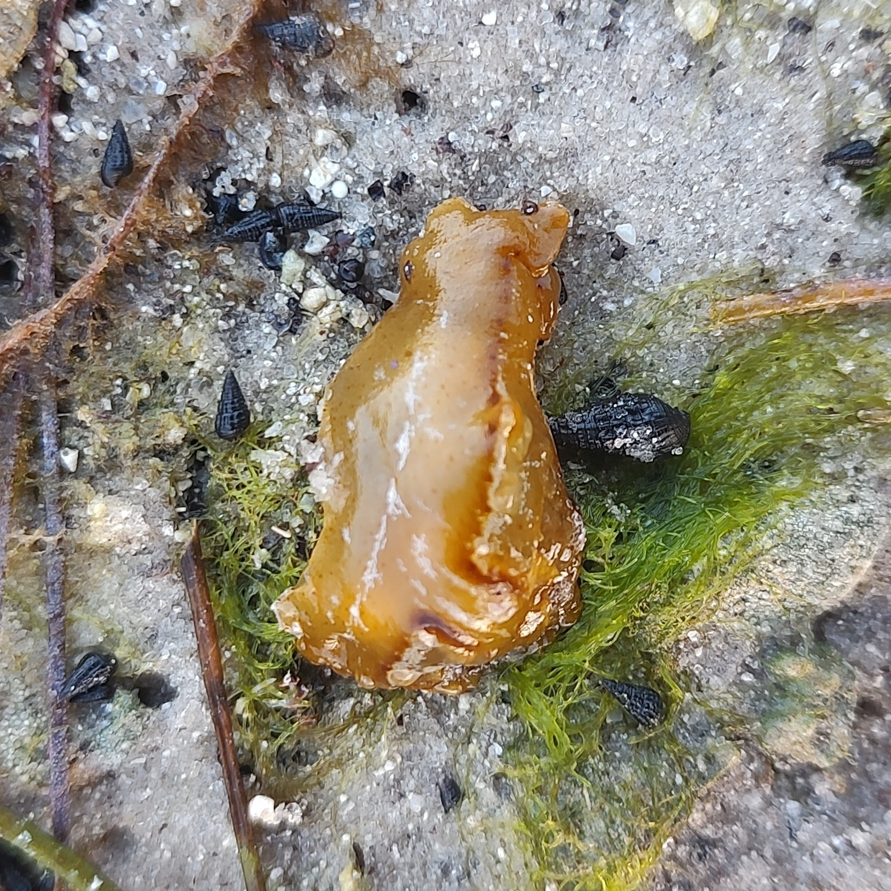
*CC BY 4.0 · © usernamefound928 (iNaturalist) · [observación](https://www.inaturalist.org/observations/331476010) · calidad 6.5/13*

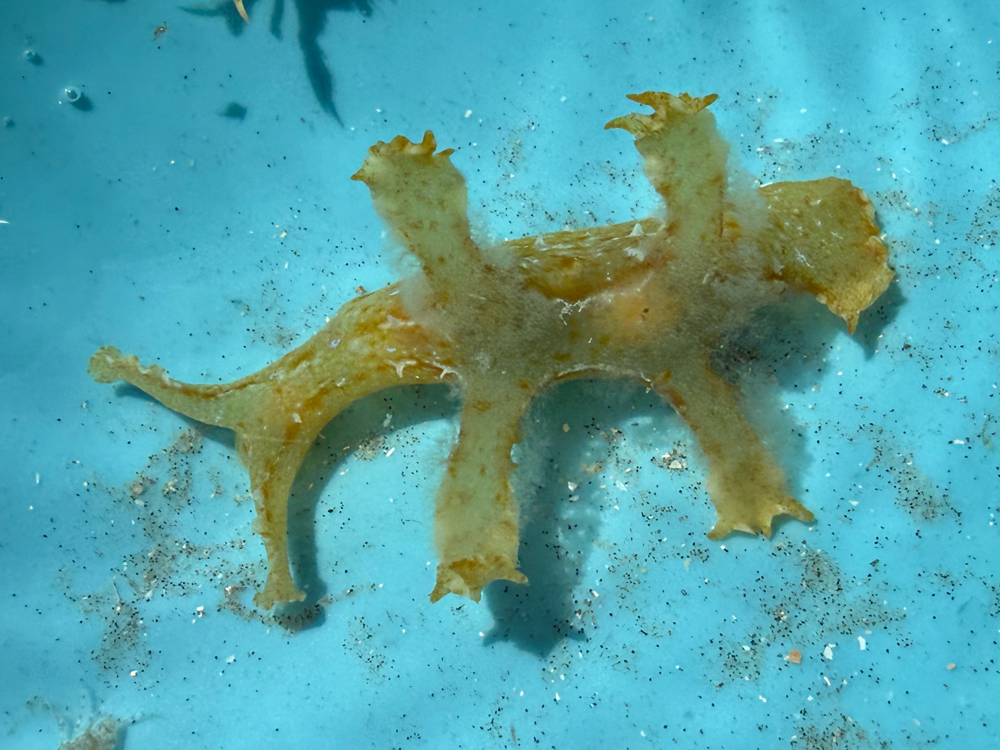
*CC BY 4.0 · © rajanrao (iNaturalist) · [observación](https://www.inaturalist.org/observations/346197891) · calidad 6.0/13*

### Latreutes fucorum — calidad 6.5/13

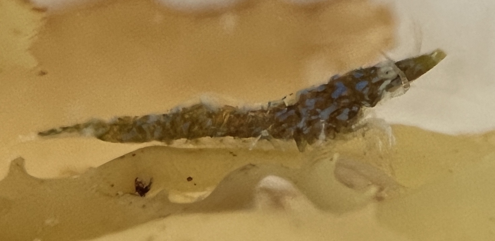
*CC BY 4.0 · © thomasirvine (iNaturalist) · [observación](https://www.inaturalist.org/observations/141194251) · calidad 6.5/13*

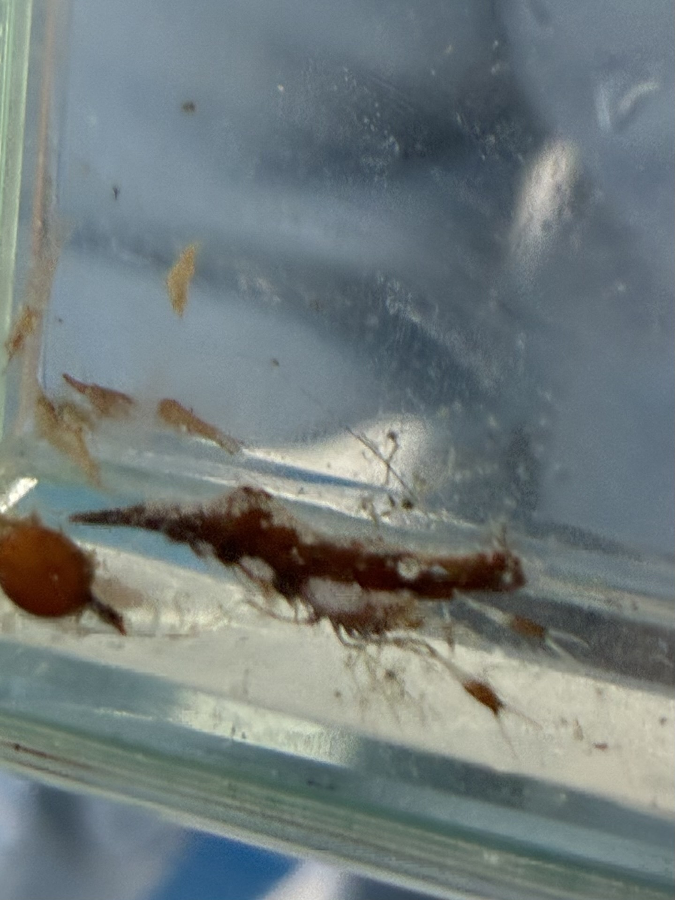
*CC BY 4.0 · © er-birds (iNaturalist) · [observación](https://www.inaturalist.org/observations/397094852) · calidad 6.0/13*

### Hippolyte coerulescens — calidad 8.1/13

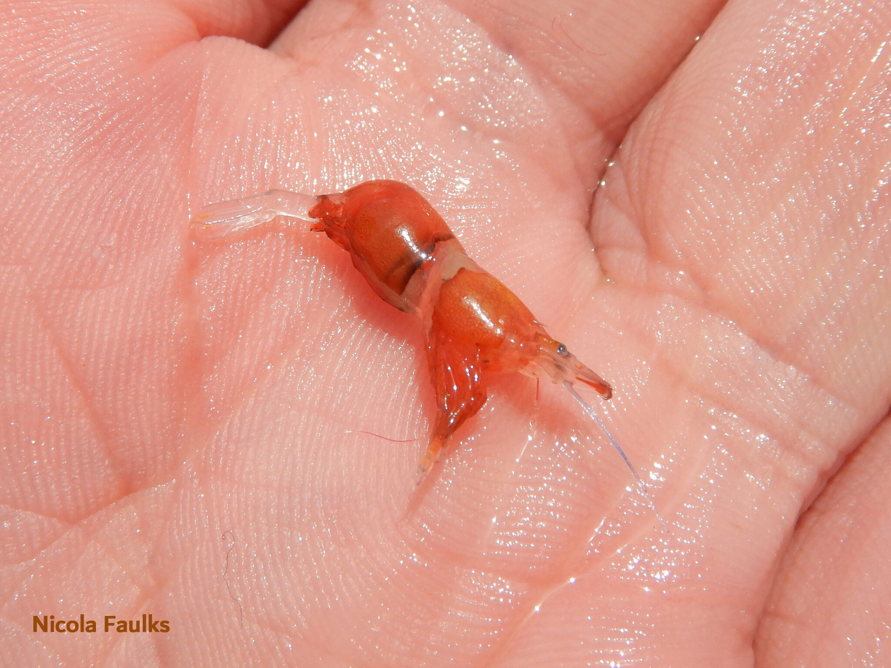
*CC BY 4.0 · © nicola35 (iNaturalist) · [observación](https://www.inaturalist.org/observations/222013216) · calidad 8.1/13*

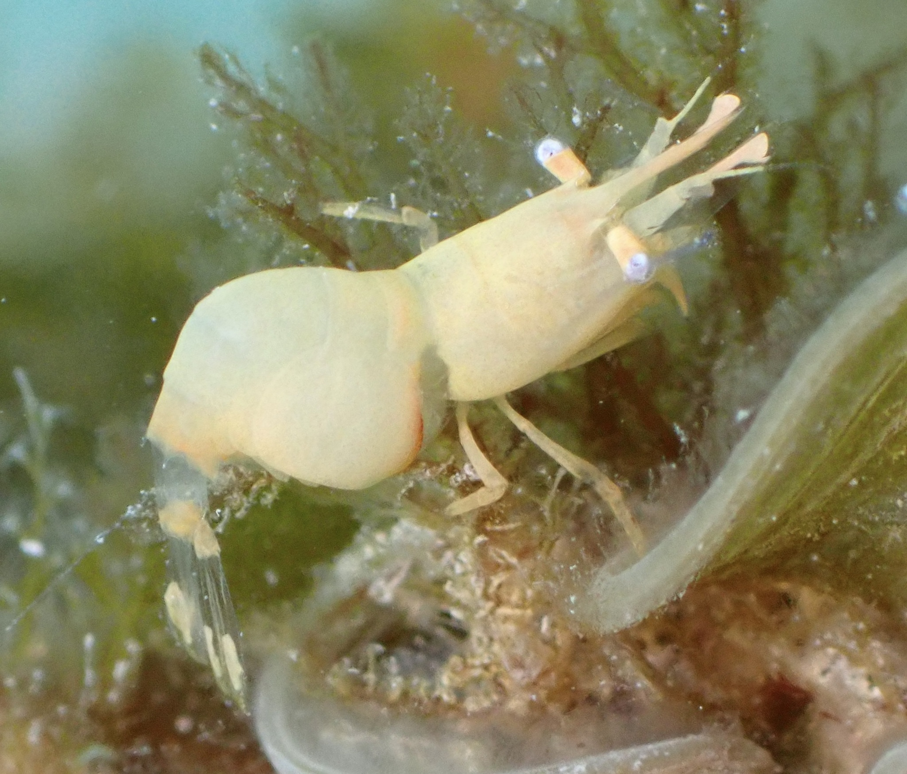
*CC BY 4.0 · © thomasirvine (iNaturalist) · [observación](https://www.inaturalist.org/observations/143721204) · calidad 7.0/13*

## Lysmata grabhami y Telmatactis cricoides (limpieza)

### Lysmata grabhami — calidad 8.1/13

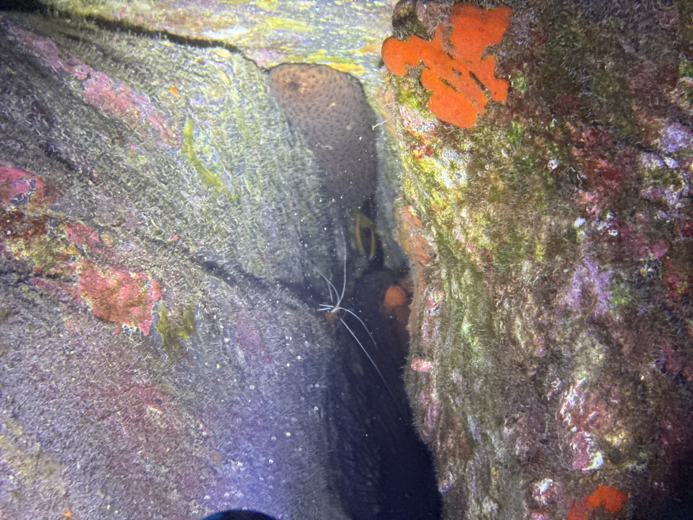
*CC0 · © benjamin_turman (iNaturalist) · [observación](https://www.inaturalist.org/observations/315660448) · calidad 8.1/13*

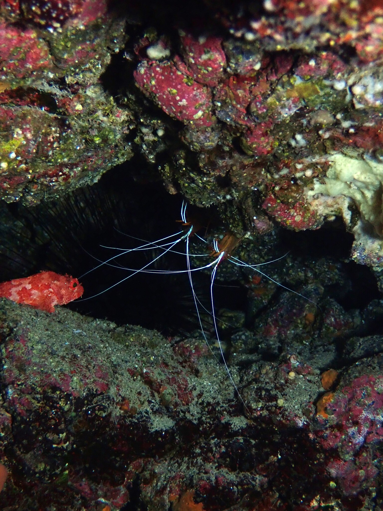
*CC BY 4.0 · © phil_newman (iNaturalist) · [observación](https://www.inaturalist.org/observations/311053212) · calidad 8.1/13*

### Telmatactis cricoides — calidad 7.0/13

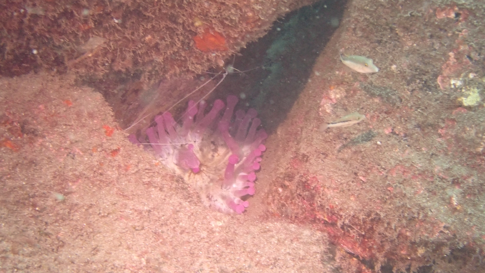
*CC BY 4.0 · © rorywilson (iNaturalist) · [observación](https://www.inaturalist.org/observations/352057814) · calidad 7.0/13*

*CC BY 4.0 · © benjobson (iNaturalist) · [observación](https://www.inaturalist.org/observations/394955405) · calidad 6.0/13*
